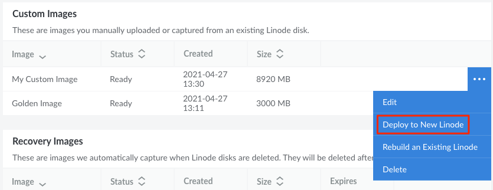

---
author:
  name: Linode
  email: docs@linode.com
title: Deploy an Image to a New Compute Instance
description: "Learn how to create a new Compute Instance from a Custom or Recovery Image"
modified: 2022-07-12
---

1. Log in to the Cloud Manager and navigate to the **Images** page.

1. On this page, locate the Image you wish to deploy and click the corresponding **ellipsis** options menu. Select **Deploy to a New Linode**.

    

1. You are redirected to the **Create Linode** form with the chosen Image preselected. Complete the remainder of this form, making sure to select your desired **Region**, **Linode Plan**, **Label**, **Root Password**, and any other options that may be needed. See [Creating a Compute Instance](/docs/guides/creating-a-compute-instance/) for full instructions on creating a Linode.

1. Click the **Create Linode** button to create the Linode based on the selected Image.

If your new Compute Instance is not accessible through SSH or it does not respond to pings, check to see if Network Helper is enabled (see [Network Helper: Auto-Configure Networking on Compute Instances](/docs/guides/network-helper/#individual-compute-instance-setting)). If it is disabled, the internal network configuration on your new instance is not automatically configured. In this case, you may need to either enable Network Helper and reboot or manually edit your network configuration files (see [Manual Network Configuration on a Compute Instance](/docs/guides/manual-network-configuration/)).