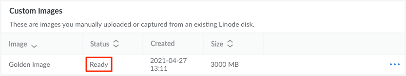

---
author:
  name: Linode
  email: docs@linode.com
image: UploadAnImage.png
title: Upload an Image
description: "How to upload an image with Linode Images."
---

## Requirements and Considerations

When creating an image file to upload as a Custom Image, keep the following limits, requirements, and considerations in mind.

- Review the overall [Technical Specifications](/docs/products/tools/images/#technical-specifications) of the Custom Images service.

- **Raw disk image:** The image file must be a [raw disk image](https://en.wikipedia.org/wiki/IMG_(file_format)) (`.img`). Other file formats will not work.

- **Compressed using gzip:** The image file must be compressed using [gzip](https://en.wikipedia.org/wiki/Gzip) (`.gz`) before uploading it. Other compression algorithms are not compatible.

- **Maximum file size is 5GB:** The maximum *compressed* size for an image file is 5GB. Larger file sizes are not supported through our current upload tooling. For the maximum *uncompressed* size, see the image size limit within the [Technical Specifications](/docs/products/tools/images/#technical-specifications).

- **Pricing considerations:** Custom Images are billed based on the *uncompressed* size of the uploaded image file.

- **For compatibility, use unpartitioned disks formatted with ext3 or ext4 file systems:** [Network Helper](/docs/guides/network-helper/) and other Linode Helpers are compatible with non-partitioned image files formatted using the ext3 or ext4 file systems. Partitioned disks and other file systems may be used, but some manual configuration may be required.

## Creating or Obtaining an Image File

Creating a custom image file is typically a complex process intended for advanced system administrators. In most cases, users will be better suited creating a custom image directly from an existing Linode (see [Capture an Image](/docs/products/tools/images/guides/capture-an-image/)) or through the Linode Packer Builder (see [How to Use the Linode Packer Builder](/docs/guides/how-to-use-linode-packer-builder/)). These two methods ensure maximum compatibility with Linode and are easier to follow for a novice user.

If you do intend on creating a custom image file to upload, here are a few methods to get you started. Depending on how you obtain or generate the image, the image or image file may need further configuration so it can be used with the Image Upload feature on Linode. Keep in mind all of the requirements and considerations listed above.

- **Existing Image:** Use a compatible image from your own on-premise environment, existing cloud provider, or through an online repository (such as a distribution's official image repository).
- **Packer:** Use Packer's [QEMU Builder](https://www.packer.io/docs/builders/qemu) to automate the creation of custom images. Within the `.json` configuration file for your image, set `"accelerator": "kvm"` and `"format": "raw"`. If running Packer inside of a virtual machine, the hypervisor needs to support nested virtualization.
- **`dd`:** Install and configure an operating system on a local, remote, or virtualized system and create a disk image using the `dd` command-line tool.
- **QEMU disk image utility:** Use the [QEMU disk image utility](https://qemu-project.gitlab.io/qemu/tools/qemu-img.html) to create the image.

#### Compressing the Image File

After the image file has been created, it needs to be compressed using the gzip utility.

-   **Linux and macOS**: Run the following command, replacing *[file.img.gz]* with the file name of your image. See [Archiving and Compressing files with GNU Tar and GNU Zip](/docs/guides/archiving-and-compressing-files-with-gnu-tar-and-gnu-zip/) for additional information on gzip.

        gzip [file.img] [file.img.gz]

-   **Windows**: Use a third party tool that supports gzip compression, such as [7-Zip](https://www.7-zip.org/).

#### Determining the Uncompressed File Size

Knowing the *uncompressed* size of an image file is helpful for planning the storage requirements of Linodes deployed using that image. This information also ensures you stay within the [limits of the Images service](/docs/products/tools/images/#limits). The best way to determine the uncompressed size of a gzip archive is to uncompress that archive and then examine its file size. Alternatively, use the zcat utility by run the following command, replacing *[file.img.gz]* with the file name of your image.

    zcat [file.img.gz] | wc -c

## Uploading an Image File through the Cloud Manager

Once you have obtained a compatible image file that meets all the requirements, upload it through the **Upload Image** Cloud Manager form. After it's uploaded, you can then deploy Linodes using that Custom Image.

1.  Log in to the Cloud Manager and open the **[Upload Image](https://cloud.linode.com/images/create/upload)** form by navigating to the **Images** page, clicking the **Create Image** button, and selecting the **Upload Image** tab.

1.  Type in the *Label* of the new Image along with an optional *Description*. Select the *Region* you would like the Image to be created within. Since Images can be deployed to any data center (regardless of where they are located), it's recommended that you select the one closest to you geographically for the fastest upload speed.

1.  Specify the image file you'd like to use by either dragging the file into the designated area or by clicking the **Browse Files** button and selecting the file. The filename will appear along with a progress bar indicating the percentage completed for the file upload.

1.  Once the image file has been successfully uploaded, the Custom Image is created and the Cloud Manager will redirect you to the main Images page. Here, you should see the new Custom Image listed along with a status of *Pending Upload*. Once the Custom Image is ready to be deployed, the status will change to *Ready*.

    

    If there is an error when processing the uploaded image file, the newly created Image may be deleted and an error message will be written to the [Events](https://cloud.linode.com/events) log. See [Understanding Events and the Activity Feed](/docs/guides/cloud-manager-events-and-activity-feeds/) for more details on viewing Cloud Manager Events.

## Uploading an Image File through the Linode CLI

Another method for uploading a compatible image file is directly through the [Linode CLI](/docs/products/tools/cli/get-started/).

1.  Run the following command to install or update the Linode CLI:

        pip3 install linode-cli --upgrade

2.  If this is your first time using the CLI or if you encounter any authorization issues, reconfigure (and authorize) your installation:

        linode-cli configure

3.  Create a Custom Image and upload the image file using the following command, replacing *[Label]* with a unique label and *[File]* with the filename and path of the image file you'd like to use:

        linode-cli image-upload --label "[Label]" [File]

    You can also optionally specify additional details by adding the following options:

    - `--description "[Description]"`, replacing *[Description]* with the text you'd like to use.
    - `--region "[region-id]"`, replacing *[region-id]* with the id of the region you'd like to use to upload the file. If this is left out, the default region you specified when configuring the Linode CLI will be used.

    In the example below, a Custom Image will be created in the Newark data center with the label of "Example Image", a description of "Some details about the image", and the image file "~/Downloads/image-file.img.gz" will be uploaded.

        linode-cli image-upload --label "Example Image" --description "Some details about the image" --region "us-east" ~/Downloads/image-file.img.gz

4. After running the above command, a progress bar will be displayed that indicates the total progress of the file upload. Once completed, a single data row table will be outputted with the details regarding the new Custom Image and a status of `pending_upload`.

    The image upload may take a few minutes to fully process. To verify that the image is available for use, run the following command and make sure the new Custom Image has a status of *available*:

        linode-cli images list --is_public false