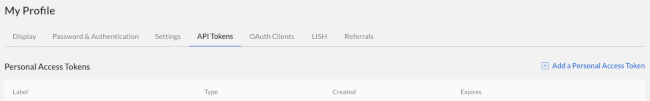
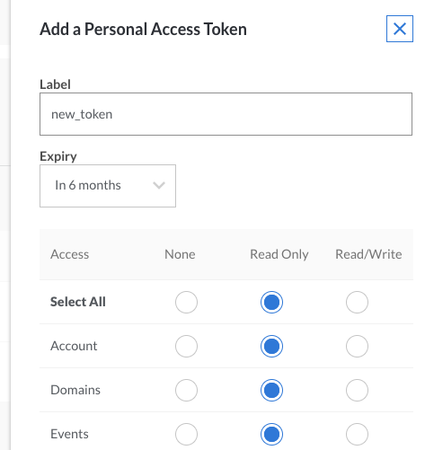

1.  Log in to the Cloud Manager.

2.  Click on your username at the top of the screen and select **My Profile**.

    

3.  Select the **API Tokens** tab:

    

4.  Click on **Add a Personal Access Token** and choose the access rights you want users authenticated with the new token to have.

    

    When you have finished, click **Submit** to generate an API token string. Copy the token and save it in a secure location. **You will not be able to view the token through the Cloud Manager after closing the popup.**
