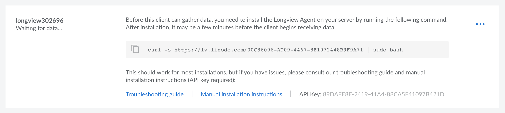
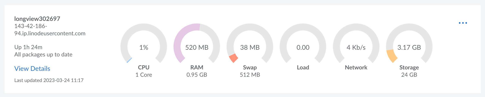

To start using Longview to capture metrics from a Linux server, you need to create a new Longview Client instance and install the Longview Agent on that server.

1. [Create a Longview Client](#create-client)
1. [SSH into the Compute Instance](#ssh)
1. [Install the Longview Agent](#install-agent)
1. [Start the Longview Agent](#start-agent)
1. [View Longview Client Statistics](#view-statistics)

## Create a Longview Client {#create-client}

1. Log in to the [Cloud Manager](https://cloud.linode.com/dashboard) and click on the **Longview** link in the sidebar.

1. On the Longview Clients page, click on the **Add a Client** link on the top right-hand corner. This creates a Longview Client instance.

1. The new Longview Client instance is displayed along with its auto-generated label, its current status, installation instructions, and API key. Its status should be *"Waiting for data"* as you have not yet installed the Longview agent on your Linux system.

    
    The displayed `curl` command is used in the next section to install the Longview agent on the desired Linux system. The long string appended to the url `https://lv.linode.com/` is your Longview Client instance's GUID (globally unique identifier).
    

    

## SSH into the Compute Instance {#ssh}

1. Open a terminal on your local computer and log in to your Compute Instance (or other Linux system) over SSH. In the command below, replace *[user]* with your remote username and *[ip-address]* with the IP address or fully qualified domain name of your instance. See [Managing IP Addresses on a Compute Instance](/docs/products/compute/compute-instances/guides/manage-ip-addresses/#viewing-ip-addresses).

    ```command
    ssh [user]@[ip-address]
    ```

1. Switch to the `root` user.

    ```command
    su - root
    ```

## Install the Longview Agent {#install-agent}

### Automatic Installation

Run the Longview Client instance's `curl` command on your Linux system. The installation will take a few minutes to complete.


Ensure you replace the example `curl` command below with your own Longview Client instance's GUID.


```command
curl -s https://lv.linode.com/05AC7F6F-3B10-4039-9DEE09B0CC382A3D | sudo bash
```


- **Lock error:** This likely means that another program is attempting to update or install packages on your system. To overcome this error, you can delete the current Longview Client, wait a few minutes, create a new Longview Client, and try the installation process again.

    ```output
    E: Could not get lock /var/lib/dpkg/lock-frontend. It is held by process 12549 (apt-get)
    N: Be aware that removing the lock file is not a solution and may break your system.
    E: Unable to acquire the dpkg frontend lock (/var/lib/dpkg/lock-frontend), is another process using it?
    ```

- **Invaliad installer session error:** To overcome this error, delete the current Longview Client, create a new one, and try to install the Longview Agent again.

    ```output
    Invalid Installer Session
    Please see the Longview details page to start a new session
    ```

If you are not able to overcome these error messages, follow the [manual installation](#manual-installation) instructions below.


### Manual Installation

If the [automatic installation](#automatic-installation) instructions failed, you can also manually install the Longview Agent on CentOS, Debian, and Ubuntu. Other distributions, like Fedora and Alpine Linux, are not officially supported.

1. Add a configuration file to store the repository information for the Longview agent:

    
    {}
Find the codename of the distribution running on your Linode.

```command
root@localhost:~# lsb_release -sc
```

```output
stretch
```

Using the text editor of your choice, like [nano](/docs/guides/use-nano-to-edit-files-in-linux/), create a custom sources file that includes Longview's Debian repository and the Debian distribution codename. In the command below, replace *stretch* with the output of the previous step.

```file {title="/etc/apt/sources.list.d/longview.list" lang="config"}
deb http://apt-longview.linode.com/ stretch main
```
    {}
    {}
Using the text editor of your choice, like [nano](/docs/guides/use-nano-to-edit-files-in-linux/), create a `.repo` file and copy the contents of the example file below. Replace `REV` in the repository URL with your CentOS version (e.g., 7). If unsure, you can find your CentOS version number with `cat /etc/redhat-release`.

```file {title="/etc/yum.repos.d/longview.repo" lang="config"}
[longview]
name=Longview Repo
baseurl=https://yum-longview.linode.com/centos/REV/noarch/
enabled=1
gpgcheck=1
```
    {}
    

1. Download the repository's GPG key and import or move it to the correct location:

    
    {}
```command
sudo curl -O https://apt-longview.linode.com/linode.gpg
sudo mv linode.gpg /etc/apt/trusted.gpg.d/linode.gpg
```
    {}
    {}
```command
sudo curl -O https://yum-longview.linode.com/linode.key
sudo rpm --import linode.key
```
    {}
    

1. Create a directory for the API key:

    ```command
    sudo mkdir /etc/linode/
    ```

1. Copy the API key from the **Installation** tab of your Longview client's [detailed view](#access-your-longview-client-s-detailed-view) in the Linode Cloud Manager. Put the key into a file, replacing the key in the command below with your own.

    ```command
    echo '266096EE-CDBA-0EBB-23D067749E27B9ED' | sudo tee /etc/linode/longview.key
    ```

1. Install Longview:

    
    {}
```command
sudo apt update
sudo apt install linode-longview
```
    {}
    {}
```command
sudo yum install linode-longview
```
    {}
    

## Start the Longview Agent {#start-agent}

Once the installation is complete, verify that the Longview agent is running:

```command
sudo systemctl status longview
```

You should see a similar output:


{}
```output
● longview.service - LSB: Longview Monitoring Agent
Loaded: loaded (/etc/init.d/longview; generated; vendor preset: enabled)
Active: active (running) since Mon 2019-12-09 21:55:39 UTC; 2s ago
    Docs: man:systemd-sysv-generator(8)
Process: 2997 ExecStart=/etc/init.d/longview start (code=exited, status=0/SUCCESS)
    Tasks: 1 (limit: 4915)
CGroup: /system.slice/longview.service
        └─3001 linode-longview
```
{}
{}
```output
● longview.service - SYSV: Longview statistics gathering
  Loaded: loaded (/etc/rc.d/init.d/longview; bad; vendor preset: disabled)
  Active: active (running) since Tue 2019-12-10 22:35:11 UTC; 40s ago
    Docs: man:systemd-sysv-generator(8)
  CGroup: /system.slice/longview.service
          └─12202 linode-longview

Dec 10 22:35:11 203-0-113-0.ip.linodeusercontent.com systemd[1]: Starting SYSV: Longview statistics gathering...
Dec 10 22:35:11 203-0-113-0.ip.linodeusercontent.com longview[12198]: Starting longview: [  OK  ]
Dec 10 22:35:11 203-0-113-0.ip.linodeusercontent.com systemd[1]: Started SYSV: Longview statistics gathering.
```
{}


If the Longview agent is not running, start it with the following command:

```command
sudo systemctl start longview
```

## View Longview Client Statistics {#view-statistics}

Switch back to the Cloud Manager's Longview Clients page in your browser and verify that system information and metrics have started to appear. To learn more about the metrics available on Longview, see [Understanding Longview Metrics](/docs/products/tools/longview/guides/metrics/).




It can take several minutes for data to load and display in the Cloud Manager.
