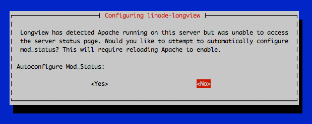
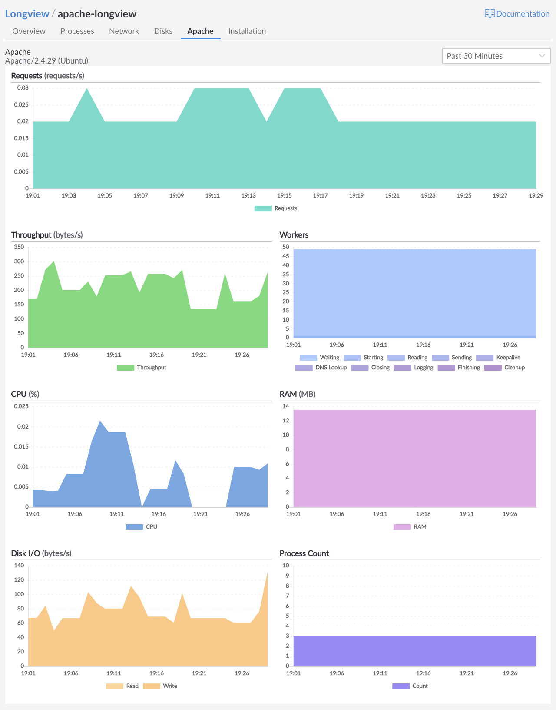

In addition to capturing general system metrics, Longview can also be used to capture metrics for Apache. The Apache tab appears in the Cloud Manager when Longview detects that you have Apache installed on your system. It can help you keep track of Apache's settings, workers and requests, system resource consumption, and other information.


In order to use Longview to capture data for Apache, you must have the Longview Agent successfully installed on the system you wish to monitor. See [Create a Longview Client and Install the Longview Agent](/docs/products/tools/longview/get-started/).


## In this Guide:

This guide covers using Longview with Apache and includes the following topics:

- [Configuring Longview for Apache](#configure-longview).
- [Interacting with the Apache data provided by Longview in the Cloud Manager](#view-metrics).
- [Troubleshooting Longview for Apache](#troubleshooting).

## Configure Longview for Apache {#configure-longview}

### Automatic Configuration

*These instructions are compatible only with Debian and Ubuntu and do not work on CentOS.*

If Apache is installed and running when you install the Longview agent, Longview should automatically configure itself for Apache. If you install Apache *after* setting up the Longview agent, you can perform the steps below to configure Longview with any available software integrations (Apache, NGINX, and MySQL). Any existing Longview data is not affected and will remain accessible.

1. [SSH into the Compute Instance](/docs/products/compute/compute-instances/guides/set-up-and-secure/#connect-to-the-instance) you are monitoring with Longview.

1. Ensure that Apache is running.

    ```command
    sudo systemctl status apache2
    ```

1. Run the automatic Longview configuration command.

    ```command
    dpkg-reconfigure -phigh linode-longview
    ```

    For most systems, Longview should be able to configure itself automatically. If this is the case, your output should be similar to the following:

    ```output
    Checking Apache configuration...
    Found Apache status page at http://127.0.0.1/server-status?auto specified in /etc/linode/longview.d/Apache.conf
    ```

    Once you see this successful message, the Longview should automatically start collecting Apache data. Refresh Longview in the Cloud Manager to start viewing your Apache stats for your Longview Client instance.

    If you receive a failure message or the popup shown below, you should visit the [Troubleshooting](#troubleshooting) section at the end of this article.

    

### Manual Configuration

*These instructions work for all supported distributions, including Debian, Ubuntu, and CentOS.*

To enable the Apache Longview integration manually, follow these steps on your system via SSH:

1. [SSH into the Compute Instance](/docs/products/compute/compute-instances/guides/set-up-and-secure/#connect-to-the-instance) you are monitoring with Longview.

1.  Verify that **mod\_status** is enabled for Apache (it should be by default). For more information, see the [Apache Module mod\_status](https://httpd.apache.org/docs/2.4/mod/mod_status.html) documentation.

    
    {}
```command
sudo a2enmod status
```
    {}
    {}
```command
sudo yum install links
httpd -M | grep status
```

The output should be similar to:

```output
status_module (shared)
```
    {}
    

1.  Update your Apache configuration file to include the block in the example file below. Depending on your Linux distribution and version, your Apache configuration file may be stored in one of the following locations:

    - `/etc/apache2/httpd.conf`
    - `/etc/apache2/apache2.conf`
    - `/etc/httpd/httpd.conf`
    - `/etc/httpd/conf/httpd.conf`

    ```file {title="httpd.conf or apache2.conf" lang=apache}
    <IfModule mod_status.c>
        ExtendedStatus On
        <Location /server-status>
            SetHandler server-status
            Require local
        </Location>
    </IfModule>
    ```

1.  Edit the Longview configuration file for Apache (`/etc/linode/longview.d/Apache.conf`) so that it includes the following line. If this line is commented out, you can uncomment it.

    ```file {title="/etc/linode/longview.d/Apache.conf" lang=apache}
    location http://127.0.0.1/server-status?auto

1.  Restart Apache:

    
    {}
```command
sudo systemctl restart apache2
```
    {}
    {}
```command
sudo systemctl restart httpd
```
    {}
    

1.  Restart Longview:

    ```command
    sudo systemctl restart longview
    ```

1.  Refresh the Longview in your Cloud Manager.

You should now be able to see Longview data for Apache. If that's not the case, proceed to the [Troubleshooting](#troubleshooting) section at the end of this article.

## View Apache Metrics {#view-metrics}

1. Log in to the [Cloud Manager](https://cloud.linode.com/) and select the **Longview** link in the sidebar.

1. Locate the Longview Client you have configured for Apache and click the corresponding **View details** link.

1. Select the **Apache** tab.

    

    You'll see the current version of Apache listed on the upper left hand side of the page.

    Hover over a data point to see the exact numbers for that time. With [Longview Pro](/docs/guides/linode-longview-pricing-and-plans/), you can view older time periods for your data. The next sections cover the Longview Apache App in detail.

### Requests

The **Requests** graph shows the total number of requests Apache handled at the selected time. This is every HTTP and HTTPS request to your system.

### Throughput

The **Throughput** graph shows the amount of data that Apache sent and received via web requests at the time selected.

### Workers

The **Workers** graph shows all of the Apache workers at the selected time. The workers are broken down by state:

-   Waiting
-   Starting
-   Reading
-   Sending
-   Keepalive
-   DNS Lookup
-   Closing
-   Logging
-   Finishing
-   Cleanup

### CPU

The **CPU** graph shows the percentage of your system's CPU being used by Apache at the selected time. If you want to see the total CPU used instead, check the [Overview tab](/docs/guides/what-is-longview/#overview).

### Memory

The **Memory** graph shows the amount of RAM being used by Apache at the selected time. If you want to see your system's total memory use instead, check the [Overview tab](/docs/guides/what-is-longview/#overview).

### Disk IO

The **Disk IO** graph shows the amount of input to and output from the disk caused by Apache at the selected time. To see the total IO instead, visit the [Disks tab](/docs/guides/what-is-longview/#disks).

### Process Count

The **Process Count** graph shows the total number of processes on your system spawned by Apache at the selected time. If you want to see more details, and how this stacks up against the total number of processes on your system, see the [Processes tab](/docs/guides/what-is-longview/#processes).

## Troubleshooting

If you don't see Longview data for Apache, you'll instead get an error on the page and instructions on how to fix it. As a general tip, you can check the `/var/log/linode/longview.log` file for errors as well. You should also compare your mod\_status configuration file to the example shown in Step 2 of the [Manual Configuration (All Distributions)](#manual-configuration-all-distributions) section of this article.

By default Longview uses port 80 for its automatic configuration. In the event you are experiencing problems you may need to edit the `/etc/apache2/ports.conf` file to use port 8080 or another non-standard port.

### Autoconfigure mod\_status Popup

If you run the [automatic Longview configuration tool](#configure-longview), and get the popup message shown below:


This indicates that Longview can't locate the Apache status page. In turn, this could indicate that either:

- The status page is in an unusual and unspecified location.
- **mod\_status** isn't enabled.
- An Apache virtual host setting is interfering with requests to the status page.
- Apache itself is misconfigured.

If you choose:

- **\<No\>**: the Longview tool will quit, and you can do a [manual configuration](#manual-configuration-all-distributions). This is the safer option.
- **\<Yes\>**: the Longview tool will attempt to enable mod\_status, set the status page location, and restart Apache. This option is easier, but has the potential to disrupt your current Apache configuration. If you choose yes, and the configuration is successful, you should see output like the following:

    ```output
    [ ok ] Stopping Longview Agent: longview.
    Checking Apache configuration...
    Enabling module status.
    To activate the new configuration, you need to run:
      service apache2 restart
    [....] Reloading web server config: . ok
    Apache mod_status enabled
    [ ok ] Starting Longview Agent: longview.
    update-rc.d: using dependency based boot sequencing
    ```

    Refresh the Longview Apache tab in the Cloud Manager to verify that it's working now.

    If instead you receive a failure message, such as:

    ```output
    [FAIL] Reloading web server config: apache2 failed!
    ```

    You will need to double-check your Apache installation, and then do a [manual configuration](#manual-configuration-all-distributions).

### Unable to Access Local Server Status for Apache

This error will state `Unable to access local server status for Apache at <http://example.com/example?auto>: <error>:`. This error occurs when either:

- Apache's mod\_status setting is disabled or has been changed from the default location.

- An Apache virtual host configuration is interfering with web requests to the mod\_status location.

    
    This error occurs when Longview attempts to check the status page `location` listed in `/etc/linode/longview.d/Apache.conf`, or the default page at `127.0.0.1/server-status?auto`, but receives a non-200 HTTP response code. Basically, it means that the status page Longview is expecting is not being returned by the server.
    

To fix this, follow these steps:

1. Make sure Apache is running:

    ```command
    sudo systemctl restart apache2
    ```

1. Make sure mod\_status is enabled. See the [Apache website](https://httpd.apache.org/docs/2.4/mod/mod_status.html#page-header) for details. You can also check the output of the following command:

    ```command
    apachectl -M
    ```

1. Check the location for mod\_status. The default location on Debian and Ubuntu systems is `http://127.0.0.1/server-status?auto` on localhost. In the Apache configuration file, this is designated with the lines:

    ```file {title="httpd.conf or apache2.conf" lang=apache}
    <Location /server-status>
        SetHandler server-status
    ```

    The `SetHandler server-status` line indicates that this is the location block for mod\_status. The location line itself sets the location.

    **On cPanel/WHM:**

    To direct Longview to the cPanel customized status page, edit the `location` line in `/etc/linode/longview.d/Apache.conf` to match the following:

    ```file {title="/etc/linode/longview.d/Apache.conf" lang=apache}
    location http://localhost/whm-server-status?auto
    ```

1. Longview is designed to check the default location automatically. If you use the default location shown above, you should be done. Refresh the Longview in the Cloud Manager to verify that it's working now.

1. If you're not using the default location, you need to create a new file, `/etc/linode/longview.d/Apache.conf`, and set the `location` variable to match what you set in the Apache configuration file:

    ```file {title="/etc/linode/longview.d/Apache.conf" lang=apache}
    location http://127.0.0.1/custom/location/path
    ``

1. Determine if an Apache virtual host configuration is interfering with requests to the mod\_status location. Use a tool like `curl` or `wget` to request the server status location:

    ```command
    curl http://127.0.0.1/server-status?auto
    ```

    Observe the output. If the output looks like something other than a simple status page, then you'll have to fix your [Apache virtual host](/docs/web-servers/apache-tips-and-tricks/) configuration.

1.  Restart Longview:

    ```command
    sudo service longview restart
    ```

1. Refresh the Longview in the Cloud Manager to verify that it's working now.

### The Apache Status Page Doesn't Look Right

This error states `The Apache status page doesn't look right. Check <http://example.com/example?auto> and investigate any redirects for misconfiguration.` This error occurs when Longview is able to reach the mod\_status page, but doesn't receive the expected content.


This error occurs when Longview attempts to check the status page, and receives a 200 HTTP response code, but can't scrape the expected status content from the page. That is, the page exists on your system, but it doesn't have the right content. If, for example, Longview was to check your website's home page, you would get this error.


To resolve this issue, follow these steps:

1. Visit the URL shown in the error. See if it directs or redirects you to a page that isn't the Apache status page.

1. Update your Apache and Longview settings so that they specify the same location:

    - The **\<Location \>** line in your Apache configuration file
    - The **location** line in `/etc/linode/longview.d/Apache.conf`

    If neither of these is set, the default location of `http://127.0.0.1/server-status?auto` on localhost will be used.

1. Make sure there aren't any Apache redirects or other settings that are affecting this page.

1. Restart Longview:

    ```command
    sudo systemctl restart longview
    ```

1. Refresh the Longview in the Cloud Manager to verify that it's working now.

### Missing Graphs: Enable ExtendedStatus

If some of your Apache graphs are missing, you may see the error `Enable ExtendedStatus in your Apache configuration for throughput and request graphs.`

This indicates that you need to add the following line to your Apache configuration file in the `<IfModule mod_status.c>` section:

```file {title="httpd.conf" lang=apache}
ExtendedStatus On
```

When you've finished modifying the configuration file, restart Apache:


{}
```command
sudo systemctl restart apache2
```
{}
{}
```command
sudo systemctl restart httpd
```
{}


### Apache Tab is Missing

If the Longview Apache tab is missing entirely, this indicates that Apache is either not installed, or has stopped. If you restart Apache, you will be able to see the tab again and view all of your old data.