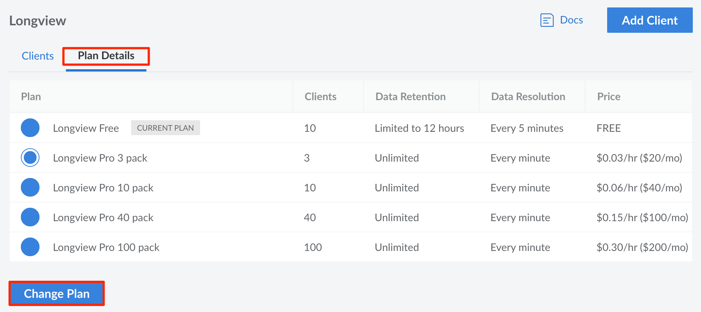


Currently, it is not possible to have both *Longview Free* and *Longview Pro* clients. If you have active Longview clients under the Longview Free plan tier, when you switch to a Longview Pro plan, all of your currently active clients will be counted towards your new Longview Pro plan's client count.


To change your plan level or to view all available Longview Pro plans, follow these steps:

1. Log in to the [Cloud Manager](https://cloud.linode.com/dashboard) and click on the **Longview** link in the sidebar.

1. Viewing the Longview Clients listing page, click on the **Plan Details** tab.

1. On the Longview Plan Details page, you can view all available Longview plans and verify the plan you are currently subscribed to.

1. If you would like to change your current plan, select your preferred plan and click on the **Change Plan** button. You will see the page update to denote your current Longview plan.


If you change your plan, your Longview Client data will temporarily be in a transitional state. Any irregularities in your displayed Longview data will clear up shortly.
