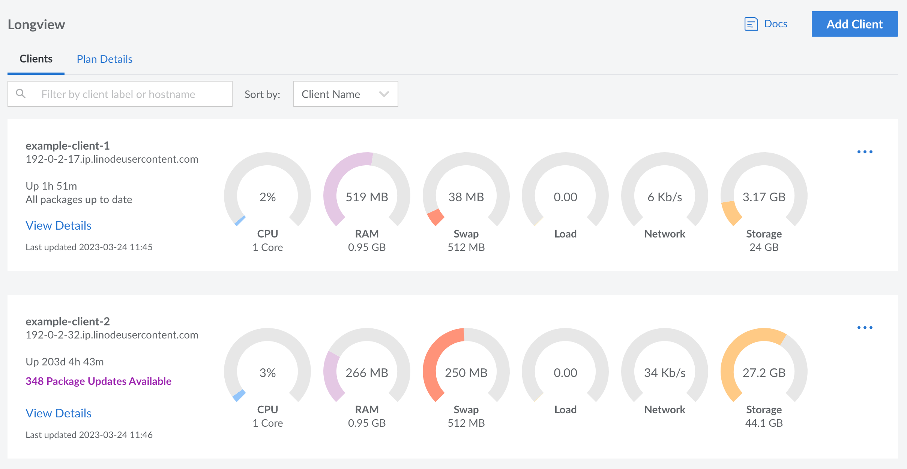
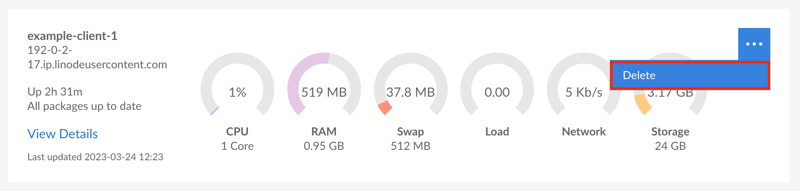

## View Longview Clients {#view-clients}

Log in to the [Linode Cloud Manager](https://cloud.linode.com/) and click the **Longview** link in the sidebar.



All existing Longview clients are displayed along with some basic system information and metrics, including:

- Hostname
- System uptime
- Available package updates
- Number of CPUs and CPU utilization
- Amount of system memory and memory utilization
- Amount of swap memory and swap utilization
- Average CPU load
- Network traffic
- Amount of disk space and disk utilization

## Create a New Longview Client {#create-client}

To start capturing metrics for one of your Compute Instances (or other Linux systems), you can create a new Longview Client instance and install the Longview Agent. See [Create a Longview Client and Install the Longview Agent](/docs/products/tools/longview/get-started/) for instructions.

## Delete a Longview Client {#delete-client}

1.  Log in to the [Linode Cloud Manager](https://cloud.linode.com/dashboard) and click on the **Longview** link in the sidebar.

1.  Click the **ellipsis** button corresponding to the Longview Client instance you'd like to remove and select **delete**.

    

1.  Next, SSH into the Compute Instance or Linux system that the Longview Client was monitoring.

    ```command
    ssh user@192.0.2.17
    ```

5.  Uninstall the Longview Agent by removing the `linode-longview` package.

    
    {}
```command
sudo apt-get remove linode-longview
```
    {}
    {}
```command
sudo yum remove linode-longview
```
    {}
    {}
```command
sudo rm -rf /opt/linode/longview
```
    {}
    