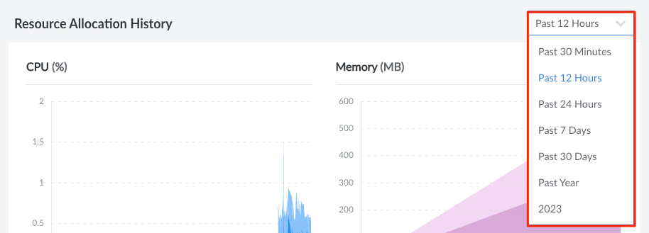
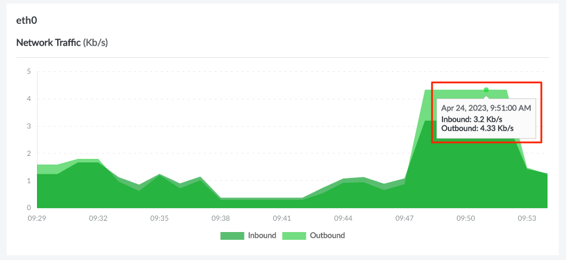
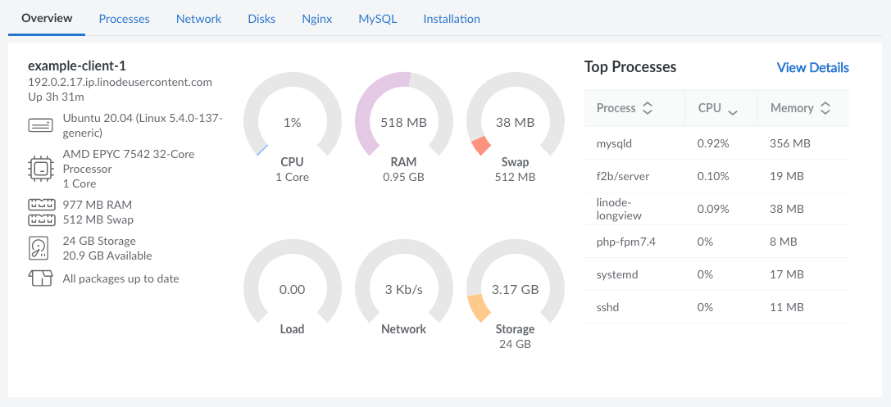
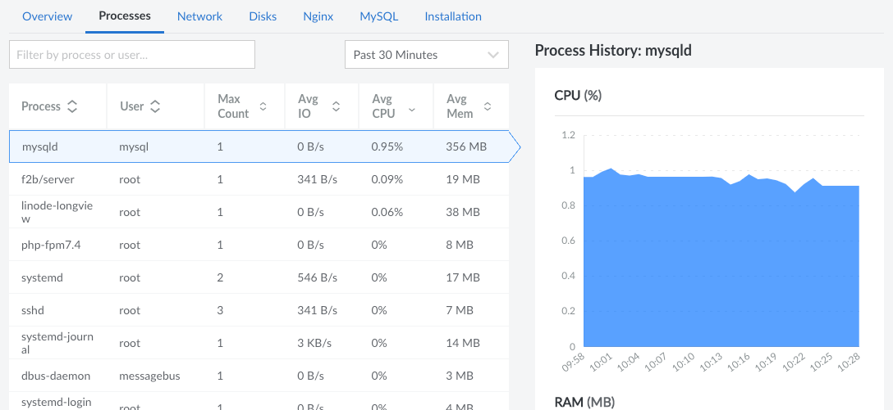
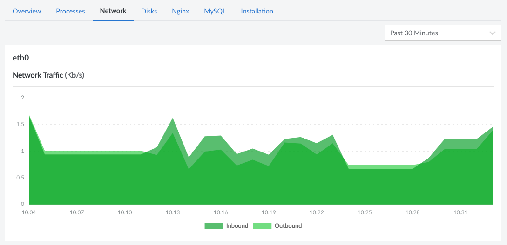
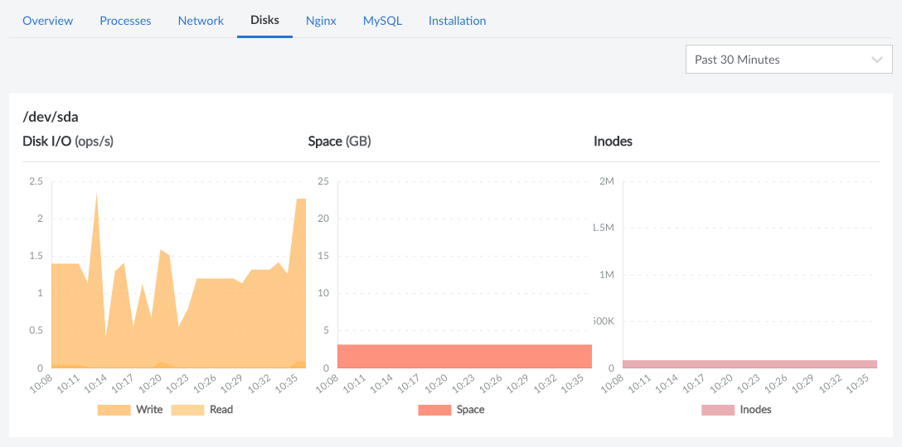
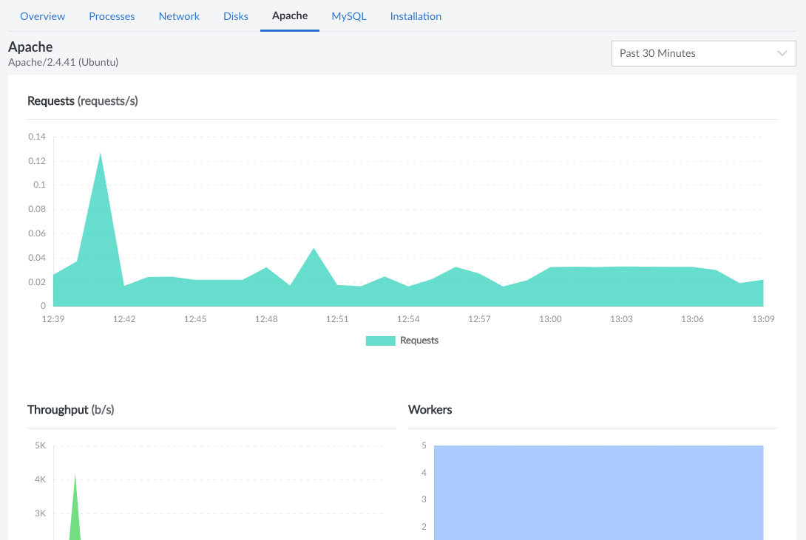
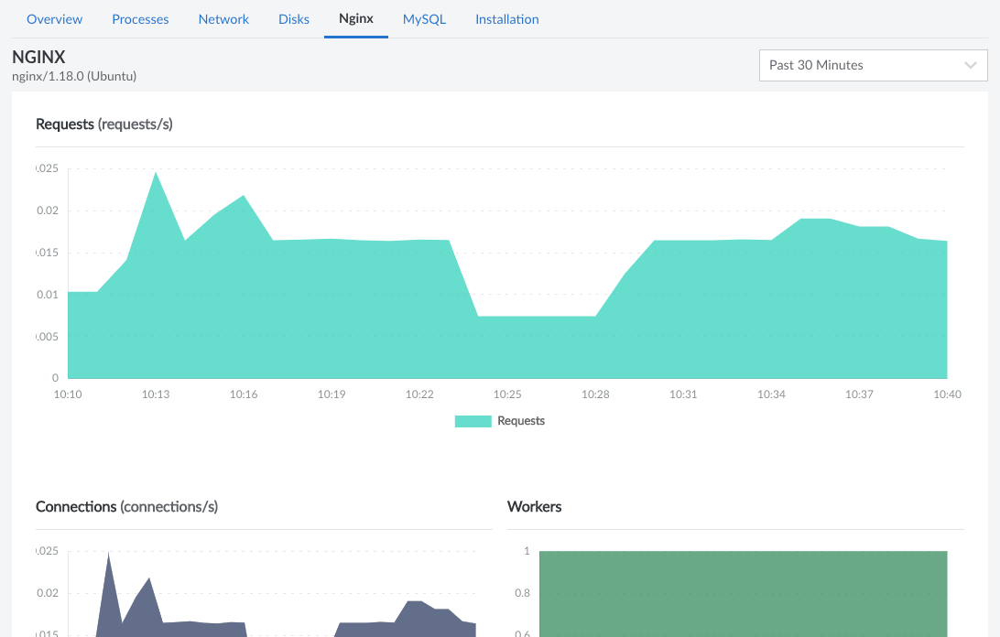
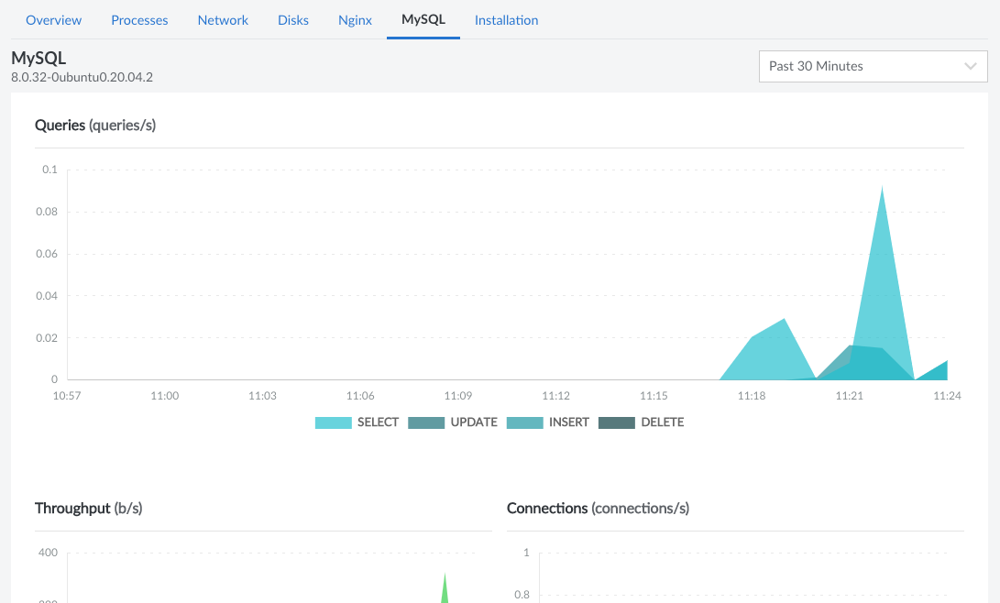

This guide provides an overview of the data and graphs available to you after successfully installing Longview on a Compute Instance or other Linux system.

## Access your Longview Client Metrics

1. To view a Longview Client's detailed graphs and metrics, log in to the [Cloud Manager](https://cloud.linode.com/) and click on the **Longview** link in the sidebar.

1. On the Longview Clients listing page, click on the **View Details** button corresponding to the client whose system statistics you'd like to view. This displays the information and metrics for the corresponding system. From here, you can select from the following tabs to view specific metrics:

    - [Overview](#overview)
    - [Processes](#processes)
    - [Network](#network)
    - [Disks](#disks)
    - [Apache (optional)](#apache)
    - [NGINX (optional)](#nginx)
    - [MySQL (optional)](#mysql)


If your Compute Instance has NGINX, Apache, or MySQL installed *and* your Longview Agent has been configured for this software, you will see a corresponding tab appear containing related system data.


## Change the Timeframe

For all graphs and most other metrics, you can change the timeframe of the data that's shown. By default, 12 hours of historical data is visible. You can change this to a smaller timeframe or, if using Longview Pro, to a larger timeframe.


The graphs only show data captured *after* the Longview Agent was installed on the system.


## View Data Points on Graphs

When viewing graphs in the Cloud Manager, you can hover over data points in the x-axis to view specific metrics for that data point.

## Overview

The Overview tab shows all of your system’s most important statistics in one place and includes the following sections:

- **System Overview:** This section includes information about your system hardware, basic resource utilization charts, and the top 6 processes running on your system (sorted by CPU utilization by default).
- **Resource Allocation History:** Detailed graphs of system resource utilization.
- **Listening Services:** A list of all services that are listening on a system port. This includes the corresponding process, the user, the protocol of the service, and the IP address that's being used.
- **Active Connections:** A list of all active connections, including the name of the service, the user, and the number of connections for that service.

## Processes

The Processes tab lists all running processes currently on your system, along with additional statistics including the UID of the user that has ownership of the process, the *Max Count* of duplicate processes, average I/O per process, average CPU percentage used per process, and average memory consumption per process. You can use the search bar above the list to filter the chart by the name of the process or the user that owns it.

When a process is selected, several graphs are displayed. These graphs show historical data for the process, including resource usage and the number instances for this process.

## Network

The Network tab gives you access to charts you can use to sort traffic analytics by network interface available on your system.

## Disks

The disks tab includes information on disk I/O, disk space usage, and [inode](https://en.wikipedia.org/wiki/Inode) usage over time.


Longview does not gather data on swap disks.


## Apache

The Apache tab is visible when Apache is installed on your system *and* the Longview Agent has been properly configured to interface with Apache. The Apache software version is displayed at the top of the page. Underneath that, there are graphs for the number of incoming requests, the throughout, and the number of workers. This page also shows resource utilization graphs for the Apache processes, including the CPU usage, RAM usage, and disk I/O.

## NGINX

This tab is only displayed when NGINX is installed on your system *and* the Longview Agent has been configured to observe NGINX. It shows the software version as well as the number of requests, connections, and workers. This page also displays the resource utilization for the NGINX processes, including the CPU usage, RAM usage, and disk I/O.

## MySQL

The MySQL tab is only displayed when MySQL is installed on your system *and* the Longview Agent has been configured to observe MySQL. Along with the software version, this page also displays the number of queries (broken down by SELECT, UPDATE, INSERT, and DELETE), the throughput, the number of connections, the number of slow queries, and the number of aborted queries. Further down the page is the resource utilization for the MySQL processes, including the CPU usage, RAM usage, and disk I/O.

