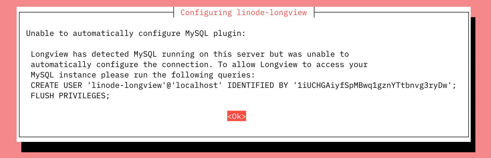
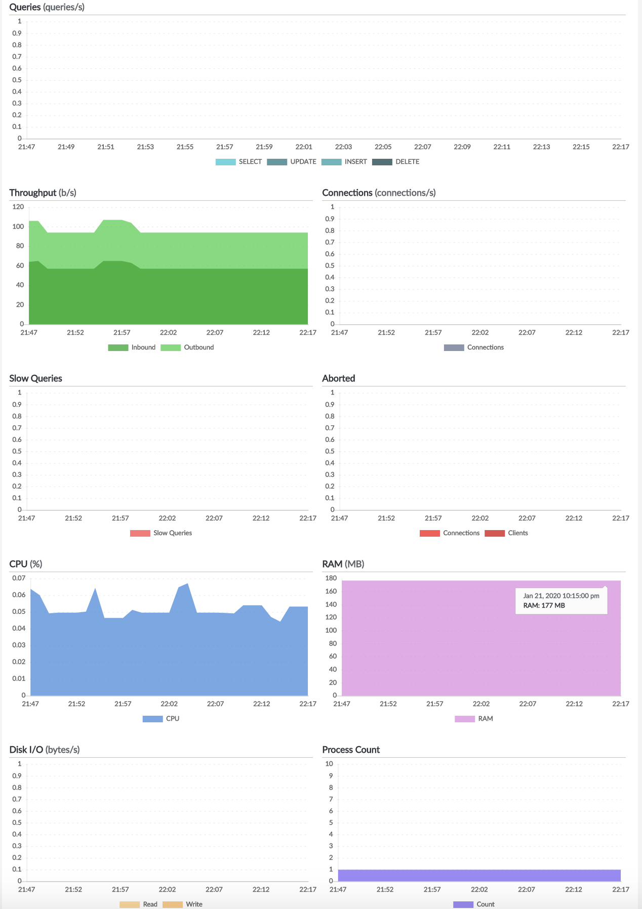

In addition to capturing general system metrics, Longview can also be used to capture metrics for MySQL. The MySQL tab appears in the Cloud Manager when Longview detects that you have MySQL installed on your system. It can help you keep track of MySQL's queries, system resource consumption, and other information.


In order to use Longview to capture data for MySQL, you must have the Longview Agent successfully installed on the system you wish to monitor. See [Create a Longview Client and Install the Longview Agent](/docs/products/tools/longview/get-started/).


## In this Guide:

This guide covers using Longview with MySQL and includes the following topics:

- [Configuring Longview for MySQL](#configure-longview).
- [Interacting with the MySQL data provided by Longview in the Cloud Manager](#view-metrics).
- [Troubleshooting Longview for MySQL](#troubleshooting).

## Configure Longview with MySQL {#configure-longview}

### Automatic Configuration

*These instructions are compatible only with Debian and Ubuntu and do not work on CentOS.*

If MySQL is installed and running when you install the Longview agent, Longview should automatically configure itself for MySQL. If you install MySQL *after* setting up the Longview agent, you can perform the steps below to configure Longview with any available software integrations (Apache, NGINX, and MySQL). Any existing Longview data is not affected and will remain accessible.

1. [SSH into the Compute Instance](/docs/products/compute/compute-instances/guides/set-up-and-secure/#connect-to-the-instance) you are monitoring with Longview.

1. Ensure that MySQL is running.

    ```command
    sudo systemctl status mysql
    ```

1. Run the automatic Longview configuration command on your system:

    ```command
    dpkg-reconfigure -phigh linode-longview
    ```

    On many systems, Longview should be able to configure itself automatically. If this is the case, your output should be similar to the following:

    ```output
    Checking MySQL configuration...
    Successfully connected to MySQL
    ```

    Once you see this successful message, the Longview should automatically start collecting MySQL data. Refresh Longview in the Cloud Manager to start viewing your MySQL metrics for your Longview Client instance.

    
    Unless you already have a specific Longview database user set up in the `/etc/linode/longview.d/MySQL.conf` file, Longview will locate and use the `debian-sys-maint` database user credentials if it can, located at `/etc/mysql/debian.cnf`.
    

    If you receive a failure message or the popup shown below, you should visit the [Troubleshooting](#troubleshooting) section at the end of this article.

    

### Manual Configuration

*These instructions work for all supported distributions, including Debian, Ubuntu, and CentOS.*

To enable the MySQL Longview integration manually, follow these steps on your system via SSH:


You cannot configure the location of a socket for the Longview client.


1. [SSH into the Compute Instance](/docs/products/compute/compute-instances/guides/set-up-and-secure/#connect-to-the-instance) you are monitoring with Longview.

1. Log into MySQL. For example, to log in as the root user:

    ```command
    sudo mysql -u root -p
    ```

1. Create a new MySQL user with minimal privileges for Longview. Run the following queries on your database as the root MySQL user to create the new user. Ensure your replace `*****************` with your desired password.

    ```command
    CREATE USER 'linode-longview'@'localhost' IDENTIFIED BY '***************';
    flush privileges;
    ```

1. Exit the MySQL:

    ```command
    exit
    ```

1. Edit `/etc/linode/longview.d/MySQL.conf` to include the same username and password you just added. It should look like the following:

    ```file {title="/etc/linode/longview.d/MySQL.conf" lang=aconf}
    username linode-longview
    password example_password
    ```

1. Restart Longview:

    ```command
    sudo systemctl restart longview
    ```

1. Refresh Longview in the Cloud Manager to verify that the MySQL tab is now present and collecting data for your Longview client instance.

You should now be able to see Longview data for MySQL. If that's not the case, proceed to the [Troubleshooting](#troubleshooting) section at the end of this article.

## View MySQL Metrics {#view-metrics}

1. Log in to the [Cloud Manager](https://cloud.linode.com/) and select the **Longview** link in the sidebar.

1. Locate the Longview Client you have configured for MySQL and click the corresponding **View details** link.

1. Select the **MySQL** tab.



You'll see the current version of MySQL listed on the upper left-hand corner.

Hover over a data point to see the exact numbers for that time. You can also zoom in on data points, or view older time periods with Longview Pro. For details, jump to this section in the main article about [navigating the Longview interface](/docs/guides/what-is-longview/#longview-s-data-explained). The next sections cover the Longview MySQL App in detail.

### Queries

The **Queries** graph shows the total number of select, update, insert, and delete queries MySQL handled at the selected time.

### Throughput

The **Throughput** graph shows the amount of data that MySQL sent and received at the time selected.

### Connections

The **Connections** graph shows all of the MySQL connections at the selected time.

### Slow Queries

The **Slow Queries** graph shows the number of slow MySQL queries at the selected time.

### Aborted

The **Aborted** graph shows the number of aborted MySQL connections and clients at the selected time.

### CPU

The **CPU** graph shows the percentage of your system's CPU being used by MySQL at the selected time. If you want to see the total CPU use instead, check the [Overview tab](/docs/guides/what-is-longview/#overview).

### RAM

The **RAM** graph shows the amount of RAM or memory being used by MySQL at the selected time. If you want to see your system's total memory use instead, check the [Overview tab](/docs/guides/what-is-longview/#overview).

### Disk IO

The **Disk IO** graph shows the amount of input to and output from the disk caused by MySQL at the selected time. To see the total IO instead, visit the [Disks tab](/docs/guides/what-is-longview/#disks).

### Process Count

The **Process Count** graph shows the total number of processes on your system spawned by MySQL at the selected time. If you want to see more details, and how this stacks up against the total number of processes on your system, see the [Processes tab](/docs/guides/what-is-longview/#processes).

## Troubleshooting

If you don't see Longview data for MySQL, you'll instead get an error on the page and instructions on how to fix it. As a general tip, you can check the `/var/log/linode/longview.log` file for errors as well.

### Unable to Automatically Configure MySQL Popup

If you run the [automatic Longview configuration tool](#debian-and-ubuntu-automatic-configuration), and get the popup message shown below:


This indicates that Longview can't locate any valid MySQL user credentials, so it will create some for itself (in the `/etc/linode/longview.d/MySQL.conf` file) and ask you to add them to MySQL. To finish getting Longview set up:

1. Copy the command shown in the popup message. You will need it for the next steps.

1. Log in to your database as the root MySQL user:

    ```command
    sudo mysql -u root -p
    ```

1. Run the query that was shown in the popup message to create the Longview user. Ensure you replace `*****************` with the password provided to you by the popup.

    ```command
    CREATE USER 'linode-longview'@'localhost' IDENTIFIED BY '***************';
    flush privileges;
    ```

    Refresh Longview in the Cloud Manager to verify that the MySQL tab is now present and collecting data for your Longview client instance.

If you've added the credentials to MySQL and it still doesn't work, double-check your MySQL installation, and then do a [manual configuration](#manual-configuration-all-distributions).

### Unable to Connect to the Database, No Credentials Found

-  You may receive this error:

    ```output
    Unable to connect to the database, no credentials found.
    ```

    This indicates that you need to add a MySQL user for Longview, and make sure the Longview configuration file has the appropriate credentials. See the [manual configuration](#manual-configuration-all-distributions) section for details.

-  You may also encounter this error message:

    ```output
    Unable to connect to the database: Authentication plugin 'sha256_password' cannot be loaded: /usr/lib/x86_64-linux-gnu/mariadb18/plugin/sha256_password.so: cannot open shared object file: No such file or directory.
    ```

    If this is the case, follow the above instructions for [manual configuration](#manual-configuration-all-distributions).

### Unable to Connect to the Database

This error will state `Unable to connect to the database:` and then specify a reason. An incorrect password is one example of something that can generate this type of error. The list of errors that could cause this issue is pretty long, so you may want to reference the [MySQL documentation](https://dev.mysql.com/doc/) if you need help understanding a specific error message.

### Unable to Collect MySQL Status Information

If you receive the error `Unable to collect MySQL status information`, this indicates that Longview was able to connect to the MySQL database, but the query it uses to collect statistics has failed. This could occur if the database crashes while the query is being executed. The specific reason that it failed will be listed with the error. If the problem persists, contact Linode [support](/docs/products/platform/get-started/guides/support/).

### MySQL Tab is Missing

If the Longview MySQL tab is missing entirely, this indicates that MySQL is either not installed, or has stopped. If you restart MySQL, you will be able to see the tab again and view all of your old data.