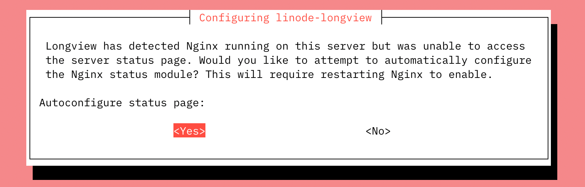
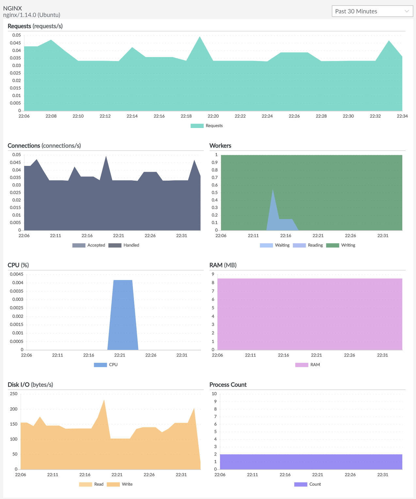

In addition to capturing general system metrics, Longview can also be used to capture metrics for NGINX. The NGINX tab appears in the Cloud Manager when Longview detects that you have NGINX installed on your system. It can help you keep track of NGINX workers, requests, system resource consumption, and other information.


In order to use Longview to capture data for NGIXN, you must have the Longview Agent successfully installed on the system you wish to monitor. See [Create a Longview Client and Install the Longview Agent](/docs/products/tools/longview/get-started/).


## In this Guide

This guide covers using Longview with NGINX and includes the following topics:

- [Configuring Linode Longview for NGINX](#configure-longview).
- [Interacting with the NGINX data provided by Longview in the Cloud Manager](#view-metrics).
- [Troubleshooting Linode Longview for NGINX](#troubleshooting).

## Configure Longview for NGINX {#configure-longview}

### Automatic Configuration

*These instructions are compatible only with Debian and Ubuntu and do not work on CentOS.*

If NGINX is installed and running when you install the Longview agent, Longview should automatically configure itself for NGINX. If you install NGINX *after* setting up the Longview agent, you can perform the steps below to configure Longview with any available software integrations (Apache, NGINX, and MySQL). Any existing Longview data is not affected and will remain accessible.

1. [SSH into the Compute Instance](/docs/products/compute/compute-instances/guides/set-up-and-secure/#connect-to-the-instance) you are monitoring with Longview.

1. Ensure that NGINX is running.

    ```command
    sudo systemctl status NGINX
    ```

1. Run the automatic Longview configuration command.

    ```command
    dpkg-reconfigure -phigh linode-longview
    ```

    For many systems, Longview should be able to configure itself automatically. If this is the case, your output should be similar to the following:

    ```output
    Checking Nginx configuration...
    Found nginx status page at http://127.0.0.2/nginx_status specified in /etc/linode/longview.d/Nginx.conf
    ```

    If this output appears, Longview is configured and you can skip to the last step.

1. If Longview can't locate the NGINX status page, a prompt may appear. This could indicate that the status page is in an unusual and unspecified location, or that the status module isn't enabled, or that NGINX itself is misconfigured.

    

    Select one of the options:

    - **No**: The configuration tool exits and you can perform a [manual configuration](#manual-configuration). This may be safer if you have a delicate NGINX setup.

    - **Yes**: The configuration tool attempts to enable the status module, set the status page location in a new vhost configuration file, and restart NGINX. This option is easier, but has the potential to disrupt your current NGINX configuration. If you choose yes, and the configuration is successful, you should see output similar to the following:

        ```output
        [ ok ] Stopping Longview Agent: longview.
        Checking Nginx configuration...
        Restarting nginx: nginx.
        Finished configuring nginx, writing new configuration to /etc/linode/longview.d/Nginx.conf
        [ ok ] Starting Longview Agent: longview.
        update-rc.d: using dependency based boot sequencing
        ```

        
        The automatic configuration sets the status page location to `http://127.0.0.2/nginx_status`.
        

1. Refresh Longview in the Cloud Manager to verify that the NGINX tab is now present and collecting data for your Longview client instance.

    If instead you received a failure message similar to the output example, double-check your NGINX installation and then perform a [manual configuration](#manual-configuration). You can also visit the [Troubleshooting](#troubleshooting) section at the end of this guide.

    ```output
    [FAIL] Reloading web server config: nginx failed!
    ```

### Manual Configuration

*These instructions work for all supported distributions, including Debian, Ubuntu, and CentOS.*

To enable the NGINX Longview integration manually, follow these steps on your system via SSH:

1. [SSH into the Compute Instance](/docs/products/compute/compute-instances/guides/set-up-and-secure/#connect-to-the-instance) you are monitoring with Longview.

1. Add the following lines to your NGINX configuration to enable the status module and set the location of the status page. The lines should be placed within your main configuration file's `http` block (`/etc/nginx/nginx.conf`) or in a separate [site configuration file](/docs/guides/getting-started-with-nginx-part-2-advanced-configuration/#host-multiple-websites).

    ```file {title="/etc/nginx/nginx.conf"}
    server {
        listen 127.0.0.1:80;
        server_name 127.0.0.1;
        location /nginx_status {
            stub_status on;
            allow 127.0.0.1;
            deny all;
        }
    }
    ```

1. Restart NGINX:

    ```command
    sudo systemctl restart nginx
    ```

1.  Edit the Longview configuration file for NGINX (`/etc/linode/longview.d/Nginx.conf`) so that it includes the following line. If this line is commented out, you can uncomment it.

    ```file {title="/etc/linode/longview.d/Nginx.conf"}
    location http://127.0.0.1/nginx_status
    ```

1.  Restart Longview:

    ```command
    sudo systemctl restart longview
    ```

1. Refresh Longview in the Cloud Manager to verify that the NGINX tab is now present and collecting data for your Longview client instance.

You should now be able to see Longview data for NGINX. If that's not the case, proceed to the [Troubleshooting](#troubleshooting) section at the end of this article.

## View NGINX Metrics {#view-metrics}

1. Log in to the [Cloud Manager](https://cloud.linode.com/) and select the **Longview** link in the sidebar.

1. Locate the Longview Client you have configured for NGINX and click the corresponding **View details** link.

1. Select the **NGINX** tab.

    

    You'll see the current version of NGINX listed on the upper left-hand side of the page.

    Mouse over a data point to see the exact numbers for that time. With [Longview Pro](/docs/guides/linode-longview-pricing-and-plans/), you can view older time periods for your data. The next sections cover the Longview Nginx App in detail.

### Requests

The **Requests** graph shows the total number of requests NGINX handled at the selected time. This is every HTTP and HTTPS request to your system.

### Connections

The **Connections** graph shows the amount of data that NGINX accepted and handled via web requests at the time selected.

### Workers

The **Workers** graph shows all of the NGINX workers at the selected time. The workers are broken down by state:

-   Waiting
-   Reading
-   Writing

### CPU

The **CPU** graph shows the percentage of your system's CPU being used by NGINX at the selected time. If you want to see the total CPU use instead, check the [Overview tab](/docs/guides/what-is-longview/#overview).

### RAM

The **RAM** graph shows the amount of RAM or memory being used by NGINX at the selected time. If you want to see your system's total memory use instead, check the [Overview tab](/docs/guides/what-is-longview/#overview).

### Disk IO

The **Disk IO** graph shows the amount of input to and output from the disk caused by NGINX at the selected time. To see the total IO instead, visit the [Disks tab](/docs/guides/what-is-longview/#disks).

### Process Count

The **Process Count** graph shows the total number of processes on your system spawned by NGINX at the selected time. If you want to see more details, and how this stacks up against the total number of processes on your system, see the [Processes tab](/docs/guides/what-is-longview/#processes).

## Troubleshooting

If you don't see Longview data for Nginx, you'll instead get an error on the page and instructions on how to fix it. As a general tip, you can check the `/var/log/linode/longview.log` file for errors as well.

### Unable to Access Server Status Page for NGINX

The error will state `Unable to access server status page (http://example.com/example) for Nginx: <error>`. This error occurs when NGINX's status setting is disabled or has been changed from the default location.


This error occurs when Longview attempts to check the status page `location` listed in `/etc/linode/longview.d/Nginx.conf`, or the default page at `http://127.0.0.1/nginx_status`, but receives a non-200 HTTP response code. Basically, it means that the status page Longview is checking doesn't exist.


To fix this, follow these steps:

1. Make sure NGINX is running:

    ```command
    sudo systemctl restart nginx
    ```

1. Check the status page location, and make sure it's available over Port 80. The default location Longview checks is `http://127.0.0.1/nginx_status` on localhost, but NGINX doesn't typically have a status page location set up by default. In the NGINX configuration file (typically `/etc/nginx/nginx.conf`) or in a [separate site configuration file](/docs/guides/getting-started-with-nginx-part-2-advanced-configuration/#host-multiple-websites), this is designated with the lines in the example file below. If your configuration file does not contain these lines, add them to the file within the `http` block. For more details, see the [Manual Configuration](/docs/guides/what-is-the-linode-longview-app-for-nginx/#manual-configuration-all-distributions) section of this guide.

    ```file {title="/etc/nginx/nginx.conf"}
    server {
        listen 127.0.0.1:80;
        server_name 127.0.0.1;
        location /nginx_status {
            stub_status on;
            allow 127.0.0.1;
            deny all;
        }
    }
    ```

1. Longview is designed to check the default location automatically. If you use the default location shown above, you should be done. Refresh Longview in the Cloud Manager to verify that the NGINX tab is now present and collecting data for your Longview client instance.

1. If you're not using the default location, you need to create a new file, `/etc/linode/longview.d/Nginx.conf`, and set the `location` variable to match what you set in the NGINX configuration file:

    ```file {title="/etc/linode/longview.d/Nginx.conf"}
    location http://127.0.0.1/url-goes-here
    ```

1. Restart Longview:

    ```command
    sudo systemctl restart nginx
    ```

1. Refresh Longview in the Cloud Manager to verify that the NGINX tab is now present and collecting data for your Longview client instance.


If you originally compiled NGINX without the status module, you will need to recompile it with `--with-http_stub_status_module` and all your other settings. Then go back and try to enable the Longview Nginx App.


### The NGINX Status Page Doesn't Look Right

The error will state `The Nginx status page doesn't look right. Check <http://example.com/example> and investigate any redirects for misconfiguration.` This error occurs when Longview is able to reach the status page, but doesn't receive the expected content.


This error occurs when Longview attempts to check the status page, and receives a 200 HTTP response code, but can't scrape the expected status content from the page. That is, the page exists on your system, but it doesn't have the right content. If, for example, Longview was to check your website's home page, you would get this error.


To resolve this issue, follow these steps:

1. Visit the URL shown in the error. See if it directs or redirects you to a page that isn't the NGINX status page.

1. Update your NGINX and Longview settings so that they specify the same status page location:

    -   The **server_name** and **location** lines in your NGINX configuration file. See the [Manual Configuration](#manual-configuration-all-distributions) section for more details.
    -   The **location** line in `/etc/linode/longview.d/Nginx.conf`

    If the location line isn't set in `/etc/linode/longview.d/Nginx.conf`, Longview will check the default location of `http://127.0.0.1/nginx_status` on localhost.

1. Make sure there aren't any NGINX redirects or other settings that are affecting this page.

1. Restart Longview:

    ```command
    sudo systemctl restart longview
    ```

1. Refresh Longview in the Cloud Manager to verify that the NGINX tab is now present and collecting data for your Longview client instance.

### NGINX Tab is Missing

If the Longview Nginx tab is missing entirely, this indicates that NGINX is either not installed, or has stopped. If you restart NGINX, you will be able to see the tab again and view all of your old data.