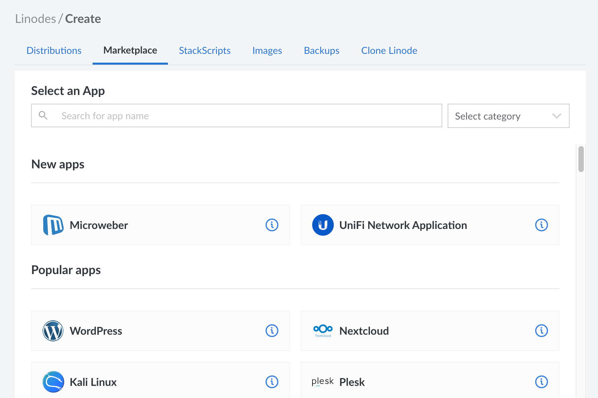

The Linode Marketplace enables users to quickly deploy software applications to a Linode Compute Instance without the hassle of using the command line.

## Deploy a Marketplace App

When a Marketplace App is deployed, a new Compute Instance is created and the appropriate software is installed with the settings you provide. Marketplace Apps do not install software to already-existing instances in your account.

1. Log in to the [Cloud Manager](https://cloud.linode.com) and select the **Marketplace** link from the left navigation menu. This displays the Linode **Create** page with the **Marketplace** tab pre-selected.

1. Under the **Select App** section, select the app you would like to deploy. Click on the info icon (**i**) to open the details panel for that app and learn more about the included software. Within the panel, there is also a link to the corresponding guide where you can learn how to deploy and access that Marketplace App.

    

1. Complete the form by following the steps and advice within the [Creating a Compute Instance](/docs/guides/creating-a-compute-instance/) guide. Depending on the Marketplace App you selected, there may be additional configuration options available. See the guide that corresponds with your selected App for compatible distributions, recommended plans, and any additional configuration options available.

1. Click the **Create Linode** button. Once the Compute Instance has been provisioned and has fully powered on, **wait for the software installation to complete**. If the instance is powered off or restarted before this time, the software installation will likely fail. To verify that the app has been fully installed, see the [Verify Installation](#verify-installation) section below.

1. Follow the instructions within the guide that corresponds with your Marketplace App to access the application and start using it.

## Verify Installation

Since software for a Marketplace App is installed *after* a Linode Compute Instance has been provisioned, you need to wait for the installation to complete before you can start using the App. For most Marketplace Apps, the installation can be verified using the instructions below. Some Marketplace Apps have different instructions. For those, see the guide that corresponds with that App.

-   **Attempt to access the app:** Each Marketplace App has an estimated deployment time range (such as 5-10 minutes). It's recommended that you attempt to access your application after this time has elapsed. If you can successfully access it, the installation has completed successfully.

-   **Lish console:** Open the [Lish console](/docs/guides/using-the-lish-console/) and follow along with the installation script. Once the *"Installation Complete!"* notice appears, the install is finished.

-   **Log file:** The same *"Installation Complete!"* notice should also appear at the end of the installation's log file, which you can view by logging in to your instance through [SSH](/docs/guides/connect-to-server-over-ssh/) or [Lish](/docs/guides/using-the-lish-console/) and running:

        grep 'Installation complete!' /var/log/stackscript.log

    If you receive output matching that string, the Marketplace App has finished installing.

## Access the App

Since each Marketplace App installs different software with different functions, the instructions for accessing an App can vary greatly. In some cases, the App deploys a webpage or admin panel that's accessible over a web browser. In other cases, you may need to log in to your instance through [SSH](/docs/guides/connect-to-server-over-ssh/) or [Lish](/docs/guides/using-the-lish-console/) and navigate to the software directory. To learn how to access the App that you deployed, review the guide that corresponds with your Marketplace App.

## Add a Custom Domain

For websites like WordPress, WooCommerce, and Drupal, it may be desirable to have a domain name associated with your app. Otherwise, your app is only accessible through the instance's IP address or rDNS value.

For information on how to add a domain name to your app, visit our [DNS Manager](/docs/guides/dns-manager/) guide. Specifically, you should [set up an *A record*](/docs/guides/dns-manager/#add-dns-records) and assign your IP address to it. For more general information about how DNS works, review the [DNS Records: An Introduction](/docs/guides/dns-records-an-introduction/) guide.
