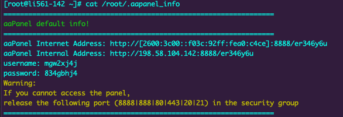
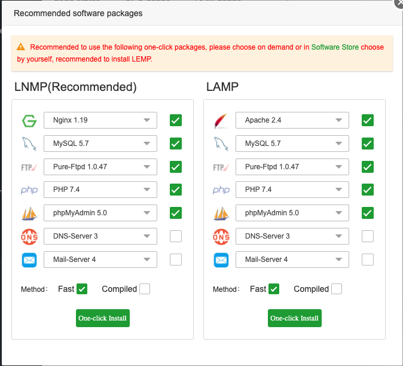

[aaPanel](https://www.aapanel.com/) is a free and open source web hosting control panel. It allows you to manage the server's web server, websites, databases, FTP, and more through a simple web-based interface. Through aaPanel, you can quickly install a LEMP (NGINX) or LAMP (Apache) stack on your server and start hosting your websites.

## Deploying a Marketplace App






**Estimated deployment time:** aaPanel should be fully installed within 5-10 minutes after the Compute Instance has finished provisioning.


## Configuration Options

- **Supported distributions:** CentOS 7
- **Recommended plan:** All plan types and sizes can be used.

## Getting Started after Deployment

### Access your aaPanel App

1.  Log in to your instance through [SSH](/docs/guides/connect-to-server-over-ssh/) or [Lish](/docs/products/compute/compute-instances/guides/lish/).

2.  Run the following command to obtain your login information for your aaPanel dashboard:

        cat /root/.aapanel_info

    

3.  Once you visit the URL and enter the login credentials you will be prompted to choose which One-Click services (LAMP/LNMP) you would like to install:

    

Now that you’ve accessed your dashboard, checkout [the official aaPanel documentation](https://doc.aapanel.com/) to learn how to further configure your instance.

