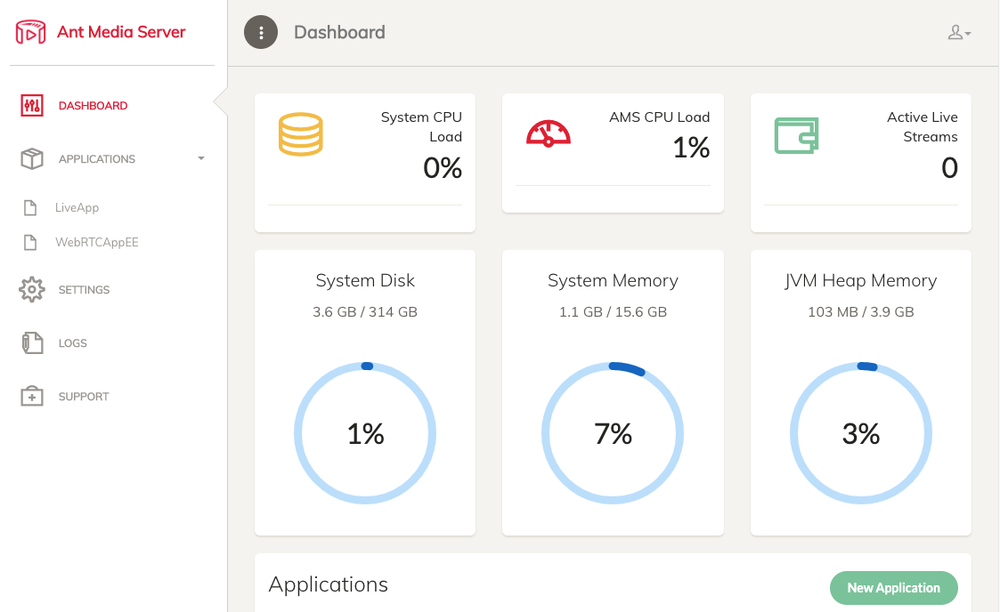
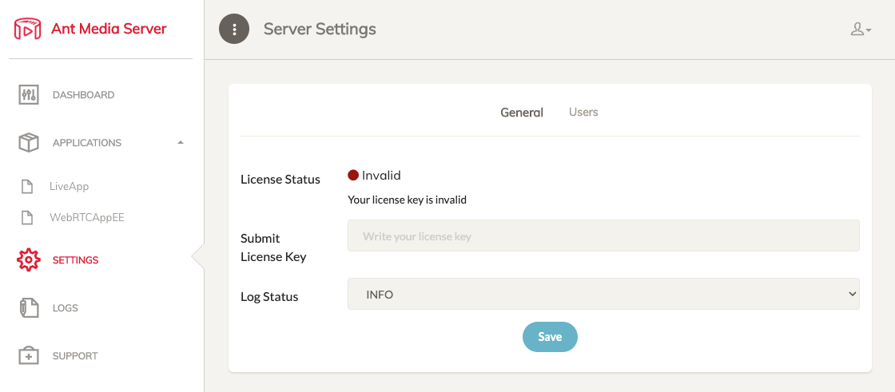

[Ant Media Server](https://antmedia.io/) is an [open source](https://github.com/ant-media/Ant-Media-Server) video streaming platform known for its scalability and low latency. It supports WebRTC live streaming, as well as CMAF and HLS streaming, and can be ingested through RTMP, WebRTC, or HLS. There are two editions of Ant Media Server: Community Edition and Enterprise Edition. This Marketplace App installs the Enterprise Edition, which is equipped with more features and enhanced performance. See this [Comparison Chart](https://github.com/ant-media/Ant-Media-Server/wiki#community-edition--enterprise-edition) for details.


The Enterprise Edition of Ant Media Server requires a valid license to use the software beyond the initial 14 day [free trial](https://antmedia.io/free-trial/) period. To purchase a license, visit [Ant Media's website](https://antmedia.io/#selfhosted) and select a plan that fits your needs. Licenses are not available directly through Linode. Alternatively, you can deploy the free [Ant Media Server Community Edition Marketplace App](/docs/products/tools/marketplace/guides/antmediaserver/).


## Deploying a Marketplace App






**Estimated deployment time:** Ant Media Enterprise Server should be fully installed within 5-10 minutes after the Compute Instance has finished provisioning.


## Configuration Options

- **Supported distributions:** Ubuntu 20.04 LTS
- **Recommended plan:** 16GB Dedicated CPU Instance

## Getting Started after Deployment

### Access the Ant Media Server Dashboard

1.  Open your web browser and navigate to `http://[ip-address]:5080`, replacing *[ip-address]* with your Compute Instance's IPv4 address. See the [Managing IP Addresses](/docs/products/compute/compute-instances/guides/manage-ip-addresses/) guide for information on viewing your IP address.

1.  The **Create First Account** screen appears. Fill out your full name and enter your desired username and password. Then click **Create Account**.

    

1. After your account has been created, the login page appears. Enter the username and password that you just created.

1. Once logged in, the Ant Media Server Dashboard appears. From here, you can manage your entire application.

    

1. To start using the Enterprise Edition of Ant Media Server, you need to obtain a license. Visit the [Self-Hosted Solutions](https://antmedia.io/#selfhosted) page on Ant Media's website to order a license.

1. Once the license key is obtained, navigate to the Settings tab within the Ant Media Dashboard, enter the License Key, and click save.

    

For more on Ant Media Server, check out the following resources:

- [Ant Media Server wiki](https://github.com/ant-media/Ant-Media-Server/wiki)
- [Publishing a Live Stream](https://github.com/ant-media/Ant-Media-Server/wiki/Publishing-Live-Streams)

