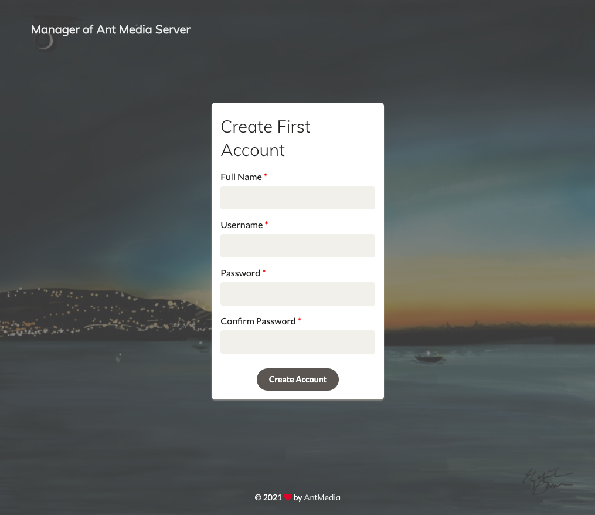

Ant Media Server is Highly Scalable Live Video Streaming Platform with Ultra Low Latency. It supports WebRTC Live Streaming, in addition to CMAF and HLS streaming. It can be ingested through RTMP or WebRTC or HLS. Any IP Camera can be connected through RTSP or ONVIF. It also enables Live Restreaming to Social Media Platforms. All codes H.264, H.265, VP8 are enabled and also GPU based encoding is also available.

* Ultra Low Latency
* One-to-Many WebRTC Streaming
* End-to-End Latency	8-12 Seconds	0.5 Seconds (500ms)
* CMAF
* Scaling
* RTMP(Ingesting) to WebRTC (Playing)
* Hardware Encoding(Nvidia GPU, QuickSync)
* WebRTC Data Channel
* Adaptive Bitrate
* Secure Streaming
* iOS & Android RTMP SDK	
* iOS & Android WebRTC SDK
* VP8 and H.265 Support
* JavaScript SDK	
* RTMP, RTSP, MP4 and HLS Support	
* WebRTC to RTMP Adapter	
* 360 Degree Live & VoD Streams	
* Web Management Dashboard	
* IP Camera Support	
* Re-stream Remote Streams
* Open Source
* Simulcast to all Social Media via RTMP

## Deploying the Ant Media Server Marketplace App



**Software installation should complete within 2-5 minutes after the Linode has finished provisioning.**

### Configuration Options

For advice on filling out the remaining options on the **Create a Linode** form, see [Creating a Compute Instance](/docs/guides/creating-a-compute-instance/). That said, some options may be limited or recommended based on this Marketplace App:

- **Supported distributions:** Ubuntu 20.04 LTS
- **Recommended plan:** 16GB Dedicated CPU Instance.

## Getting Started after Deployment

### Access your Ant Media Server App
After Ant Media Server has finished installing, you can access your server with your Linode's IPv4 address. Copy your Linode’s IPv4 address from the [Linode Cloud Manager](https://cloud.linode.com), and then connect to the server from your browser using your Linode's IPv4 address and port `5080`(for example `192.0.2.0:5080`).

Once you are logged into your Ant Media Server, you will need to obtain a license in order to fully utilize the application. To obtain a license you can visit the link below where you can choose which plan you'd like to utilize:

https://antmedia.io/#selfhosted

Once the license key is obtained, you can go to the Settings tab within the Ant Media Dashboard and enter the License Key and click save.

    

For more on Ant Media Server, check out the following resources:

- [Ant Media Server wiki](https://github.com/ant-media/Ant-Media-Server/wiki)
- [Publishing a Live Stream](https://github.com/ant-media/Ant-Media-Server/wiki/Publishing-Live-Streams)

