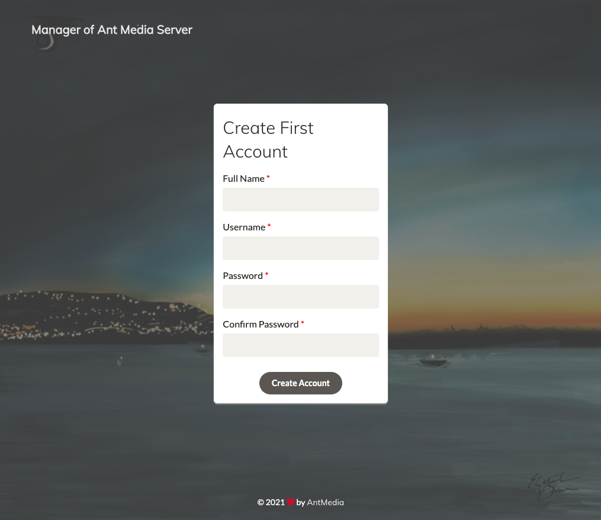

[Ant Media Server](https://antmedia.io/) is an [open source](https://github.com/ant-media/Ant-Media-Server) video streaming platform known for its scalability and low latency. It supports WebRTC live streaming, as well as CMAF and HLS streaming, and can be ingested through RTMP, WebRTC, or HLS. There are two editions of Ant Media Server: Community Edition and Enterprise Edition. This Marketplace App installs the Community Edition.

The Community Edition is a limited version of Ant Media Server Enterprise Edition and supports the following features.

- Publish live streams with WebRTC, RTMP - Play Live and VoD streams with RTMP and HLS
- RTMP, RTSP, MP4 and HLS Support
- WebRTC to RTMP Adapter
- 360 Degree Live & VoD Streams
- Web Management Dashboard
- IP Camera Support
- Re-stream Remote Streams (IPTV)
- Open Source https://github.com/ant-media/Ant-Media-Server
- Simulcasting to Periscope
- Your Live or VoD streams can play anywhere including mobile(Android, iOS) browsers.

If you need adaptive streaming, cluster, load balancer, and hardware encoding, consider using the [Enterprise Edition](/docs/products/tools/marketplace/guides/antmediaenterpriseserver/).

## Deploying a Marketplace App






**Estimated deployment time:** Ant Media Server should be fully installed within 2-5 minutes after the Compute Instance has finished provisioning.


### Configuration Options

- **Supported distributions:** Ubuntu 20.04 LTS
- **Recommended plan:** 8GB Dedicated CPU Instance or higher

## Getting Started after Deployment

### Access your Ant Media Server App

1.  Open your web browser and navigate to `http://[ip-address]:5080`, replacing *[ip-address]* with your Compute Instance's IPv4 address. See the [Managing IP Addresses](/docs/products/compute/compute-instances/guides/manage-ip-addresses/) guide for information on viewing your IP address.

1.  The **Create First Account** screen appears. Complete this form and click **Create Account**.

    

For more on Ant Media Server, check out the following resources:

- [Ant Media Server wiki](https://github.com/ant-media/Ant-Media-Server/wiki)
- [Publishing a Live Stream](https://github.com/ant-media/Ant-Media-Server/wiki/Publishing-Live-Streams)

