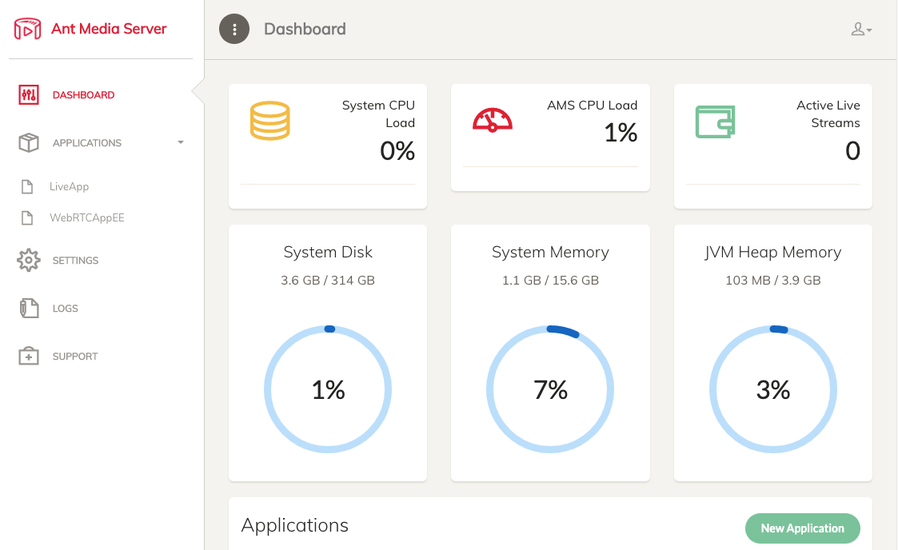
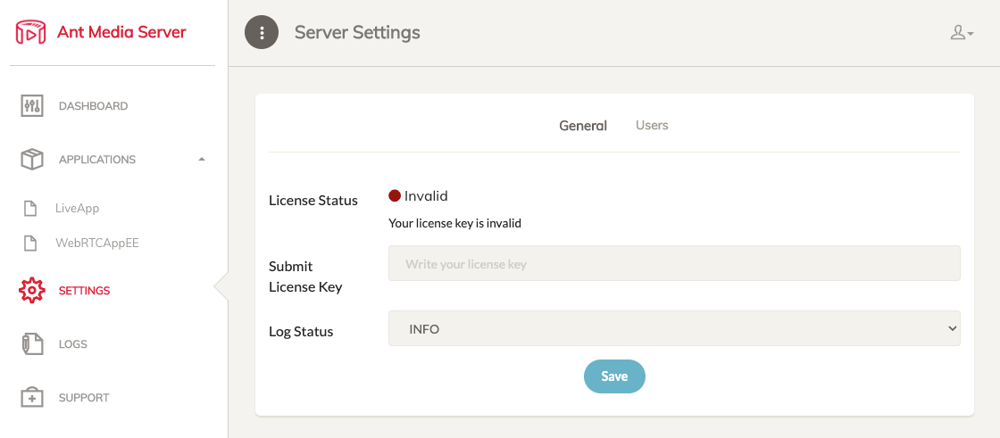

[Ant Media Server](https://antmedia.io/) is an [open source](https://github.com/ant-media/Ant-Media-Server) video streaming platform known for its scalability and low latency. It supports WebRTC live streaming, as well as CMAF and HLS streaming, and can be ingested through RTMP, WebRTC, or HLS. There are two editions of Ant Media Server: Community Edition and Enterprise Edition. This Marketplace App installs the Community Edition.

The Community Edition is a limited version of Ant Media Server Enterprise Edition and supports the following features.

- Publish live streams with WebRTC, RTMP - Play Live and VoD streams with RTMP and HLS
- RTMP, RTSP, MP4 and HLS Support
- WebRTC to RTMP Adapter
- 360 Degree Live & VoD Streams
- Web Management Dashboard
- IP Camera Support
- Re-stream Remote Streams (IPTV)
- Open Source https://github.com/ant-media/Ant-Media-Server
- Simulcasting to Periscope
- Your Live or VoD streams can play anywhere including mobile(Android, iOS) browsers.

If you need adaptive streaming, cluster, load balancer, and hardware encoding, consider using the [Enterprise Edition](/docs/products/tools/marketplace/guides/antmediaenterpriseserver/).

## Deploying a Marketplace App

{}

{}


**Estimated deployment time:** Ant Media Server should be fully installed within 5-10 minutes after the Compute Instance has finished provisioning.


## Configuration Options

- **Supported distributions:** Ubuntu 22.04 LTS
- **Recommended plan:** 16GB Dedicated CPU Instance

### Ant Media Server Options

- **SOA email address:** Enter the email address that should be used for the SSL generation.

{}

{}

{}

## Getting Started after Deployment

### Access the Ant Media Server Dashboard

1. Open your web browser and navigate to `https://[domain]:5443`, where *[domain]* can be replaced with the custom domain you entered during deployment or your Compute Instance's rDNS domain (such as `192-0-2-1.ip.linodeusercontent.com`). You can also use your IPv4 address. See the [Managing IP Addresses](/docs/products/compute/compute-instances/guides/manage-ip-addresses/) guide for information on viewing IP addresses and rDNS.

1. After your account has been created, the login page appears. Enter the username and password that you just created. The username and password can be obtained in the `/home/$USERNAME/.credentials` file.

1. Once logged in, the Ant Media Server Dashboard appears. From here, you can manage your entire application.

    

1. To start using the Enterprise Edition of Ant Media Server, you need to obtain a license. Visit the [Self-Hosted Solutions](https://antmedia.io/#selfhosted) page on Ant Media's website to order a license.

1. Once the license key is obtained, navigate to the Settings tab within the Ant Media Dashboard, enter the License Key, and click save.

    

For more on Ant Media Server, check out the following resources:

- [Ant Media Server wiki](https://github.com/ant-media/Ant-Media-Server/wiki)
- [Publishing a Live Stream](https://github.com/ant-media/Ant-Media-Server/wiki/Publishing-Live-Streams)

{}