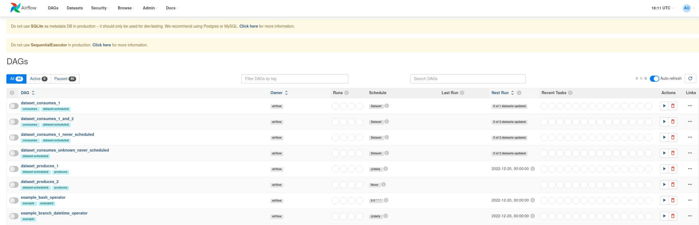

---
author:
  name: Linode
  email: docs@linode.com
description: "Deploy Apache Airflow on a Linode Compute Instance. This provides you with an open-source workflow management platform for data engineering pipelines."
keywords: ['airflow','workflow management','data engineering']
tags: ["marketplace", "linode platform", "cloud manager"]
license: '[CC BY-ND 4.0](https://creativecommons.org/licenses/by-nd/4.0)'
published: 2023-01-23
modified: 
modified_by:
  name: Linode
title: "Deploying Apache Airflow through the Linode Marketplace"
external_resources:
- '[Apache Airflow](https://airflow.apache.org/docs/)'
aliases: ['/guides/deploying-apache-airflow-marketplace-app/','/guides/apache-airflow-marketplace-app/']
---

[Apache Airflow](https://airflow.apache.org) is an open source workflow management platform for data engineering pipelines. The Linode Marketplace app deploys Apache Airflow in standalone mode, suitable for development, testing and intial configurations. Standalone mode is not recommended for [production deployments](https://airflow.apache.org/docs/apache-airflow/stable/production-deployment.html).

## Deploying a Marketplace App






**Estimated deployment time:** Apache Airflow should be fully installed within 10-15 minutes after the Compute Instance has finished provisioning.


## Configuration Options

- **Supported distributions:** Ubuntu 20.04 LTS
- **Recommended plan:** All plan types and sizes can be used.

### Apache Airflow Options
- **Email Address** *(required)*: The email address to use for generating SSL certificates. 





## Getting Started after Deployment 

1. Log into your new compute instance through LISH or SSH using the root user and associated password you entered when creating the instance. 

2. The Admin password is generated and printed to the Message of the Day. This displays on login, or through the `cat` command: 

    ```command
    cat /etc/motd
    ```
    The file contains the admin password and URL where you can access the Apache Airflow GUI.
    
    ```file {title="/etc/motd"}
    The installation of Apache Airflow is now complete, and the application is running in standalone mode.
    #
    You can log into the Airflow GUI at $IPADDRESS.ip.linodeusercontent.com
    With the credentials: 
    Username: admin
    Password: Xwcqe22WBcGS2nvR
    #
    Standalone mode is not recommended for production.
    ```
3. After entering the admin username and password you can access the Apache Airflow GUI. 



4. For more information on using Apache Airflow, please see the [documentation](https://airflow.apache.org/docs/). 
