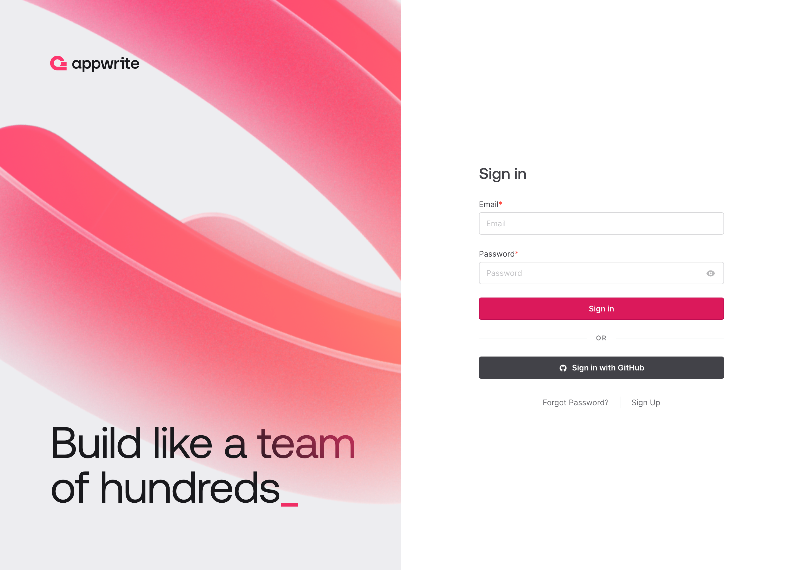
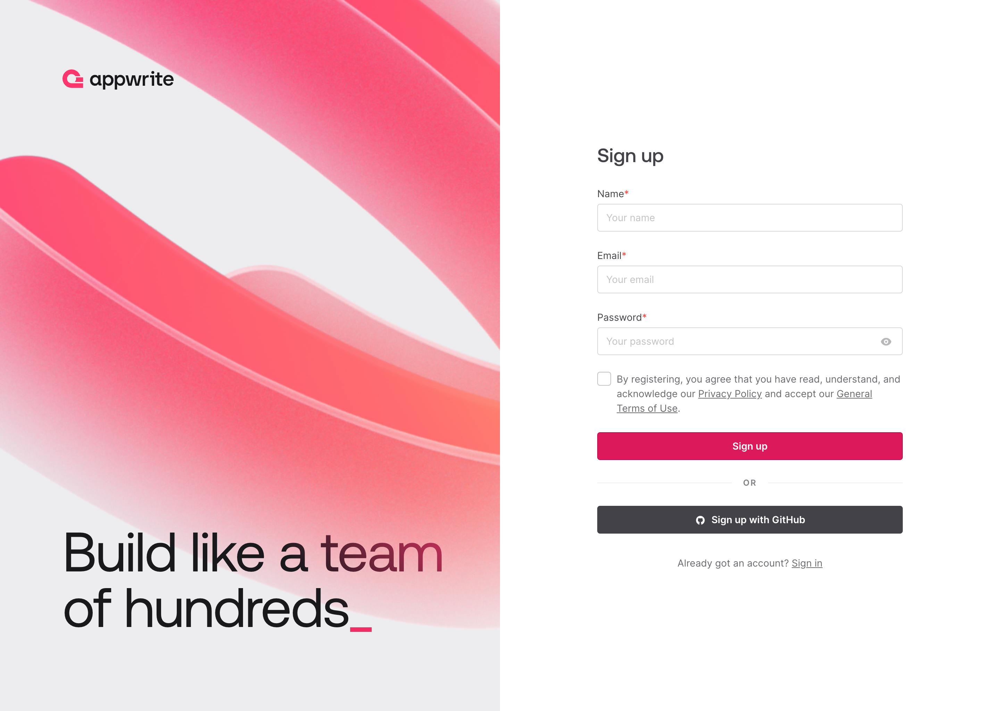
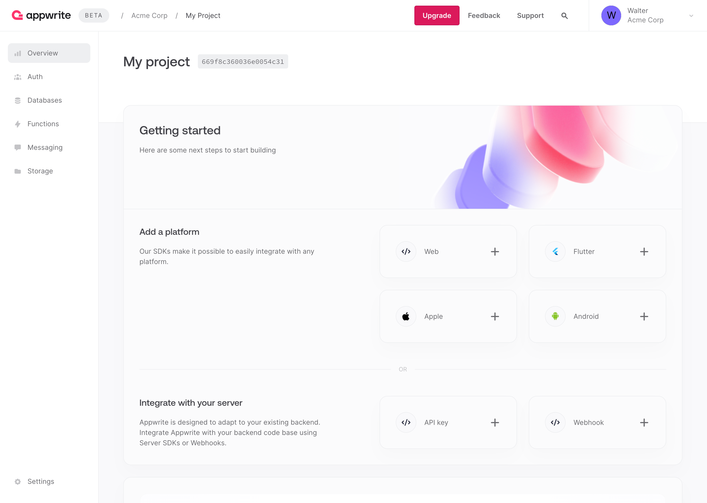

[Appwrite](https://appwrite.io/) is an open-source, self-hosted backend server that provides developers with a set of tools and services to build and manage web and mobile applications. It offers various features to simplify the development process, including user authentication, database management, file storage, and more.

## Deploying a Marketplace App






**Estimated deployment time:** Appwrite should be fully installed within 5-10 minutes after the Compute Instance has finished provisioning.


## Configuration Options

- **Supported distributions:** Ubuntu 22.04 LTS
- **Recommended plan:** We recommend a 4GB Dedicated CPU or Shared Compute instance for Appwrite.

## Getting Started after Deployment

### Accessing the Appwrite Web UI

1.  Open your web browser and navigate to `http://[ip-address]`, where *[ip-address]* is your Compute Instance's IPv4 address or default rDNS domain. See the [Managing IP Addresses](/docs/products/compute/compute-instances/guides/manage-ip-addresses/) guide for information on viewing IP addresses.

1.  In the **Sign in** page that is displayed, click the **Sign Up** link if this is your first time accessing the app.

    

1.  The sign up page should open, which allows you to create a new user on this Appwrite deployment. Enter your name, your email address, and a secure password. Then, click the **Sign up** button.

    

1.  After creating your account and logging in for the fist time, the application prompts you to create your first project. Enter a project name and click the **Create project** button to continue.

    

1. Once your project has been created, you should see the Overview page for that project. From here, you can manage this project, including adding web application platforms, users, databases, and more.

    

Now that you’ve accessed your Appwrite instance, check out [the official Appwrite documentation](https://appwrite.io/docs) to learn how to further utilize your instance.

