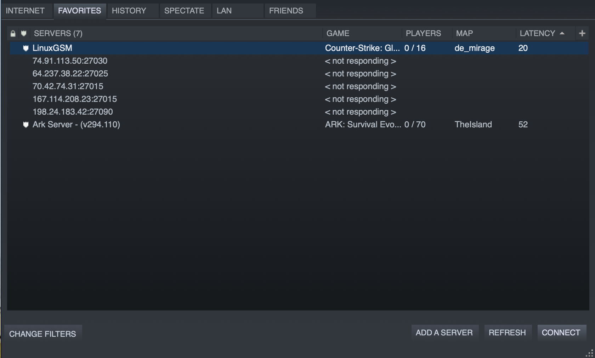
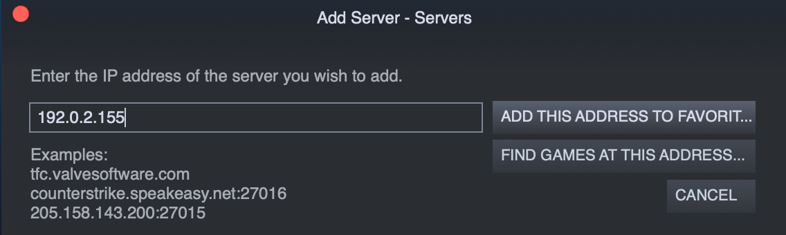
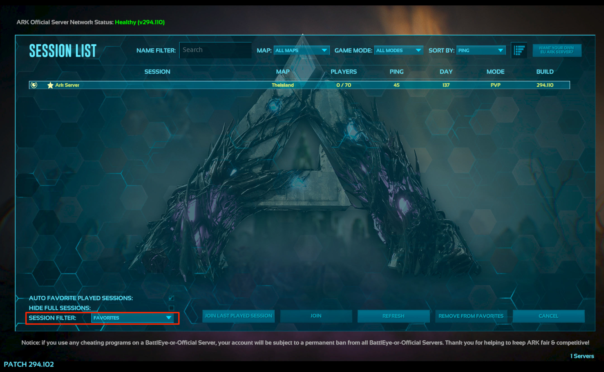

[ARK: Survival Evolved](http://playark.com/ark-survival-evolved/) is a multiplayer action-survival game released in 2017. The game places you on a series of fictional islands inhabited by dinosaurs and other prehistoric animals. In ARK, the main objective is to survive. ARK is an ongoing battle where animals and other players have the ability to destroy you. To survive, you must build structures, farm resources, breed dinosaurs, and even set up trading hubs with neighboring tribes.

This Marketplace App deploys the ARK: Survival Evolved server software through [SteamCMD](https://developer.valvesoftware.com/wiki/SteamCMD). Hosting an ARK server gives you control of the entire game. You can define the leveling speed, the amount of players, and the types of weapons that are available. While no additional license is required to run the server, each client needs to have a license for the game.

## Deploying a Marketplace App






**Estimated deployment time:** ARK Survival Evolved should be fully installed within 5-15 minutes after the Compute Instance has finished provisioning.


## Configuration Options

- **Supported distributions:** Debian 11
- **Recommended plan:** Depends on the amount of traffic and players you expect. An 8GB Dedicated CPU or Shared Compute Instance is a good starting point.

### ARK Options

- **RCON Password** *(required)*: Your password for [RCON](https://developer.valvesoftware.com/wiki/Source_RCON_Protocol), a protocol which allows ARK administrators to remotely execute commands on the game server.
- **Server Name:** Your ARK server's name.
- **Message of the Day:** A message that is displayed whenever a player logs on to the server.
- **Server Password:** Your ARK server's password, if you want the game server to be password protected.
- **Hardcore Mode Enabled:** Enables Hardcore mode, which resets a player to level 1 after dying.
- **XP Multiplier:** Increases or decreases the amount of experience awarded for various actions.
- **Server PvE:** Disables player vs player combat and enables player vs environment combat.



## Getting Started After Deployment

Ensure that you have [installed Steam](https://store.steampowered.com/about/) on your personal computer and bought the ARK: Survival Evolved game on your Steam account before getting started with this section.

After the Ark: Survival Evolved Server Marketplace App has finished installing, you will be able to access your server by copying your Linode's IPv4 address and entering it into the favorite servers list in your computer's Steam client:

1. Click on the **Linodes** link in the sidebar. You will see a list of all your Linodes.

1. Find the Linode you just created when deploying your app and select it.

1. Navigate to the **Networking** tab.

1. Your IPv4 address will be listed under the **Address** column in the **IPv4** table. Copy the address.

1. On your personal computer, open Steam. Click on **View > Servers**, then click on the **Favorites** tab.

    

1. Click on **Add a Server**, then paste in your Linode's IP address. Click on **Add This Address to Favorites**.

    

1.  Once you have added your Linode's IP address to your Steam favorites list, open ARK: Survival Evolved. Click on **Join ARK**. At the bottom of the screen, click on the **Session Filter** drop down list and select **Favorites**. Your ARK Linode should appear:

    

    Click on the server and then select **Join** at the bottom of the screen. You will be loaded into your server.

## Software Included

The ARK: Survival Evolved Marketplace App will install the following required software on your Linode:

| **Software** | **Description** |
|:--------------|:------------|
| [**ARK: Survival Evolved**](https://store.steampowered.com/app/346110/ARK_Survival_Evolved/) | Game server. |
| [**LinuxGSM**](https://linuxgsm.com) | A command line tool for the deployment and management of Linux game servers. |
| [**UFW**](https://wiki.ubuntu.com/UncomplicatedFirewall) | Firewall utility. Ports 27015/udp, 7777:7778/udp and 27020/tcp will allow outgoing and incoming traffic. |
| [**Fail2ban**](https://www.fail2ban.org/wiki/index.php/Main_Page) | Fail2Ban is an intrusion prevention software framework that protects computer servers from brute-force attacks. |


