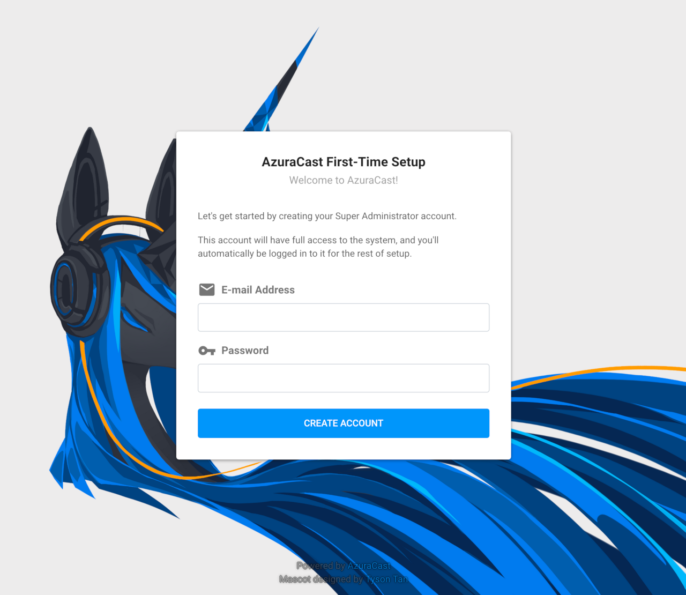
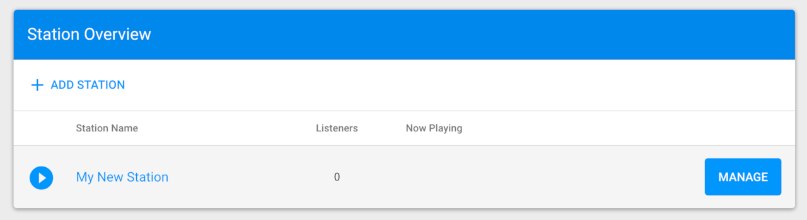

---
author:
  name: Linode
  email: docs@linode.com
description: "AzuraCast is a self-hosted web radio station and management suite. Follow this guide to deploy AzuraCast on Linode using Marketplace Apps."
keywords: ['azuracast','marketplace', 'server']
tags: ["debian","ubuntu","marketplace", "web applications","linode platform", "cloud manager"]
license: '[CC BY-ND 4.0](https://creativecommons.org/licenses/by-nd/4.0)'
published: 2020-09-28
modified: 2022-03-08
image: DeployAzuraCast_OneClickApps.png
modified_by:
  name: Linode
title: "Deploying AzuraCast through the Linode Marketplace"
external_resources:
- '[About AzuraCast](https://www.azuracast.com/about/)'
- '[Troubleshooting AzuraCast](https://www.azuracast.com/help/)'
- '[AzuraCast Github](https://github.com/azuracast/azuracast)'
aliases: ['/platform/marketplace/how-to-deploy-azuracast-with-marketplace-apps/', '/platform/one-click/how-to-deploy-azuracast-with-one-click-apps/','/guides/how-to-deploy-azuracast-with-one-click-apps/','/guides/how-to-deploy-azuracast-with-marketplace-apps/','/guides/deploy-azuracast-with-one-click-apps/','/platform/one-click/deploy-azuracast-with-one-click-apps/','/guides/azuracast-marketplace-app/']
---

[AzuraCast](https://www.azuracast.com) is a free self-hosted web radio station and management suite. Installation is simple with Marketplace Apps, and the intuitive web interface makes running a web station easy. After installation, you can be broadcasting within in minutes.

## Deploying a Marketplace App






**Estimated deployment time:** AzuraCast should be fully installed within 2-5 minutes after the Compute Instance has finished provisioning.


## Configuration Options

- **Supported distributions:** Debian 10, Ubuntu 20.04 LTS
- **Recommended plan:** All plan types and sizes can be used.

## Getting Started After Deployment

### Accessing AzuraCast

AzuraCast is now installed and ready to use.

1.  Open your web browser and navigate to `http://[ip-address]/`, replacing *[ip-address]* with your Compute Instance's IPv4 address. See the [Managing IP Addresses](/docs/guides/managing-ip-addresses/) guide for information on viewing your IP address.

1.  The first thing you want to do is create a *Super Administrator* account that has system-wide permissions.

    

1.  Next, AzuraCast prompts you to create a new radio station. Fill out the required fields, then click the **Save Changes** button at the bottom of the screen to continue.

    

1.  On the next page you can set other settings including using a custom URL if you have one set up. Learn more about using a custom URL with Linode DNS in our [DNS Manager](/docs/guides/dns-manager/) guide. When you are finished, click the **Save Changes** button at the bottom of the screen to continue.

1.  Your station is now ready. On the following page, you are taken to the control panel, and you are ready to start broadcasting your station.

1.  To manage the station you just created click the **Manage** button in the **Station Overview** section. This will open the Station Dashboard for the station you created during setup.

    

1.  Here you can control your station, add songs, add DJs, take requests, and more.

## Software Included

The AzuraCast Marketplace App installs the following software on your Linode:

| **Software** | **Description** |
|:--------------|:------------|
| [**Lquidsoap**](https://www.liquidsoap.info/) | An AutoDJ that keeps the tunes streaming.|
| [**Icecast 2.4 (Icecast-KH on supported systems)**](https://icecast.org/) | A broadcasting frontend. |
| [**SHOUTcast 2 DNAS**](http://wiki.shoutcast.com/wiki/SHOUTcast_DNAS_Server_2) | An alternate broadcasting frontend. |
| [**NGINX**](https://www.nginx.com/) | A webserver a proxy. |
| [**MariaDB**](https://mariadb.org/) | A database. |
| [**PHP 7**](https://secure.php.net/) | General purpose programming language used for the website. |
| [**InfluxDB**](https://www.influxdata.com/) | A database for capturing time-series based statistics. |
| [**Redis**](https://redis.io/) | A database for session management and caching |


