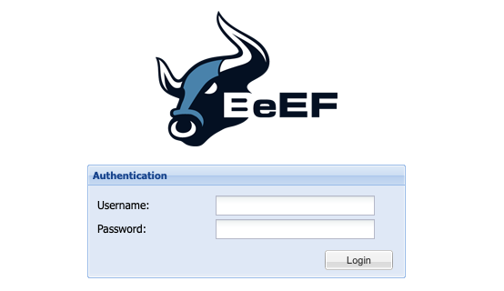

[BeEF](https://beefproject.com/) (The Browser Exploitation Framework) is a penetration testing tool that focuses on the web browser. BeEF offers an efficient and affective penetration test tool to assess the actual security posture of a target environment by using client-side attack vectors. BeEF looks beyond just the network perimeter and client system. It allows you to examine exploitability within the context of the web browser.

## Deploying a Marketplace App






**Estimated deployment time:** BeEF should be fully installed within 10-15 minutes after the Compute Instance has finished provisioning.


## Configuration Options

- **Supported distributions:** Ubuntu 22.04 LTS
- **Recommended plan:** All plan types and sizes can be used.

### BeEF Options

- **BeEF Password** *(required)*: Enter a *strong* password to use for the BeEF admin user.
- **Email address** *(required)*: Enter the email address to use for generating the SSL certificates.







## Getting Started after Deployment

### Accessing the BeEF App

1. Once the app has been *fully* deployed, view the BeEF completion message through one of the methods below:

    - **Lish Console:** Within the Cloud Manager, navigate to **Linodes** from the left menu, select the Compute Instance you just deployed, and click the **Launch LISH Console** button. See [Using the Lish Console](/docs/products/compute/compute-instances/guides/lish/).
    - **SSH:** Log in to your Compute Instance over SSH using the `root` user and run the following command. See [Connecting to a Remote Server Over SSH](/docs/guides/connect-to-server-over-ssh/) for assistance.

        ```command
        cat /root/beef.info
        ```

1. The completion message contains the *Endpoint* URL, as shown in the example below.

    ```output
    ##############################
    # BEEF INSTALLATION COMPLETE #
    ##############################
    Endpoint: https://192-0-2-1.ip.linodeusercontent.com:3000/ui/panel
    Credentials can be found here:
    /home/beef/config.yaml
    Happy hunting!
    ```

1. Navigate to this URL in a web browser to display the login prompt.

    

1. Enter `beef` as the username and use the password you entered into the *BeEF Password* field when you created the Instance.

    
    If you forget this password, run the following command when logged in through Lish or SSH:

    ```command
    less /home/beef/config.yaml
    ```

    Scroll down until you see the *credentials* section with the *user* and *passwd* parameters as shown in the example output below:

    ```output
    # Credentials to authenticate in BeEF.
    # Used by both the RESTful API and the Admin interface
    credentials:
        user:   "beef"
        passwd: "T$a%T1O*&2kP"
    ```
    

Now that you’ve accessed your BeEF instance, check out [the official BeEF documentation](https://github.com/beefproject/beef/wiki) to learn how to further utilize your BeEF instance.

