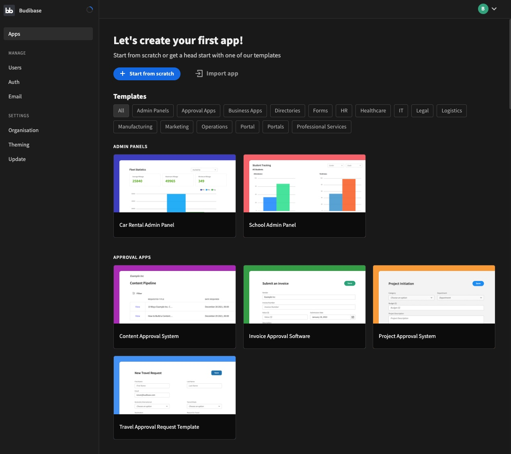

---
author:
  name: Linode
  email: docs@linode.com
description: "Deploy Budibase, a low-code platform for building modern business applications, on a Linode Compute Instance."
keywords: ['budibase','CRUD','low-code']
tags: ["marketplace", "linode platform", "cloud manager"]
license: '[CC BY-ND 4.0](https://creativecommons.org/licenses/by-nd/4.0)'
published: 2022-08-09
modified_by:
  name: Linode
title: "Deploying Budibase through the Linode Marketplace"
---

[Budibase](https://github.com/Budibase/budibase) is an open-source, low-code platform for building modern business applications. Build, design, and automate different types of applications, including admin panels, forms, internal tools, and client portals. Using Budibase helps developers avoid spending weeks building simple CRUD applications and, instead, allows them to complete many projects in significantly less time.


When self-hosting the Budibase application, you are responsible for the security of your server. Follow best practices for securing, updating, and backing the software on your Compute Instance. See [Setting Up and Securing a Compute Instance](https://www.linode.com/docs/guides/set-up-and-secure/).


## Deploying a Marketplace App






**Estimated deployment time:** Budibase should be fully installed within 5-10 minutes after the Compute Instance has finished provisioning.


## Configuration Options

- **Supported distributions:** Ubuntu 22.04 LTS, Debian 11
- **Recommended plan:** All plan types can be used.

## Budibase Options

- **Budibase port:** Enter the port the web UI will listen on. Defaults to 80.

## Getting Started after Deployment

### Accessing the Budibase app

1. Open your web browser and navigate to `http://[ip-address]`, where *[ip-address]* can be replaced with your Compute Instance's IP address or rDNS domain. If you've chosen to have Budibase listen on a port other than port 80, append that port to the URL `http://[ip-address]:[port]`. See the [Managing IP Addresses](/docs/guides/managing-ip-addresses/) guide for information on viewing IP addresses and rDNS.

1. The screen for creating a new admin user should appear. Enter the email address and password you wish to use and then click the **Create super admin user** button.

    

1. After the admin user has been created, you are prompted to sign in to Budibase. Enter the credentials you just created and click **Sign in to Budibase**.

    

1. Once you are logged in to the Budibase web app, you can create apps, manage users, add authentication methods, select themes, and more. For more information on using Budibase for development, see the [Budibase documentation](https://docs.budibase.com/docs).

    


