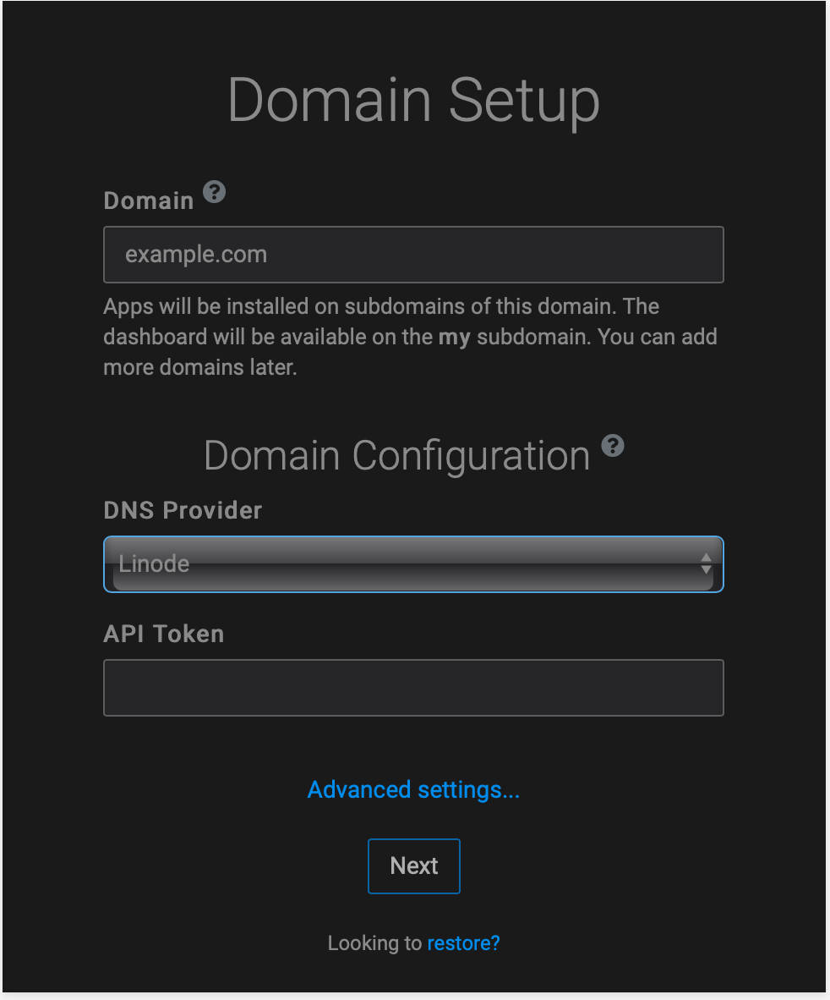

[Cloudron](https://www.cloudron.io) is a platform that makes it easy to install, manage, and secure web apps on a server. Cloudron provides a centralized way to manage users and specify which apps they can access.


Cloudron offers both free and paid plans. Visit [Cloudron's website](https://www.cloudron.io/pricing.html) to view available plans and pricing information.


## Deploying a Marketplace App






**Estimated deployment time:** Cloudron should be fully installed within 10-12 minutes after the Compute Instance has finished provisioning.


## Configuration Options

- **Supported distributions:** Ubuntu 20.04 LTS
- **Recommended plan:** All plan types and sizes can be used.

## Getting Started after Deployment

The Cloudron application is served on the Linode, however it still requires a few additional steps to fully complete the installation process.

1.  The Cloudron setup wizard is served at the IP address of the Linode server . For example, `http://203.0.113.0 `, replacing the IP address with values for the Linode server and accept the self-signed certificate.

    
    In Chrome, you can accept the self-signed certificate by clicking on Advanced and then click Proceed to <ip> (unsafe). In Firefox, click on Advanced, then Add Exception and then Confirm Security Exception.
    

1.  At this point, the Cloudron Domain setup wizard appears.

    

1.  In the setup screen, fill in the fields and click the **Next** button. The **Setup Admin Account** page appears.

    

1.  After the account is created, Cloudron prompts you to proceed to the dashboard on completing the setup and displays a confirmation screen.

    


