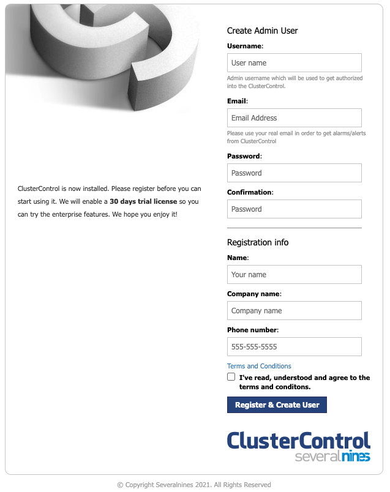

[ClusterControl](https://severalnines.com/product/clustercontrol) (by developer Severalnines) is a unified console to manage the full database lifecycle of the most popular open-source databases (on-premise or in the cloud). Provision, monitor and manage highly available database clusters in minutes with dashboards, backups, notifications, reports and automated recovery.

**Supported databases: MySQL, MariaDB Server, MariaDB Galera, Percona Server, Percona XtraDB, PostgreSQL, Redis, MS SQL Server 2019, TimescaleDB, and MongoDB


ClusterControl offers both free and paid plans. Visit [Severalnines' website](https://severalnines.com/pricing) to view available plans and pricing information.


## Deploying a Marketplace App






**Estimated deployment time:** ClusterControl should be fully installed within 2-5 minutes after the Compute Instance has finished provisioning.


## Configuration Options

- **Supported distributions:** Ubuntu 20.04 LTS
- **Recommended plan:** All plan types and sizes can be used.

### ClusterControl Options

- **MySQL Root Password** *(required)*: MySQL Root Password.
- **CMON User Password** *(required)*: CMON user password.
- **Email address** *(required)*: Enter the email address to use for generating the SSL certificates.


- **Would you like to use a free Let's Encrypt SSL certificate?:** Select *yes* to generate a free Let's Encrypt certificate and enabled secure HTTPS traffic. This uses the default rDNS value for the new instance or the custom domain, if one is specified.



## Getting Started after Deployment

### Access your ClusterControl App

To access your ClusterControl instance, Open a browser and navigate to the domain you created during in the beginning of your deployment or your Linode rDNS domain `https://203-0-113-0.ip.linodeusercontent.com`. Replace `https://203-0-113-0.ip.linodeusercontent.com` with your [Linode's RDNS domain](/docs/products/compute/compute-instances/guides/manage-ip-addresses/#viewing-ip-addresses).

From there you will see the welcome screen where you can enter the requested information to setup your ClusterControl instance:

Now that you’ve accessed your dashboard, checkout [the official ClusterControl documentation](https://docs.severalnines.com/docs/clustercontrol/) to learn how to further configure your instance.

