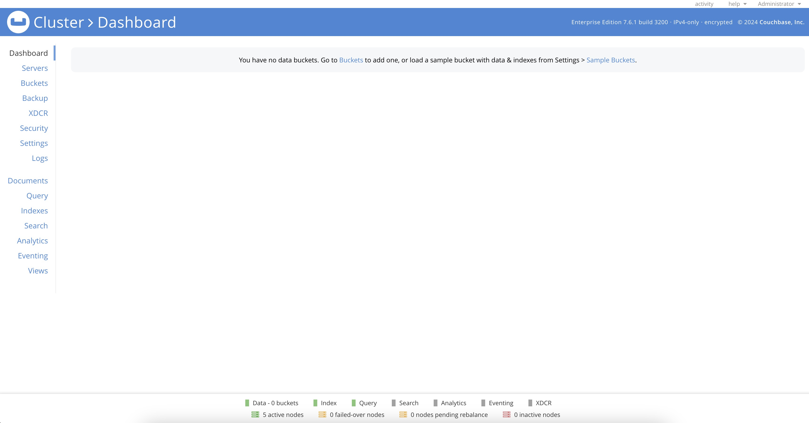
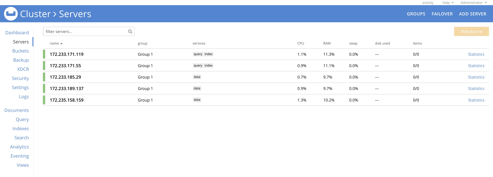

[Couchbase](https://www.couchbase.com/) is an enterprise class NoSQL database designed with memory-first architecture, built-in cache and workload isolation. The Couchbase One-Click cluster deploys five connected Couchbase Server nodes, split between data, index and query services. This starting configurating allows quick deployment and rapid cluster expansion with Couchbase's multi-dimensional scaling.

{{ < note >}}
**Couchbase Enterprise Server License**
Couchbase Enterprise is not free to use in production. Contact [Couchbase Support](https://www.couchbase.com/pricing/) to activate your license on Akamai Connected Cloud and enable [Couchbase application support](https://support.couchbase.com/hc/en-us/articles/360043247551-Accessing-Couchbase-Support).
{{ < note >}}
    

## Deploying a Marketplace App






**Estimated deployment time:** Couchbase should be fully installed within 10-20 minutes after the Linode has finished provisioning.


## Configuration Options

- **Supported distributions:** Ubuntu 22.04 LTS
- **Minimum plan:** Couchbase Enterprise Server requires 8GB of RAM. 
- **Suggested Plan:** 16GB of RAM is suggested for production deployments.

### Couchbase Options

- **API Token** *(required)*: A valid API token with grants to deploy Linodes. 

- **Email address** *(required)*: Enter the email address to use for generating the SSL certificates.





### Getting Started after Deployment

## Accessing the Couchbase Server

Access Couchbase's web UI by launching your preferred web browser and navigating to either the reverse DNS address of the *cluster provisioner*. This is the instance labeled `couchbase-occ-1-$region-$uuid`. If you need assistance in finding your Linode's IP addresses and rDNS information, refer to the [Managing IP Addresses](/docs/products/compute/compute-instances/guides/manage-ip-addresses/) guide for detailed instructions. 

Provide the username Administrator and generated password included in `/home/$sudo_username/.credentials` to access the Dashboard.

While there are no buckets yet configured on this new cluster, you can see all five nodes marked ready on the bottom status bar, and verify the status of the cluster members from the Servers tab.

### More Information

You may wish to consult the following resources for additional information on this topic. Please note that we cannot guarentee for the accuracy or timeliness of externally hosted materials.

- [Couchbase](https://www.couchbase.com/)
- [Couchbase Documentation](https://docs.couchbase.com/home/server.html)

