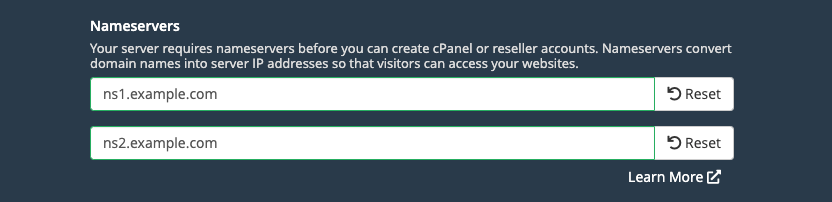

[cPanel](https://cpanel.net/products/) is a Linux-based server/website administration platform that streamlines publishing and managing websites. It is widely used by individual businesses, web development agencies, and hosting platforms. cPanel (and the included WHM interface) provides an easy and intuitive method for managing all aspects of website administration, including software installation, DNS, databases, email, and *much* more.


cPanel requires a valid license to use the software beyond the initial 15 day [free trial](https://cpanel.net/products/trial/) period. To purchase a license, visit [cPanel’s website](https://cpanel.net/pricing/) and select a plan that fits your needs. Licenses are not available directly through Linode.


## Deploying a Marketplace App






**Estimated deployment time:** cPanel/WHM should be fully installed within 15 minutes after the Compute Instance has finished provisioning.


## Configuration Options

- **Supported distributions:** Ubuntu 20.04 LTS, AlmaLinux 8, Rocky Linux 8
- **Recommended minimum plan:** 2GB Shared CPU Compute Instance or higher, depending on the number of sites and size of the sites you plan on hosting.

## Getting Started after Deployment

### Access WHM (Web Host Manager)

WHM is the core interface for managing your server and all websites (also called "accounts").

1. Open your web browser and navigate to `http://[ip-address]:2087/`, where *[ip-address]* can be replaced with your Compute Instance's IPv4 address or rDNS domain (such as `192-0-2-1.ip.linodeusercontent.com`). See the [Managing IP Addresses](/docs/products/compute/compute-instances/guides/manage-ip-addresses/) guide for information on viewing IP addresses and rDNS.

1. The WHM login page should appear. Enter `root` as the username and use the root password you created when deploying this instance. Then click the **Log In** button.

    

1. You are then presented with cPanel and WHM's terms. Read through the terms and click on **Agree to All** if you agree and would like to continue.

1. Next, enter in the email address where you would prefer to receive notifications and alerts.

1. On the same page, you must also enter in the nameservers for this server. Nameservers are the underlying servers of the DNS system that map domain names to IP addresses. Managing DNS through cPanel allows you to quickly add sites, configure subdomains, set up email, and more without needing to manually update DNS records. For this step, make sure you have a registered domain name.

    1. Within the nameservers for your domain name, create two [*A records*](/docs/guides/dns-overview/#a-and-aaaa). The *hostname* / *name* field should be *ns1* (for the first record) and *ns2* (for the second). The IP address should be the IPv4 address of your new Compute Instance. If you do not have a nameserver for your registered domain, consider using Linode's [DNS Manager](/docs/products/networking/dns-manager/).

    1. Within the cPanel form, enter the following values into the nameserver fields. Replace *example.com* with the domain name you are using.

        - `ns1.example.com`
        - `ns2.example.com`

        

    If you prefer to manually manage your DNS records, you can use Linode's DNS Manager or any other 3rd party service. When doing so, enter the primary two nameservers for your DNS provider. Linode's nameservers are `ns1.linode.com` and `ns2.linode.com`.

1. Click **Next** to continue.

1. The cPanel license screen appears. Click on the **Purchase** button to be taken to cPanel's license management system. From here, you can obtain a trial license (if eligible) or purchase a license.

    
    Provided the IP address hasn't already been registered in cPanel, your cPanel Marketplace App installation automatically receives a free 15-day trial license. You must [purchase a new cPanel & WHM license](https://documentation.cpanel.net/display/CKB/How+to+Purchase+a+cPanel+License) before the end of this trial period. At the end of your trial period your license will expire.
    

1. After obtaining a license, you are automatically logged in and taken to WHM.

## Going Further

Now that you're able to access WHM, you can manage your server, install software, and create new cPanel accounts. Here are some guides to help you start using your new cPanel/WHM instance.

- [The WHM Interface](https://docs.cpanel.net/whm/the-whm-interface/the-whm-interface/): Learn how to navigate the WHM interface.
- [Create a New Account](https://docs.cpanel.net/whm/account-functions/create-a-new-account/): A cPanel account can be created for each *website* or each *client*. Once created, you can log in to cPanel directly, which is a streamlined interface for managing each web application, databases, and email accounts for a domain.
- [The cPanel Interface (Jupiter theme)](https://docs.cpanel.net/cpanel/the-cpanel-interface/the-cpanel-interface-jupiter/): Learn the main functions of the cPanel interface, shown with the default Jupiter theme enabled.


***Sending* email:** Newly created Linode accounts have restrictions on ports `25`, `465`, and `587` applied to Compute Instances, which prevent instances from sending email. If you'd like to send email on a Compute Instance, [open a ticket](https://cloud.linode.com/support/tickets?type=closed&drawerOpen=true) with our Support team.



