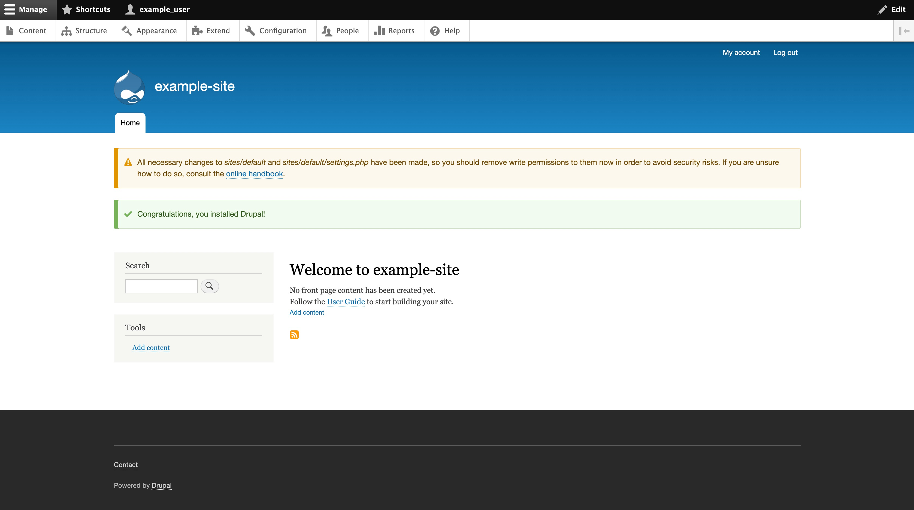

---
author:
  name: Linode Community
  email: docs@linode.com
description: "Learn how to use the Drupal Marketplace App to easily install the popular open source content management system."
keywords: ['drupal','marketplace', 'cms']
tags: ["cloud-manager","linode platform","drupal","cms","marketplace"]
license: '[CC BY-ND 4.0](https://creativecommons.org/licenses/by-nd/4.0)'
published: 2019-03-25
modified: 2022-07-11
modified_by:
  name: Linode
title: "Deploying Drupal through the Linode Marketplace"
aliases: ['/platform/marketplace/deploying-drupal-with-marketplace-apps/','/platform/marketplace/how-to-deploy-drupal-with-marketplace-apps/', '/platform/one-click/deploying-drupal-with-one-click-apps/','/guides/deploying-drupal-with-one-click-apps/','/platform/one-click/how-to-deploy-drupal-with-one-click-apps/','/guides/how-to-deploy-drupal-with-one-click-apps/','/guides/how-to-deploy-drupal-with-marketplace-apps/','/guides/drupal-marketplace-app/']
contributor:
  name: Linode
external_resources:
 - '[Drupal 9 Official Documentation](https://www.drupal.org/docs/understanding-drupal)'
---

[Drupal](https://www.drupal.org/) is a content management system (CMS) designed for building custom websites for personal and business use. Built for high performance and scalability, Drupal provides the necessary tools to create rich, interactive "community" websites with forums, user blogs, and private messaging. Drupal also has support for personal publishing projects and can power podcasts, blogs, and knowledge-based systems, all within a single, unified platform.

In addition to the core infrastructure, there are a number of freely available Drupal modules that allow administrators of Drupal sites to provide additional functionality, and a robust API makes it easy to enable these features. Furthermore, Drupal has an advanced theming engine that allows for a great amount of flexibility for displaying content.

## Deploying a Marketplace App






**Estimated deployment time:** Drupal should be fully installed within 2-5 minutes after the Compute Instance has finished provisioning.


## Configuration Options

- **Supported distributions:** Debian 11
- **Recommended minimum plan:** All plan types and sizes can be used.

### Drupal Options

- **Database Root Password** *(required)*: Password for your Drupal site's MariaDB database `root` user.
- **Database User Password** *(required)*: Password for your Drupal site's MariaDB database `drupal` user.

## Getting Started after Deployment

### Access your Drupal Site

After Drupal has finished installing, you will be able to access your Drupal site over `http://` with your Linode's IPv4 address.

1. To find your Linode's IPv4 address, click on the **Linodes** link in the Cloud Manager sidebar. You will see a list of all your Linodes.

1. Find the Linode you just created. Under the **IP Address** column, copy the IPv4 address.

1. Navigate to the **Networking** tab.

1. Paste the IPv4 address into a browser window, for example, `http://192.0.2.0`. You will be brought to the Drupal installation page.

    

1. Follow the prompts for the **Choose language**, **Choose profile**, and **Verify requirements** screens and select the appropriate configuration values for your Drupal site.

1. In the **Database configuration** screen, fill in the form with the values in the table below. Click on **Save and Continue** when you are done.

    | **Database Configuration** | **Description** |
    |:--------:|:---------:|
    | Database name | The Marketplace App will create a database named `drupaldb`. Provide this value in the form. |
    | Database username | The Marketplace App will create a database user named `drupal`. Provide this value in the form. |
    | Database password | When you deployed the Marketplace app, in the [Drupal Options](##drupal-options) section, you provided a *Database User Password*. Provide this value in the form. |

1. Continue to follow the prompts for the **Configure site** screen and select the appropriate configuration values for your Drupal site. When complete, you will be brought to your Drupal site's admin panel where you can begin [building your Drupal site](https://www.drupal.org/documentation/build).

    

## Software Included

The Drupal Marketplace App installs the following required software on your Linode:

| **Software** | **Description** |
|:--------------|:------------|
| [**MariaDB Server**](https://mariadb.org/) | Relational database. |
| [**PHP 7**](https://www.php.net) | Drupal is written in PHP and requires PHP to operate. |
| [**Apache HTTP Server**](https://httpd.apache.org) | Web Server used to serve the Drupal site. |
| [**Drupal 9**](https://www.drupal.org/about/9) | Content management system. |



## Next Steps

- Register a domain name and [create a DNS record](/docs/guides/dns-manager/) for it using the Linode Cloud Manager.
- [Configure your Apache HTTP Server](/docs/web-servers/lamp/how-to-install-a-lamp-stack-on-debian-10/#configure-name-based-virtual-hosts) to point to your domain name.
