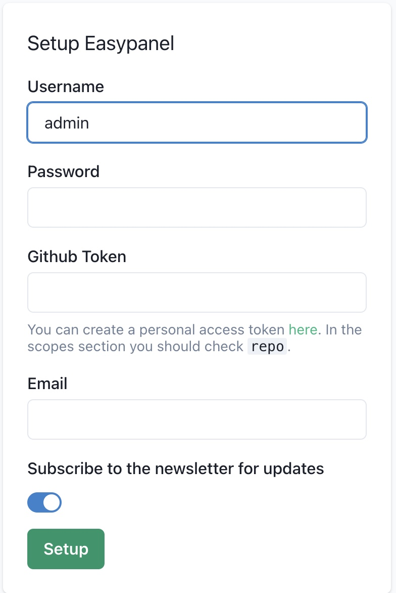

---
author:
  name: Linode
  email: docs@linode.com
description: "Deploy Easypanel on a Linode Compute Instance. This provides a modern server control panel which uses Docker."
keywords: ['easypanel','control panel','cpanel']
tags: ["marketplace", "linode platform", "cloud manager"]
license: '[CC BY-ND 4.0](https://creativecommons.org/licenses/by-nd/4.0)'
published: 2022-05-25
title: "Deploying Easypanel through the Linode Marketplace"
contributor:
  name: Holden Morris
  link: https://github.com/hmorris3293
---

[Easypanel](https://easypanel.io) is a modern server control panel built for quickly deploying web applications. Based on Docker, Easypanel allows for zero downtime deployments and push deployments through GitHub. It includes support for most popular web programming languages, including PHP, Python, Java, Go, Ruby, and Node.js.

## Deploying a Marketplace App






**Estimated deployment time:** Easypanel should be fully installed within 5-10 minutes after the Compute Instance has finished provisioning.


## Configuration Options

- **Supported distributions:** Ubuntu 22.04 LTS
- **Recommended plan:** All plan types and sizes can be used.

## Getting Started after Deployment

1.  Open your web browser and navigate to the IPv4 address for your Compute Instance. See the [Managing IP Addresses](/docs/guides/managing-ip-addresses/) guide for information on viewing IP addresses. The connection uses the `http` protocol and is not encrypted by default.

1. Enter a username, password, email, and Github token (if applicable). Click **Setup** once finished.

    

1. After logging in, the admin control panel will appear. From there, you can manage your projects. Check out [the official Easypanel documentation](https://easypanel.io/docs) to learn how to further utilize your Easypanel instance.

