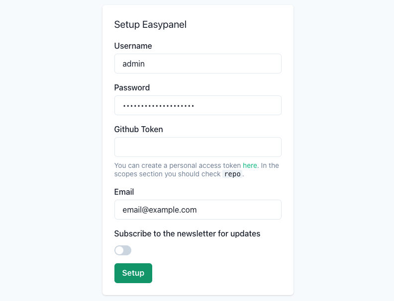

[Easypanel](https://easypanel.io) is a modern server control panel built for quickly deploying web applications. Based on Docker, Easypanel allows for zero downtime deployments and push deployments through GitHub. It includes support for most popular web programming languages, including PHP, Python, Java, Go, Ruby, and Node.js.

## Deploying a Marketplace App






**Estimated deployment time:** Easypanel should be fully installed within 5-10 minutes after the Compute Instance has finished provisioning.


## Configuration Options

- **Supported distributions:** Ubuntu 22.04 LTS
- **Recommended plan:** All plan types and sizes can be used.

## Getting Started after Deployment

1.  Open your web browser and navigate to `https://[ip-address]:3000` where *[ip-address]* can be replaced with your Compute Instance's IPv4 address or rDNS domain (such as `192-0-2-1.ip.linodeusercontent.com`). See the [Managing IP Addresses](/docs/products/compute/compute-instances/guides/manage-ip-addresses/) guide for information on viewing IP addresses. The connection uses the `https` protocol with a self-signed certificate. Your browser will likely display a message stating that the connection is not private or that there is a potential security risk. You can safely continue past this message. In most browsers, click **Advanced** and then **Proceed** or **Accept risk**.

1. In the setup screen, enter your preferred username, password, email address. You can also enter your Github token now or you can leave that field blank to enter it at a later time. Click **Setup** once finished.

    

1. After logging in, the admin control panel appears. From there, you can manage your projects. Check out [the official Easypanel documentation](https://easypanel.io/docs) to learn how to further utilize your Easypanel instance.

