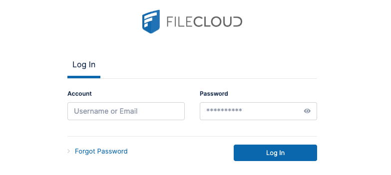
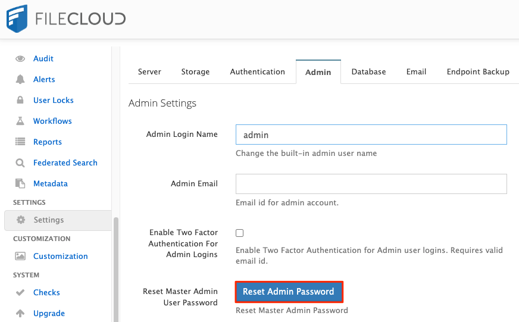

[FileCloud](https://www.filecloud.com/) is a cloud-based file-sharing application, similar to tools like Dropbox, that allows users to remotely access, upload, and sync hosted files.

## Deploying a Marketplace App






**Estimated deployment time:** FileCloud should be fully installed within 2-5 minutes after the Compute Instance has finished provisioning.


## Configuration Options

- **Supported distributions:** Ubuntu 20.04 LTS
- **Recommended minimum plan:** All plan types and sizes can be used. The Linode plan that you select should be appropriate for the amount of data transfer, users, storage, and other stress that may affect the performance of server.

### FileCloud Options


- **SOA email address:** Enter the email address that should be used for the domain's SOA DNS record.





## Getting Started after Deployment

Once the FileCloud server is up and running, a few additional steps must be completed before you can begin using your application.

### Creating Secure Login Credentials

A new administrator password must be created to secure the server:

1.  Open your web browser and navigate to `http://[domain]/admin`, where *[domain]* can be replaced with the custom domain you entered during deployment or your Compute Instance's rDNS domain (such as `192-0-2-1.ip.linodeusercontent.com`). You can also use your IPv4 address. See the [Managing IP Addresses](/docs/products/compute/compute-instances/guides/manage-ip-addresses/) guide for information on viewing IP addresses and rDNS.

1.  In the login fields that appear, enter the default credentials:

    - **Username:** admin
    - **Password:** password

    

1.  A number of messages and warnings appear. For now, dismiss them to clear your screen.

1.  Navigate to the **Settings** sidebar option, followed by the **Admin** tab. Click on the **Reset Admin Password** to reset your Admin Password to something more secure.

    

1.  Follow the prompts and select the **Reset Password** button to complete the password reset.

1.  If the password reset was successful, you are logged out and redirected to the administrator login page. Enter the administrator username and your new password to proceed.

### Obtain a new License Key

FileCloud by default is inaccessible without either a trial or paid license key provided by FileCloud.

1. To obtain a trial license key, sign on or create an account at [FileCloud's customer portal](https://portal.getfilecloud.com/ui/user/index.html). After logging in to your new account, click on the **Begin Trial** button and follow the prompts to obtain a new trial license key file.See [FileCloud - License Purchase And Renewal](https://www.getfilecloud.com/supportdocs/display/cloud/FileCloud+-+License+Purchase+And+Renewal) for full instructions on obtaining a license.

1. Once you have a valid license key, log in to the FileCloud administrator page. After a new successful login, a message should be displayed notifying you that the license is invalid. If this message is not visible, navigate to **Settings** > **License**.

1. Click the **Choose File** button to upload your `license.xlm` file and register your license key with this FileCloud installation.

