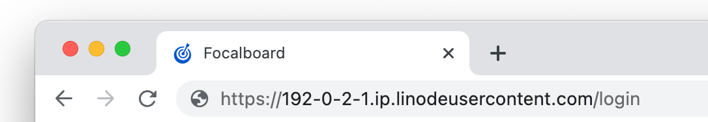
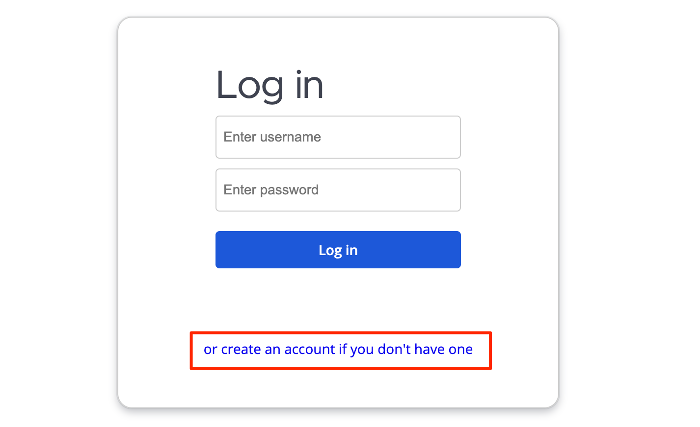
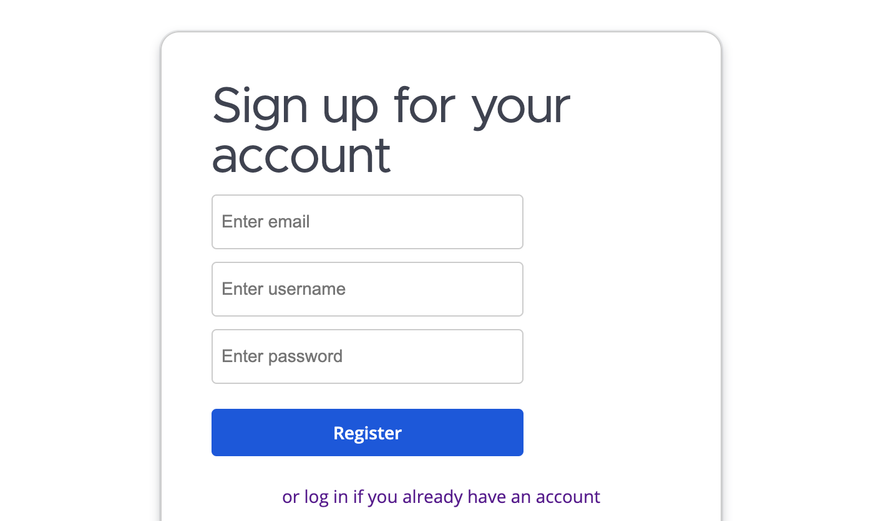
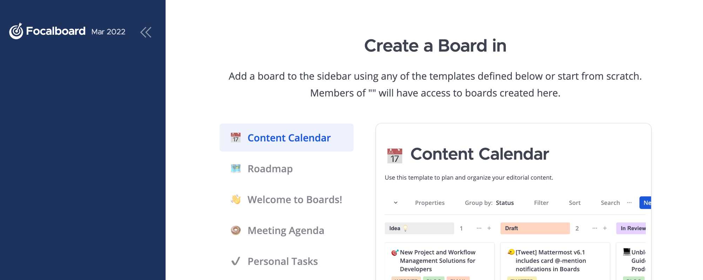

[Focalboard](https://www.focalboard.com/) is an open source alternative to tools like Asana, Trello, and Notion. It helps teams, individuals, and developers stay aligned and organized on their everyday tasks. With Focalboard, you can reach milestones, keep track of project notes, and achieve goals.

## Deploying a Marketplace App






**Estimated deployment time:** Focalboard should be fully installed within 5-10 minutes after the Compute Instance has finished provisioning.


## Configuration Options

- **Supported distributions:** Ubuntu 20.04 LTS, Debian 11
- **Recommended plan:** All plan types and sizes can be used.

### Focalboard Options

- **Email address** *(required)*: Enter the email address to use for generating the SSL certificates.







## Getting Started after Deployment

### Accessing the Focalboard App

1.  Open your web browser and navigate to `http://[domain]/`, where *[domain]* can be replaced with the custom domain you entered during deployment or your Compute Instance's rDNS domain (such as `192-0-2-1.ip.linodeusercontent.com`). See the [Managing IP Addresses](/docs/products/compute/compute-instances/guides/manage-ip-addresses/) guide for information on viewing rDNS.

    

1.  On the Focalboard login page that appears, click the *create an account* link.

    

1.  Complete the sign-up form and click the **Register** button.

    

1.  You are automatically logged in and the **Create Board** screen should display.

    

Now that you’ve accessed your dashboard, check out [the official Focalboard documentation](https://www.focalboard.com/guide/user/) to learn how to further utilize your Focalboard instance.

