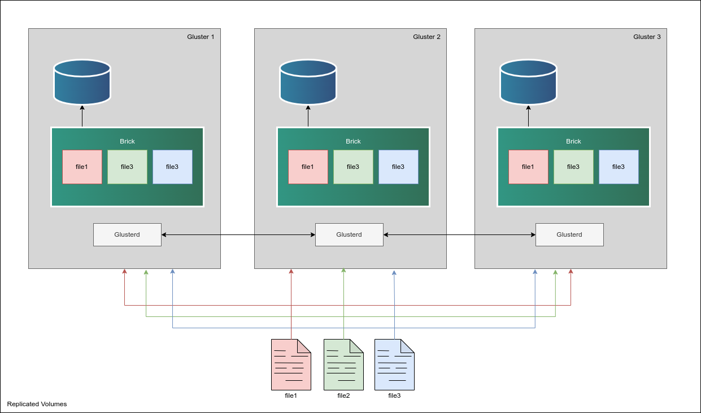

## Cluster Deployment Architecture



[GlusterFS](https://www.gluster.org/) GlusterFS is an open-source, distributed network filesystem designed to scale out and handle large amounts of data across compute instances. It replicates data across multiple GlusterFS servers into a single application mount point, allowing seamless access to files to client instances. With its flexible architecture and ability to replicate data across nodes, GlusterFS provides high availability and fault tolerance, making it suitable for cloud storage and high availability architectures.

## Deploying a Marketplace App

{}

{}


**Estimated deployment time:** You GlusterFS cluster should be fully installed within 5-10 minutes after the Compute Instance has finished provisioning.


## Configuration Options

- **Supported distributions:** Ubuntu 22.04 LTS
- **Suggested minimum plan:** All plan types and sizes can be used depending on your storage needs.

### GlusterFS Options

- **[Linode API Token](/docs/products/tools/api/guides/manage-api-tokens/#create-an-api-token):** The provisioner node will use an authenticated API token to create the additional components to the cluster. This is required to fully create the GlusterFS cluster.

{}

{}
- **List of IP addresses to whitelist:** A list of IP address that will be allowed to access GlusterFS cluster. These should be client IPs that will mount GlusterFS. SSL certificates will be created for the provided IP addresses.

## Getting Started After Deployment

GlusterFS is now installed and ready to use!

1.  Before you can use your new GlusterFS cluster, your clients will need to install a single dependency to mount GlusterFS as a filesystem:

    - On every **client node**, install the GlusterFS client:

    ```command
    sudo apt install glusterfs-client
    ```

1.  Next, ensure that the GlusterFS client knows we are using SSL certificates. We'll create the `secure-access` file. Do this on every **client node**:

    ```command
    mkdir /var/lib/glusterd
    touch /var/lib/glusterd/secure-access
    ```

1.  Grab the certificate for each respective client from **the first GlusterFS** instance.

    If during the creation of the cluster you provided client IPs, you will find SSL certificates on the **first GlusterFS server** in `/usr/lib/ssl`:

    ```output
    (env) root@gluster1:/usr/lib/ssl# ls -l
    total 68
    lrwxrwxrwx 1 root root    14 Mar 16  2022 certs -> /etc/ssl/certs
    -rw-r--r-- 1 root root  1630 Mar 28 14:40 client1.csr
    -rw------- 1 root root  3243 Mar 28 14:40 client1.key
    -rw-r--r-- 1 root root  1761 Mar 28 14:40 client1.pem
    -rw-r--r-- 1 root root  1630 Mar 28 14:40 client2.csr
    -rw------- 1 root root  3243 Mar 28 14:40 client2.key
    -rw-r--r-- 1 root root  1761 Mar 28 14:40 client2.pem
    -rw-r--r-- 1 root root  1630 Mar 28 14:40 client3.csr
    -rw------- 1 root root  3243 Mar 28 14:40 client3.key
    -rw-r--r-- 1 root root  1761 Mar 28 14:40 client3.pem
    -rw-r--r-- 1 root root   769 Mar 28 14:40 dhparams.pem
    -rw-r--r-- 1 root root 10584 Mar 28 14:40 glusterfs.ca
    -rw-r--r-- 1 root root  1635 Mar 28 14:40 glusterfs.csr
    -rw------- 1 root root  3243 Mar 28 14:40 glusterfs.key
    -rw-r--r-- 1 root root  1765 Mar 28 14:40 glusterfs.pem
    drwxr-xr-x 2 root root  4096 Mar 28 14:16 misc
    lrwxrwxrwx 1 root root    20 Feb 16 08:51 openssl.cnf -> /etc/ssl/openssl.cnf
    lrwxrwxrwx 1 root root    16 Mar 16  2022 private -> /etc/ssl/private
    ```

    This output assumes you created 3 client certificates! We'll focus on installing the certificate for first client which is identified as `client1` in the above output:

    - Copy the contents of `client1.pem` from **gluster1** and place it under `/usr/lib/ssl/glusterfs.pem` on **client1**
    - Copy the contents of `client1.key` from **gluster1** and place it under `/usr/lib/ssl/glusterfs.key` on **client1**
    - Copy the contents of `glusterfs.ca` from **gluster1** and place it under `/usr/lib/ssl/glusterfs.ca` on **client1**

1.  Finally, mount GlusterFS from the client nodes. Replace `gluster1` with the private IP address of the first GlusterFS instance.

    ```command
    mount -t glusterfs gluster1:/data-volume /mnt
    ```

1.  Update the client's `/etc/hosts` file. For example:

    ```command
    192.168.139.160 gluster1
    192.168.201.13 gluster2
    192.168.230.83 gluster3
    ```

    Update the IP addresses to match your GlusterFS IP addresses.

1.  Mount the GlusterFS filesystem automatically on boot.

    - Edit the `/etc/fstab` on the client nodes and append the following:

    ```command
    gluster1:/data-volume  /MYMOUNT  glusterfs defaults,_netdev,backup-volfile-servers=gluster2:gluster3 0 0
    ```

    **Note:** Update `MYMOUNT` with the location of where GlusterFS should be mounted. This could `/mnt` as an example.

1.  Follow steps 1 through 6 for the remainder clients that need to be configured.

You are done!

## Software Included

The GlusterFS Marketplace App installs the following software on your Linode:

| **Software** | **Description** |
|:--------------|:------------|
| [**GlusterFS**](https://www.gluster.org/) | Distributed network filesystem. |
| [**Firewalld**](https://firewalld.org/) | Firewalls to restrict port-level access to the cluster |

{}