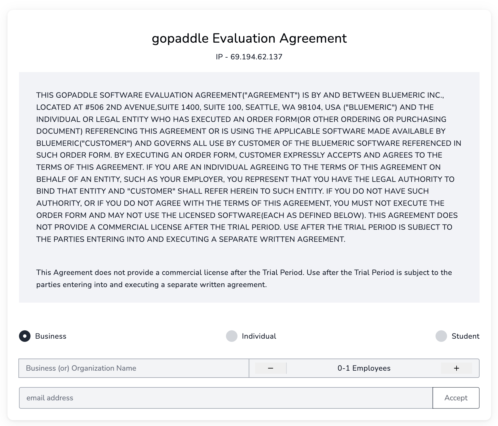
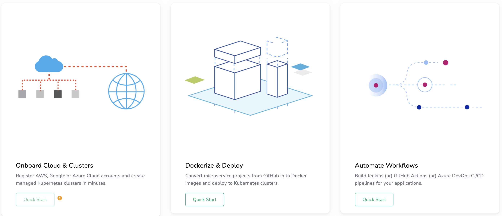
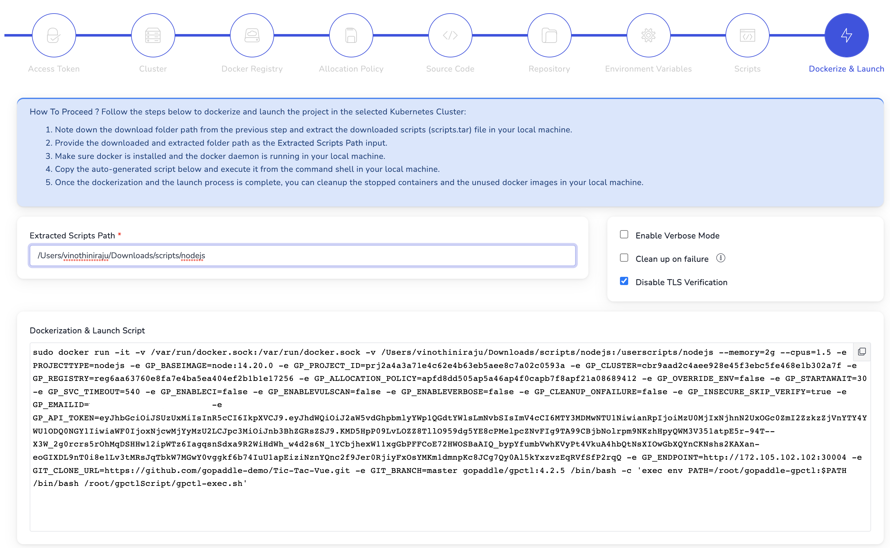
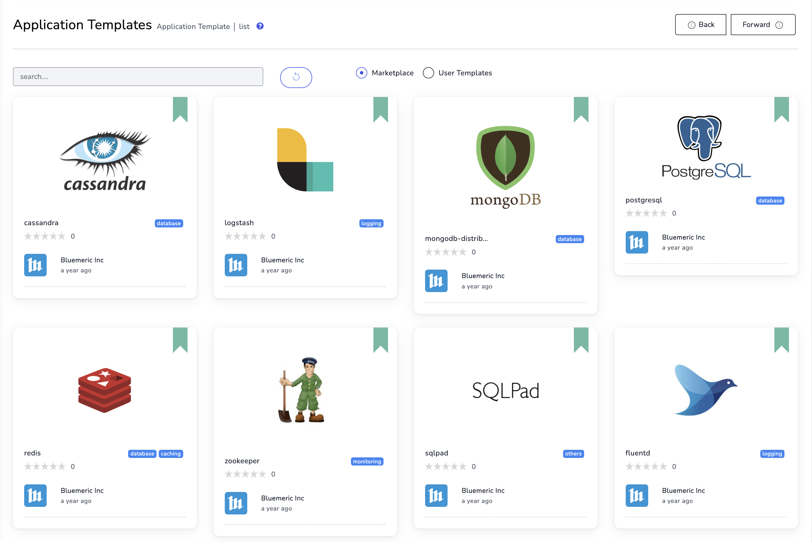

[gopaddle](https://gopaddle.io/) is a low-code Internal Developer Platform (IDP) for Kubernetes developers and operators. It provides a self-service portal through which developers can scaffold code to containers, auto-generate YAML files, build Docker images, deploy applications on to Kubernetes, and manage the application life cycle centrally.


The gopaddle Marketplace App installs gopaddle lite, which is a free community edition. To learn more about this version, see [gopaddle lite - Community Edition](https://gopaddle.io/devspace.html).


## Deploying a Marketplace App






**Estimated deployment time:** gopaddle should be fully installed within 15-20 minutes after the Compute Instance has finished provisioning.


## Configuration Options

- **Supported distributions:** Ubuntu 18.04 LTS
- **Recommended plan:** A minimum plan size of 8GB Shared CPU Linode is recommended for GoPaddle.

## Getting Started After Deployment

1. Log into your new Compute Instance through [LISH](/docs/products/compute/compute-instances/guides/lish/) or [SSH](/docs/products/compute/compute-instances/guides/set-up-and-secure/#connect-to-the-instance) using the root user and the password you entered when creating the instance.

1. Review the installation log.

    ```command
    tail -f /var/log/stackscript.log
    ```

1. When the installation is complete, the following message is displayed in that log file. This line includes the URL to your gopaddle dashboard.

    ```output
    gopaddle-lite installation is complete !
    You can now access the gopaddle dashboard @ http://192-0-2-110.ip.linodeusercontent.com:30003/
    ```

    
    The gopaddle dashboard is not available until installation has finished. As such, do not continue with this guide until the completion message appears in the log file.
    

1. Open your web browser and navigate to the URL provided in the last step. This should be `http://[ip-address]:30003/`, where *[ip-address]* can be replaced with your Compute Instance's IPv4 address or rDNS domain (such as `192-0-2-1.ip.linodeusercontent.com`). See the [Managing IP Addresses](/docs/products/compute/compute-instances/guides/manage-ip-addresses/) guide for information on viewing IP addresses and rDNS.

1. Provided the installation has finished, this URL should display the *gopaddle Evaluation Agreement* page. Review the evaluation agreement and subscribe to the lite edition.

    

## Using gopaddle

### Containerize and Deploy

Once the subscription is complete, you can login to the gopaddle console, using your email ID and the initial password.

In the main dashboard, the **Containerize and Deploy** Quickstart wizard helps to onboard a Source Code project from GitHub using the GitHub personal access token, build and push the generated container image to the Docker Registry. Once the build completes, gopaddle generates the necessary YAML files and deploys the docker image to the local microk8s cluster.



#### Pre-requisites

[Docker Access Token with Read & Write Permissions](https://www.docker.com/blog/docker-hub-new-personal-access-tokens/)

[GitHub Person Access Token for containerizing Private Repositories](https://docs.github.com/en/authentication/keeping-your-account-and-data-secure/creating-a-personal-access-token)

In the final step of the Containerize and Deploy Quickstart wizard, enable the option to **Disable TLS verification**.



All the artifacts generated during the process can be edited and re-deployed at a later stage.

### Application Templates - Marketplace

Under Templates, the Marketplace Applications hosts a variety of pre-built Kubernetes templates. Developers can subscribe to these templates and deploy them on the local microk8s cluster.



For more information on gopaddle configurations, please see the [documentation](https://help.gopaddle.io).

