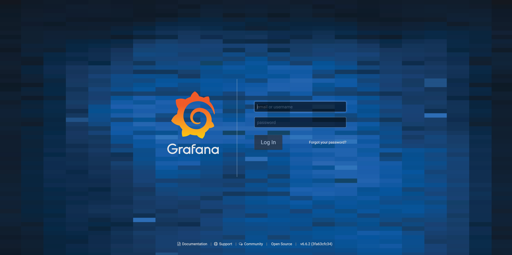

---
author:
  name: Linode Community
  email: docs@linode.com
description: "Learn how to deploy Grafana, an open source analytics and monitoring solution with a focus on metric visualization, through the Linode Marketplace."
keywords: ['grafana','monitoring','dashboard','marketplace']
tags: ["linode platform","monitoring","marketplace","cloud-manager"]
license: '[CC BY-ND 4.0](https://creativecommons.org/licenses/by-nd/4.0)'
published: 2020-03-11
modified: 2022-03-08
modified_by:
  name: Linode
title: "Deploying Grafana through the Linode Marketplace"
image: feature.png
contributor:
  name: Linode
external_resources:
- '[Create Grafana API tokens and dashboards for an organization](https://grafana.com/docs/grafana/latest/tutorials/api_org_token_howto/)'
- '[Grafana Alerting and Engine Rules](https://grafana.com/docs/grafana/latest/alerting/rules/)'
aliases: ['/platform/marketplace/how-to-deploy-grafana-with-marketplace-apps/', '/platform/one-click/how-to-deploy-grafana-with-one-click-apps/','/guides/how-to-deploy-grafana-with-one-click-apps/','/guides/how-to-deploy-grafana-with-marketplace-apps/','/guides/grafana-marketplace-app/']
---

[Grafana](https://grafana.com/docs/grafana/latest/guides/what-is-grafana/) is an open source analytics and monitoring solution with a focus on accessibility for metric visualization. You can use Grafana to create, monitor, store, and share metrics with your team to keep tabs on your infrastructure. Grafana is very lightweight and does not use a lot of memory and CPU resources.


Grafana is often used alongside [Prometheus](https://prometheus.io/) for monitoring and data collection. Consider using the combined [Prometheus and Grafana Marketplace App](/docs/products/tools/marketplace/guides/prometheus-grafana/) if you intend on using both of these applications together.


## Deploying a Marketplace App






**Estimated deployment time:** Grafana should be fully installed within 2-5 minutes after the Compute Instance has finished provisioning.


## Configuration Options

- **Supported distributions:** Debian 11
- **Recommended minimum plan:** All plan types and sizes can be used.

### Grafana Options

- **Grafana Password** *(required)*: Set your Grafana instance's admin password. You will use this password when first logging into Grafana.



## Getting Started after Deployment

### Access Your Grafana Client

Now that your Grafana Marketplace App is deployed, you can log into Grafana to access all of its monitoring and visualization features.

1. Open a browser and navigate to your [Linode's IP address](/docs/guides/find-your-linodes-ip-address/) and port `3000`, for example, `http://192.0.2.0:3000/`. By default, Grafana will listen to port `3000`.

    
The Grafana Marketplace App will install and enable the [UFW firewall](/docs/guides/configure-firewall-with-ufw/) allowing TCP traffic on port `3000`.
    

1. Viewing Grafana's log in page, enter in `admin` as the *username* and the Grafana password you set in the [Grafana Options](#grafana-options) section of the Cloud Manager, as the *password*. Click on the **Log In** button.

    

1. Once you are logged into Grafana, complete your configurations by [adding a data source](https://grafana.com/docs/grafana/latest/features/datasources/add-a-data-source/#add-a-data-source), [creating dashboards](https://grafana.com/docs/grafana/latest/guides/getting_started/#create-a-dashboard), and [adding users](https://grafana.com/docs/grafana/latest/permissions/overview/).


