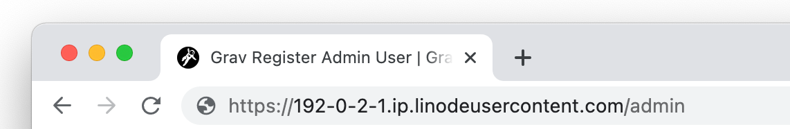
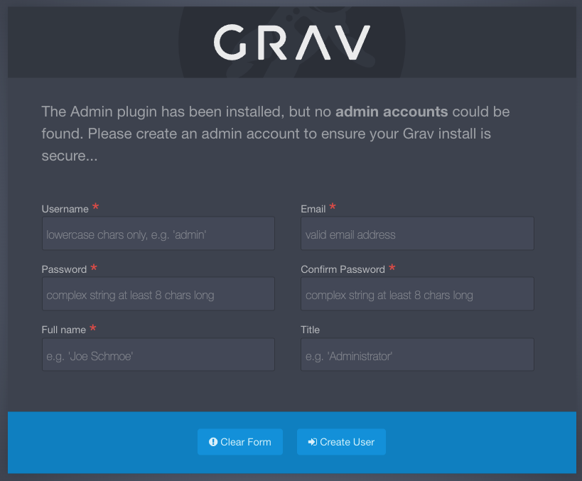
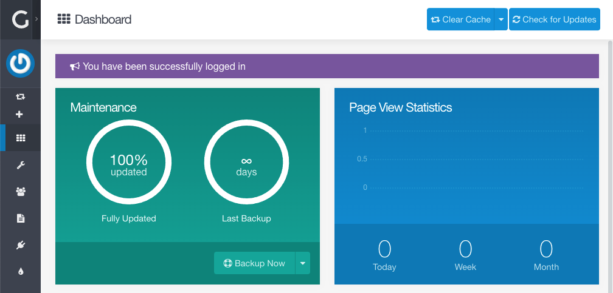

[Grav](https://getgrav.org/) is a flexible open source flat-file CMS (Content Management System). It can be used by both technical and non-technical people, allowing users to operate in the command line through its own [CLI](https://learn.getgrav.org/17/cli-console/command-line-intro) or in a web browser through its [Admin panel](https://learn.getgrav.org/17/admin-panel/introduction). Page templates in Grav are constructed using the highly customizable [Twig templating engine](https://twig.symfony.com/) and content can be written directly in Markdown. Using Grav also enables you to pull from a plethora of pre-built resources, including [starter templates](https://getgrav.org/downloads/skeletons), unique [themes](https://getgrav.org/downloads/themes), and quite a few [plugins](https://getgrav.org/downloads/plugins). If you need assistance getting started, there is an active [community form](https://discourse.getgrav.org/) and [extensive documentation](https://learn.getgrav.org/17/basics/what-is-grav).

## Deploying a Marketplace App






**Estimated deployment time:** Grav should be fully installed within 5-10 minutes after the Compute Instance has finished provisioning.


## Configuration Options

- **Supported distributions:** Ubuntu 20.04 LTS
- **Recommended plan:** All plan types and sizes can be used.

### Grav Options

- **Email address** *(required)*: Enter the email address to use for generating the SSL certificates.







## Getting Started after Deployment

### Accessing the Grav Admin Panel

1.  Open your web browser and navigate to `http://[domain]/admin`, where *[domain]* can be replaced with the custom domain you entered during deployment or your Compute Instance's rDNS domain (such as `192-0-2-1.ip.linodeusercontent.com`). You can also use your IPv4 address, though your connection will not be encrypted. See the [Managing IP Addresses](/docs/products/compute/compute-instances/guides/manage-ip-addresses/) guide for information on viewing IP addresses and rDNS.

    

1.  You are now prompted to create a new admin user for Grav. Complete the form and click the **Create User** button.

    

1.  Once the admin user had been created, you are automatically logged in and taken to the Admin dashboard. From here, you can fully administer your new Grav site, including creating content, modifying your configuration, changing your theme, and much more.

    

Now that you’ve accessed your dashboard, check out [the official Grav documentation](https://learn.getgrav.org/) to learn how to further utilize your Grav instance.

