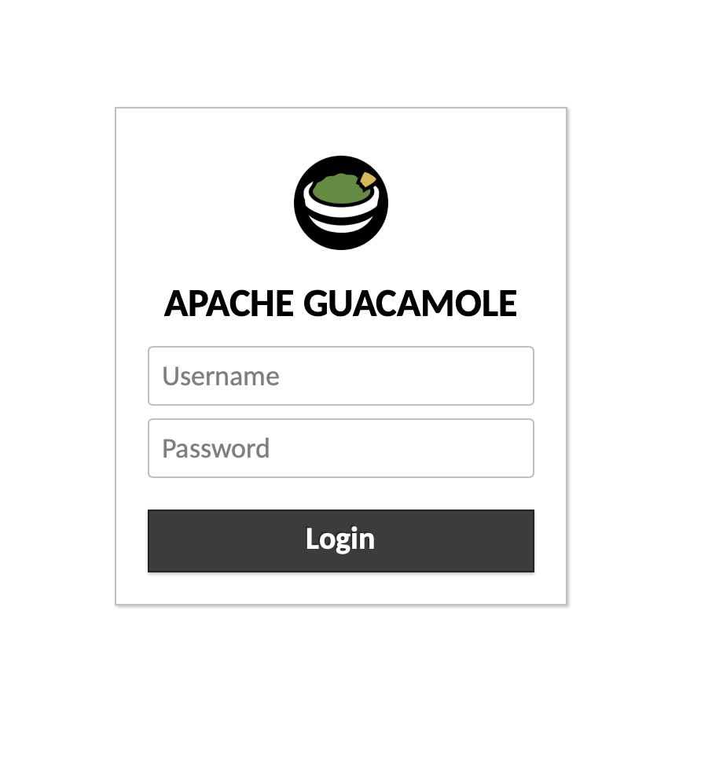
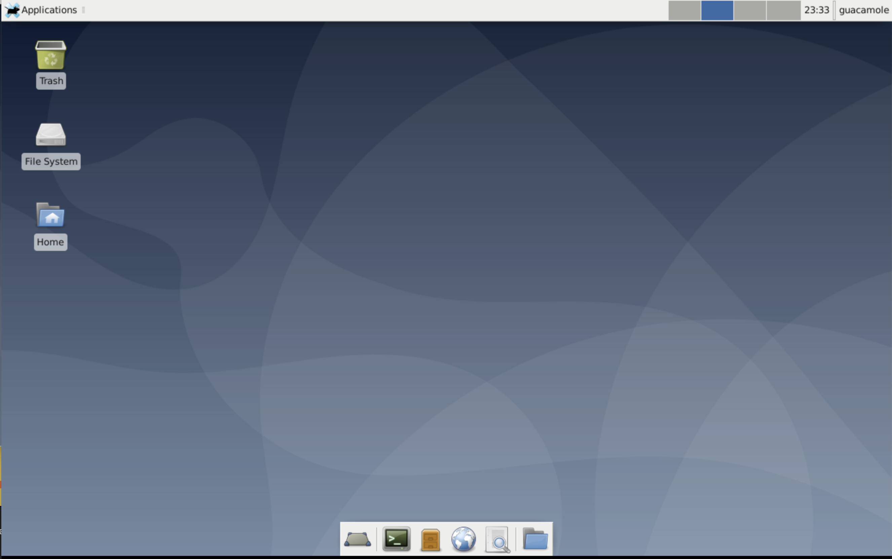

---
author:
  name: Linode
  email: docs@linode.com
description: "Use the Guacamole Marketplace App to easily install the popular open source remote desktop and access your Linode from any device."
keywords: ['guacamole', 'marketplace', 'remote desktop']
tags: ["cloud-manager","linode platform","cms","marketplace"]
license: '[CC BY-ND 4.0](https://creativecommons.org/licenses/by-nd/4.0)'
published: 2020-12-11
modified: 2022-03-08
modified_by:
  name: Linode
title: "Deploy Apache Guacamole through the Linode Marketplace"
aliases: ['/platform/marketplace/guacamole/','/guides/deploy-guacamole-with-marketplace-apps/','/guides/guacamole-marketplace-app/']
contributor:
  name: Linode
external_resources:
 - '[Guacamole Documentation](https://guacamole.apache.org/doc/gug/)'
---

[Apache Guacamole](https://guacamole.apache.org/) is an open source HTML5-based web application used as a remote desktop gateway. With the Guacamole Marketplace App, you can access your Linode with a graphical VNC session using the XFCE desktop environment from any device. This Marketplace App installs and configures Guacamole on a Linode, complete with an SSL certificate generated by [Certbot](https://certbot.eff.org/) for your domain.

## Deploying a Marketplace App






**Estimated deployment time:** Apache Guacamole should be fully installed within 5-20 minutes after the Compute Instance has finished provisioning.


## Configuration Options

- **Supported distributions:** Debian 10
- **Recommended plan:** All plan types and sizes can be used with Guacamole.

### Guacamole Options

- **The limited sudo/VNC user to be created for the Linode** *(required)*: The VNC username created for this Linode with sudo permissions. This is used for your VNC session.
- **The password for the limited sudo/VNC user** *(required)*: Password for your sudo/VNC user. This is used for your VNC session.
- **The username to be used with Guacamole** *(required)*: Your Guacamole Username. This is used to log in to Guacamole.
- **The password to be used with Guacamole** *(required)*: Your Guacamole Password. This is used to log in to Guacamole.

#### Limited User SSH Options (Optional)

- **SSH public key for the limited user:** If you wish to login as the limited user through public key authentication (without entering a password), enter your public key here. See [Creating an SSH Key Pair and Configuring Public Key Authentication on a Server](/docs/guides/use-public-key-authentication-with-ssh/) for instructions on generating a key pair.
- **Disable root access over SSH:** To block the root user from logging in over SSH, select *Yes* (recommended). You can still switch to the root user once logged in and you can also log in as root through [Lish](/docs/guides/lish/).


- **Admin Email:** The email address to register with [Certbot](https://certbot.eff.org/) when generating an SSL certificate for your absolute domain. This field is required along with your `API Token` and `Domain` for HTTPS access to your Guacamole remote desktop.

## Getting Started after Deployment

### Access your Guacamole App

After Guacamole has finished installing, access the dashboard over `http://` or `https://` with your Linode's IPv4 address or absolute domain name, depending on your setup choices.

1. If you set up a [domain name](#guacamole-options) for your Guacamole App during setup, skip to step 3.

1. If you didn't set up a domain name, find your Linode's IPv4 address by clicking on **Linodes** in the Cloud Manager sidebar to see a list of all your Linodes. Find the Linode you just created. Under the **IP Address** column, copy the IPv4 address.

1. Enter your Linode's absolute domain or IPv4 address into a browser window (for example, `http://192.0.2.0`) to access the Guacamole login page. Enter your [Guacamole username and password](#guacamole-options).

    

    
    The Guacamole login page may take several minutes to become available while the Application completes the creation process.
    

1. Once you've completed the login process, you have full access to your Linode from your Guacamole remote desktop using VNC and the XFCE desktop environment.

     

1. Additional tasks can be performed remotely through your web browser. For example, you can install the [Firefox](https://www.mozilla.org/firefox) web browser for use with your Guacamole remote desktop by entering the following command in its Terminal Emulator:

        sudo apt install firefox-esr

    When prompted, enter the password you chose for the [limited sudo/VNC user](#guacamole-options). You can now browse the web on your Guacamole browser from within your local browser.


