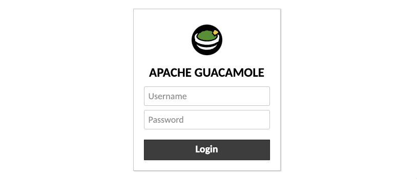
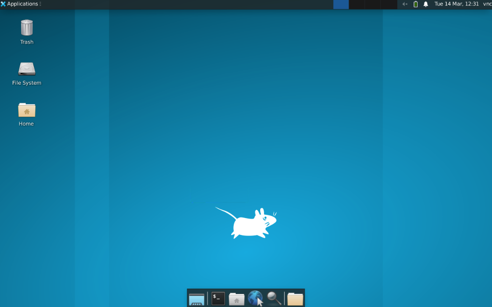

[Apache Guacamole](https://guacamole.apache.org/) is an open source HTML5-based web application used as a remote desktop gateway. With the Guacamole Marketplace App, you can access your Compute Instance with a graphical VNC session using the [Xfce](https://www.xfce.org/) desktop environment from any device. This Marketplace App installs and configures Guacamole on a Compute Instance, complete with an SSL certificate generated by [Certbot](https://certbot.eff.org/) for your domain.

## Deploying a Marketplace App






**Estimated deployment time:** Apache Guacamole should be fully installed within 5-20 minutes after the Compute Instance has finished provisioning.


## Configuration Options

- **Supported distributions:** Ubuntu 22.04 LTS
- **Recommended plan:**  We recommend a 4GB Dedicated CPU or Shared CPU Compute Instance.

### Guacamole Options

- **The limited sudo/VNC user to be created for the Linode** *(required)*: The VNC username created for this Compute Instance with sudo permissions. This is used for your VNC session.
- **The password for the limited sudo/VNC user** *(required)*: Password for your sudo/VNC user. This is used for your VNC session.
- **The username to be used with Guacamole** *(required)*: Your Guacamole Username. This is used to log in to Guacamole.
- **The password to be used with Guacamole** *(required)*: Your Guacamole Password. This is used to log in to Guacamole.

#### Limited User SSH Options (Optional)

- **SSH public key for the limited user:** If you wish to login as the limited user through public key authentication (without entering a password), enter your public key here. See [Creating an SSH Key Pair and Configuring Public Key Authentication on a Server](/docs/guides/use-public-key-authentication-with-ssh/) for instructions on generating a key pair.
- **Disable root access over SSH:** To block the root user from logging in over SSH, select *Yes* (recommended). You can still switch to the root user once logged in and you can also log in as root through [Lish](/docs/products/compute/compute-instances/guides/lish/).


- **Admin Email:** The email address to register with [Certbot](https://certbot.eff.org/) when generating an SSL certificate for your absolute domain. This field is required along with your `API Token` and `Domain` for HTTPS access to your Guacamole remote desktop.



## Getting Started after Deployment

### Access your Guacamole App

After Guacamole has finished installing, the Compute Instance will reboot. Once the instance fully boots back up, you can access the dashboard by following the instructions below.

1.  Open your web browser and navigate to the custom domain you entered during deployment or your Compute Instance's rDNS domain (such as `192-0-2-1.ip.linodeusercontent.com`). The site uses the secure HTTPS protocol.

1. In the Apache Guacamole login window that appears, enter the username and password you specified for Guacamole during deployment.

    

    
    The Guacamole login page may take several minutes to become available while the Application completes the creation process.
    

1. Once you have logged in, the Xfce graphical desktop environment for your Compute Instance will appear. This provides you with full access to your internal system through the VNC user you created.

     

1. Additional tasks can be performed remotely through your web browser. For example, you can install the [Firefox](https://www.mozilla.org/firefox) web browser for use with your Guacamole remote desktop by entering the following command in its Terminal Emulator:

    ```command
    sudo apt install firefox-esr
    ```

    When prompted, enter the password you chose for the limited sudo/VNC user. You can now browse the web on your Guacamole browser from within your local browser.


