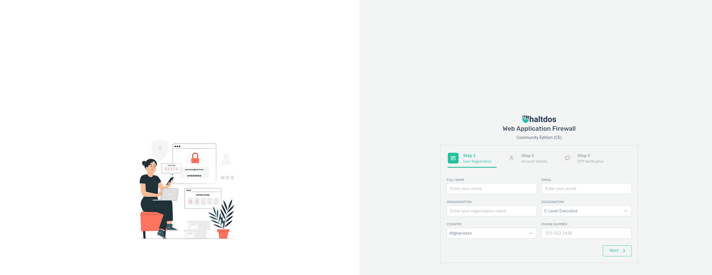
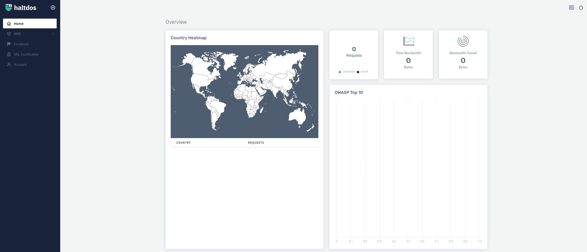

[Haltdos](https://www.haltdos.com/) Community Edition is a free user-friendly web application. It provides protection from OWASP 10 threats, XSS, SQL, and other web-based threats.

## Deploying a Marketplace App






**Estimated deployment time:** Haltdos Community WAF should be fully installed within 5-10 minutes after the Compute Instance has finished provisioning.


## Configuration Options

- **Supported distributions:** Ubuntu 22.04 LTS and Debian 11
- **Recommended plan:** A minimum of a 2GB Shared CPU Compute Instance is recommended.

## Getting Started after Deployment

### Accessing Haltdos Community WAF

1. Open your web browser and navigate to `https://[ip-address]:9000/`, where *[ip-address]* can be replaced with your Compute Instance's IPv4 address or rDNS domain (such as `192-0-2-1.ip.linodeusercontent.com`). See the [Managing IP Addresses](/docs/products/compute/compute-instances/guides/manage-ip-addresses/) guide for information on viewing IP addresses and rDNS.

    
    Haltdos uses a self-signed TLS/SSL certificate. It is likely that your web browser will display a security warning. You need to accept this risk and bypass the warning to continue.
    

1. The initial registration page  should appear, requesting you to enter user registration and account information, as well as complete email OTP to proceed with the Haltdos Community WAF configuration.

    

1. Once registration is complete, you can start using the Haltdos Community WAF.

    

For more information on configuring Haltdos Community WAF please see the [documentation](https://docs.haltdos.com/community/docs/overview).