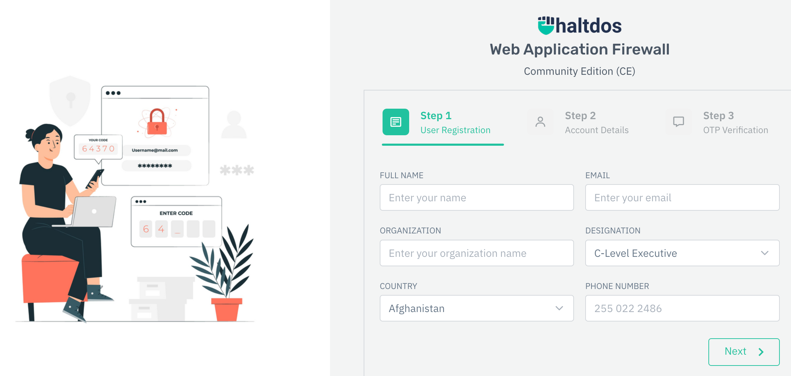

---
author:
  name: Linode
  email: docs@linode.com
description: "Learn how to deploy Haltdos Community WAF, a free web application firewall, on the Linode platform."
keywords: ['haltdos','firewall','security','web application firewall']
tags: ["marketplace", "linode platform", "cloud manager"]
license: '[CC BY-ND 4.0](https://creativecommons.org/licenses/by-nd/4.0)'
published: 2023-01-23
modified: 
modified_by:
  name: Linode
title: "Deploy Haltdos Community WAF through the Linode Marketplace"
contributor:
  name: Linode
external_resources:
- '[Haltdos Community WAF](https://docs.haltdos.com/community)'
aliases: ['/guides/deploying-haltdos-marketplace-app/','/guides/haltdos-marketplace-app/']
---

[Haltdos](https://www.haltdos.com/) brings you user friendly Web application firewall as free to access for all, in the form of Haltdos Community Edition (CE). The Community Edition provides 360 degrees of website security from OWASP 10 threats, XSS, SQL and other web-based threats. 

## Deploying a Marketplace App






**Estimated deployment time:** Haltdos Community WAF should be fully installed within 5-10 minutes after the Compute Instance has finished provisioning.


## Configuration Options

- **Supported distributions:** Ubuntu 22.04 LTS and Debian 11
- **Recommended plan:** A 2GB Shared CPU Linode is recommended for Haltdos Community WAF. 

## Getting Started after Deployment

### Accessing Haltdos Community WAF 

1. Open your web browser and navigate to port 9000 on your Linode's IP address. This will look like `https://$IPADDRESS:9000` 

Haltdos Community WAF uses a self-signed SSL certificate on port 9000, and you may need to bypass a security warning in your browser to proceed. 

2. You will need to register user and account information, as well as complete email OTP to proceed with the Haltdos Community WAF configuration. 

 

3. Once registration is complete you can proceed to the Haltdos Community WAF home page. 

For more information on configuring Haltdos Community WAF please see the [documentation](https://docs.haltdos.com/community/docs/overview). 

