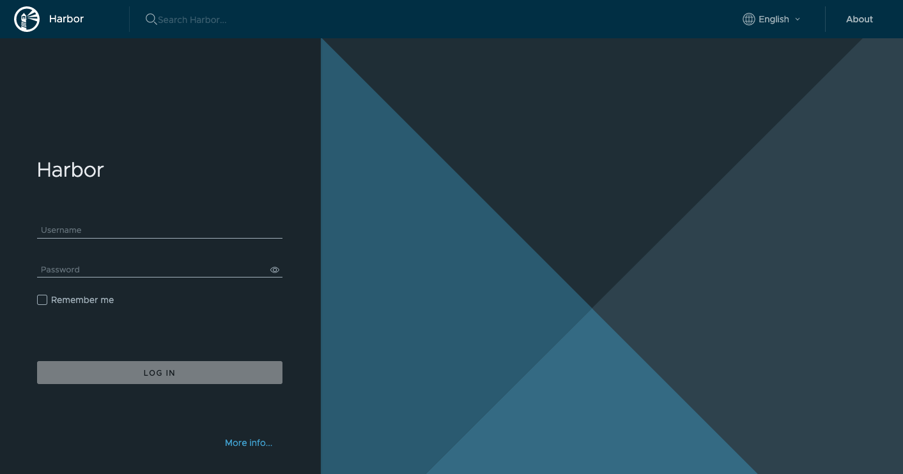

[Harbor](https://goharbor.io/) is an open source container registry platform, cloud-native content storage, and signing/scanning tool. Harbor enhances the open source Docker distribution by providing features like security, identification, and management. The image transfer efficiency can be improved by having a registry closer to the build and run environment. Harbor includes comprehensive security features like user administration, access control, and activity auditing, as well as image replication between registries.

Harbor is an excellent compliment to the [Linode Kubernetes Engine (LKE)](/docs/products/compute/kubernetes/). However, you cannot install Harbor on an existing or new LKE clusters.

## Deploying a Marketplace App






**Estimated deployment time:** Harbor should be fully installed within 2-5 minutes after the Compute Instance has finished provisioning.


## Configuration Options

- **Supported distributions:** Ubuntu 22.04 LTS, Debian 11
- **Recommended plan:** All plan types and sizes can be used.

### Harbor Options

- **Admin Password** *(required)*: The Harbor admin password.
- **Database Password** *(required)*: The Harbor database password.
- **Email address** *(required)*: Enter the email address to use for generating the SSL certificates.







## Getting Started after Deployment

### Accessing the Harbor App

1.  Open a browser and navigate to the domain you created in the beginning of your deployment. You can also use your Compute Instance's rDNS, which may look like `203-0-113-0.ip.linodeusercontent.com`. See the [Managing IP Addresses](/docs/products/compute/compute-instances/guides/manage-ip-addresses/) guide for information on viewing and setting the rDNS value.

1.  In the Harbor login screen that appears, enter `admin` as the username and use the *Admin password* you created in the beginning of your deployment.

    

Now that you’ve accessed your dashboard, check out [the official Harbor documentation](https://goharbor.io/docs/2.3.0/administration/) to learn how to further utilize your Harbor instance.


