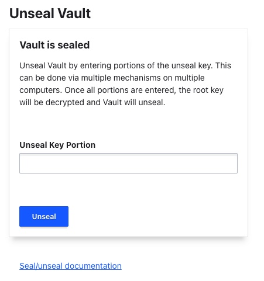
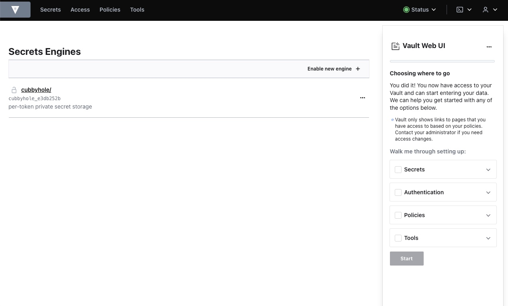

---
author:
  name: Linode
  email: docs@linode.com
description: "Deploy HashiCorp Vault, an open source, centralized secrets management system, on a Linode Compute Instance.'"
keywords: ['HashiCorp','vault','secrets',]
tags: ["marketplace", "linode platform", "cloud manager"]
license: '[CC BY-ND 4.0](https://creativecommons.org/licenses/by-nd/4.0)'
published: 2022-08-09
modified_by:
  name: Linode
title: "Deploying HashiCorp Vault through the Linode Marketplace"
---

[HashiCorp Vault](https://www.vaultproject.io/) is an open source, centralized secrets management system. It provides a secure and reliable way of storing and distributing secrets like API keys, access tokens, and passwords.

## Deploying a Marketplace App






**Estimated deployment time:** Vault should be fully installed within 5-10 minutes after the Compute Instance has finished provisioning.


## Configuration Options

- **Supported distributions:** Debian 11, Ubuntu 22.04 LTS
- **Recommended plan:** We recommend a 4GB Dedicated CPU or Shared Compute instance for the Vault instance.



## Getting Started after Deployment

### Obtaining the Unseal Key

The data within Vault is protected by a series of encryption keys. The first layer is an encryption key stored in the keyring. The keyring is then encrypted using the root key. And lastly, the root key is encrypted using the unseal key. The unseal key is split into multiple portions, which can then be distributed to multiple people. This process ensures the data is protected and only authorized users can gain access. See [Seal/Unseal documentation](https://www.vaultproject.io/docs/concepts/seal) to learn more about this encryption process.

Follow the instructions below to view the unseal key and root token.

1.  Log in to your Compute Instance via [SSH](/docs/guides/connect-to-server-over-ssh/) or [Lish](/docs/guides/using-the-lish-console/) using the root user credientials you created during deployment.

1.  Run the following command to display all five portions of the unseal key. These portions can be used together to decrypt the root key and unseal Vault.

        cat /root/.vault_tokens.txt

    
cat /root/.vault_tokens.txt
Unseal Key 1: M8H0MQbg5Vgdf5IFEL/xOvyBC0bXwH+exN9wLgSwyq1y
Unseal Key 2: oP7fCkpdJXrO/AegtuUtQAiiyK//fhPtfyfFzEnT5z8b
Unseal Key 3: dSB00TzKHK9Nq5S+w2zWDzlokxMhYnUx6xNXXFuXHw9o
Unseal Key 4: UJEqMsSKbtGM1SZNJjUmx0/V7Q4g5pI63V0aRIulHVm3
Unseal Key 5: UMBRh+13zGwYgTIunTl6F0qJRoWW4JS6U5WzazwAhOoz
Initial Root Token: hvs.z1f4cwvE9llTjBmkJO71xhF4


1.  Distribute the portions of the unseal key to your team as needed, making sure they are saved in a safe and secure location. In addition, save the **Initial Root Token**. After you are finished, you can delete this text file.

        rm /root/.vault_tokens.txt

### Accessing the Vault Web UI

1. Open your web browser and navigate to `http://[ip-address]:8200`, where *[ip-address]* is your Compute Instance's IPv4 address. See the [Managing IP Addresses](/docs/guides/managing-ip-addresses/) guide for information on viewing IP addresses.

1. To access the Vault instance, three of the unseal keys must be entered along with the root token.

    

1. Once the Vault is unsealed, the web UI can be used to set up secrets, authentication, and policies.

    

    
HashiCorp recommends using mutual TLS (mTLS) with a private CA to secure cluster communications and the web UI. Please see the following HashiCorp documentation for more details.
https://www.vaultproject.io/docs/auth/cert
https://www.vaultproject.io/docs/secrets/pki/setup


1. Additional configurations are required to use the Linode Marketplace Vault instance in a production environment. We recommend reviewing the [Configuration](https://www.vaultproject.io/docs/configuration), [Secrets Engine](https://www.vaultproject.io/docs/secrets), and [Authentication](https://www.vaultproject.io/docs/auth) documentation before proceeding further.


