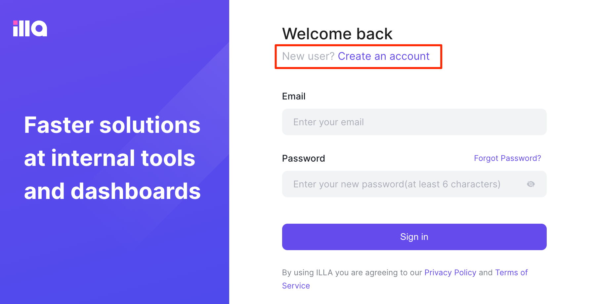
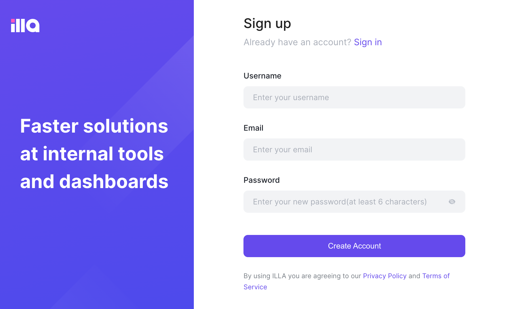
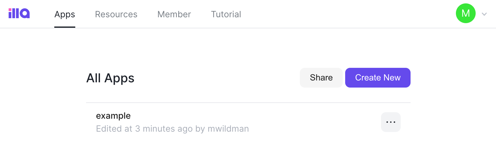
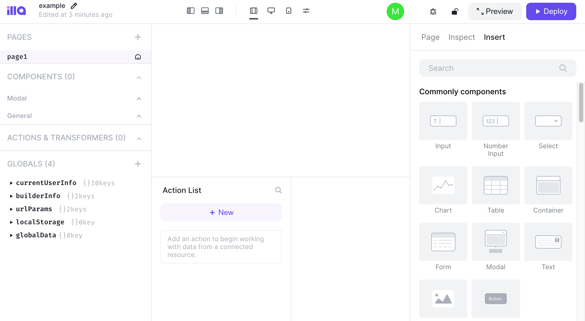

[ILLA Builder](https://github.com/illacloud/illa-builder) is an open-source low-code development tool that allows developers to quickly build internal tools. ILLA lets developers focus more on the core functionality of the tools they are building and spend less time on websites and integrations.

## Deploying a Marketplace App






**Estimated deployment time:** ILLA Builder should be fully installed within 5-10 minutes after the Compute Instance has finished provisioning.


## Configuration Options

- **Supported distributions:** Ubuntu 22.04 LTS, Ubuntu 20.04 LTS
- **Recommended plan:** We recommend a 4GB Dedicated CPU or Shared Compute instance for ILLA Builder.

### ILLA Options

- **Postgres Password** *(required)*: Provide a secure password for the postgres database.
- **ILLA Builder Port** (default: "80"): The port that is used for the HTTP site. If you'd like to use a non-standard web port, enter it here.

## Getting Started after Deployment

### Accessing ILLA Builder

1.  Open your web browser and navigate to `http://[ip-address]`, where *[ip-address]* is your Compute Instance's IPv4 address or default rDNS domain. See the [Managing IP Addresses](/docs/products/compute/compute-instances/guides/manage-ip-addresses/) guide for information on viewing IP addresses. If you specified a port other than port 80, append `:[port]` to the URL, replacing *[port]* with your custom port number.

1.  In the login page that is displayed, click the **Create Account** button if this is your first time accessing the app.

    

1.  The sign up page should open, which allows you to create a new user on this ILLA Builder deployment. Enter your preferred username, your email address, and a secure password. Then, click the **Create Account** button.

    

1.  After creating your account or logging in with an existing user, the dashboard is displayed.

    

1. To get started with a new app, click the **Create New** button and enter a name for the app. The app builder screen is displayed, allowing you to customize and deploy your application.

    

For additional guidance on using ILLA Builder, please see the [official documentation](https://www.illacloud.com/docs/about-illa).

