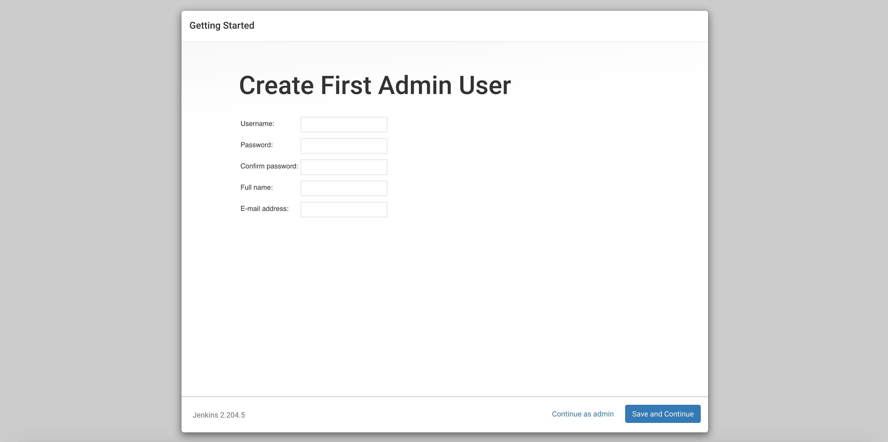

---
author:
  name: Linode Community
  email: docs@linode.com
description: "This guide shows how to install Jenkins, an open source automation tool which system administrators can use to build, test, and deploy your infrastructure."
keywords: ['jenkins','marketplace','pipeline','continuous delivery']
tags: ["linode platform","automation","marketplace","cloud-manager"]
license: '[CC BY-ND 4.0](https://creativecommons.org/licenses/by-nd/4.0)'
published: 2020-03-12
modified: 2022-03-08
modified_by:
  name: Linode
title: "Deploying Jenkins through the Linode Marketplace"
contributor:
  name: Linode
external_resources:
- '[Creating Your First Jenkins Pipeline](https://jenkins.io/doc/pipeline/tour/hello-world/)'
- '[Managing Jenkins Masters and Nodes](https://jenkins.io/doc/book/managing/)'
- '[Managing Jenkins Plugins](https://jenkins.io/doc/book/managing/plugins/)'
aliases: ['/platform/marketplace/how-to-deploy-jenkins-with-marketplace-apps/', '/platform/one-click/how-to-deploy-jenkins-with-one-click-apps/','/guides/how-to-deploy-jenkins-with-one-click-apps/','/guides/how-to-deploy-jenkins-with-marketplace-apps/','/guides/jenkins-marketplace-app/']
---

[Jenkins](https://jenkins.io/) is an open source automation tool which can build, test, and deploy your infrastructure. It gives you access to a massive library of plugins to support automation in your project's lifecycle. You can create a [continuous delivery pipeline](https://jenkins.io/doc/pipeline/tour/hello-world/#what-is-a-jenkins-pipeline) which automates the process for getting your software from version control to your users.

## Deploying a Marketplace App






**Estimated deployment time:** Jenkins should be fully installed within 2-5 minutes after the Compute Instance has finished provisioning.


## Configuration Options

- **Supported distributions:** Debian 10
- **Recommended minimum plan:** All plan types and sizes can be used.

## Getting Started after Deployment

After deploying your Jenkins instance, you are ready to log in and continue the configuration process. Follow the steps in the next section to get started.

### Access Your Jenkins Instance

1. [Connect to your Linode via SSH](/docs/guides/set-up-and-secure/#connect-to-the-instance).

1. Retrieve your Jenkins admin password by viewing the contents of the `/var/lib/jenkins/secrets/initialAdminPassword` file.

        cat /var/lib/jenkins/secrets/initialAdminPassword

    You should see a similar output

    
0f6fed516bc4ceab24373fe5de513dc
    

1. Open a browser and navigate to `http://192.0.2.0:8080/`. Replace `192.0.2.0` with your [Linode's IP address](/docs/guides/find-your-linodes-ip-address/). This will bring you the *Unlock Jenkins* page. Enter the password you retrieved in the previous step and click **continue**.

    

1. You are now ready to continue to configure Jenkins by installing the community suggested plugins or manually selecting plugins to install. Select the option you prefer.

    

1. After you have installed the desired plugins, you will be prompted to create your first admin user. Since the login password retrieved in the beginning of this section is temporary, you should create your admin user now.

    


