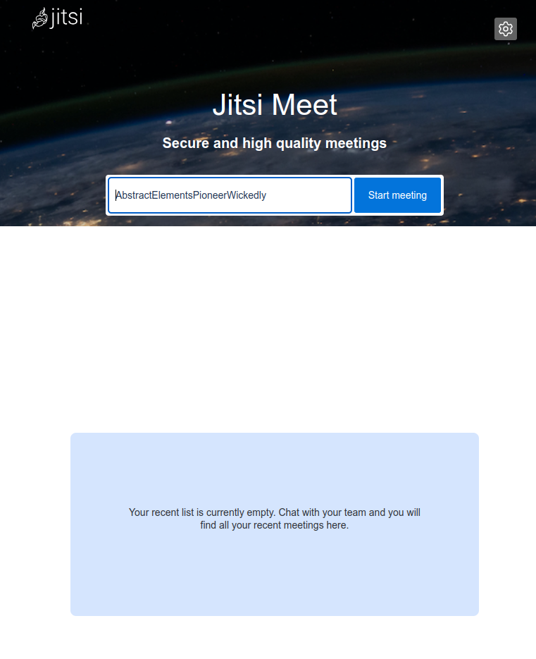

---
author:
  name: Linode
  email: docs@linode.com
description: "Jitsi is an open source suite that helps you host your own virtual video conferences. Follow this guide to deploy Jitsi on Linode using Marketplace Apps."
keywords: ['jitsi','marketplace', 'server']
tags: ["ubuntu","marketplace", "web applications","linode platform", "cloud manager", "ssl"]
license: '[CC BY-ND 4.0](https://creativecommons.org/licenses/by-nd/4.0)'
published: 2020-09-28
modified: 2022-03-08
image: Deploy_Jitsi_oneclickapps.png
modified_by:
  name: Linode
title: "Deploying Jitsi through the Linode Marketplace"
contributor:
  name: Linode
external_resources:
- '[About Jitsi](https://jitsi.org/about/)'
- '[Jitsi Documentation](https://jitsi.github.io/handbook/docs/intro)'
- '[Scale Your Jitsi Setup](https://jitsi.github.io/handbook/docs/devops-guide/devops-guide-scalable)'
aliases: ['/platform/marketplace/how-to-deploy-jitsi-with-marketplace-apps/', '/platform/one-click/how-to-deploy-jitsi-with-one-click-apps/','/platform/one-click/deploy-jitsi-with-one-click-apps/','/guides/how-to-deploy-jitsi-with-marketplace-apps/','/guides/jitsi-marketplace-app/']
---

[Jitsi](https://jitsi.org) is a suite of open source projects that allows you to host your own virtual video conferences.

## Deploying a Marketplace App






**Estimated deployment time:** Jitsi should be fully installed within 3-5 minutes after the Compute Instance has finished provisioning.


## Configuration Options

- **Supported distributions:** Ubuntu 20.04 LTS
- **Recommended minimum plan:** All plan types and sizes can be used, though we recommend a 8GB Dedicated CPU or Shared Compute Instance for hosting large meetings or multiple simultaneous meetings.

### Jitsi Options


- **Admin Email for the Jitsi server**
- **Would you like to use a free Let's Encrypt SSL certificate?** Select `Yes` if you would like the install to create an SSL certificate for you, or `No` if you do not. You cannot create secure, encrypted conferences without an SSL certificate. If `No` is selected, the Jitsi app triggers security warnings in most web browsers.



## Getting Started After Deployment

Jitsi is now installed and ready to use.

1.  Before you go to your app, if you filled out the optional Jitsi configuration fields:

    - In the Cloud Manager [DNS Manager](/docs/guides/dns-manager/#add-a-domain) there is now an entry for your domain with two `A/AAAA` records pointing to your new server. One for the domain name and one for the hostname.
    - [Configure the rDNS](/docs/guides/configure-your-linode-for-reverse-dns/) on your Linode.

1.  If you didn't setup a domain, navigate to the rDNS address of the Linode in your browser. You can find the rDNS address in the **Networking** tab for your Linode in the [Cloud Manager](https://cloud.linode.com). If you did setup a domain, navigate to the address as described in the [Jitsi Options](#jitsi-options) section above.

1.  Jitsi prompts you to start a meeting.

## Software Included

The Jitsi Marketplace App installs the following software on your Linode:

| **Software** | **Description** |
|:--------------|:------------|
| [**Jitsi Meet**](https://jitsi.org/jitsi-meet) | The WebRTC compatible JavaScript application that enables the video conferencing.|
| [**Jitsi Videobridge (jvb)**](https://jitsi.org/jitsi-videobridge) | WebRTC compatible server that routes the video streams between participants in the conference. |
| [**Jitsi Conference Focus (jicofo)**](https://github.com/jitsi/jicofo) | The server-side focus component that manages sessions between participants. |
| [**Prosody**](https://prosody.im/) | XMPP server for signalling. |


