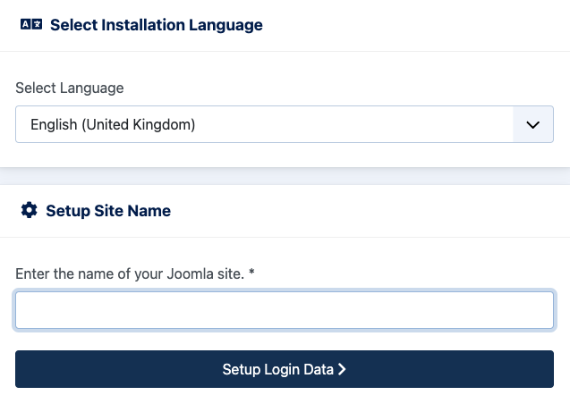
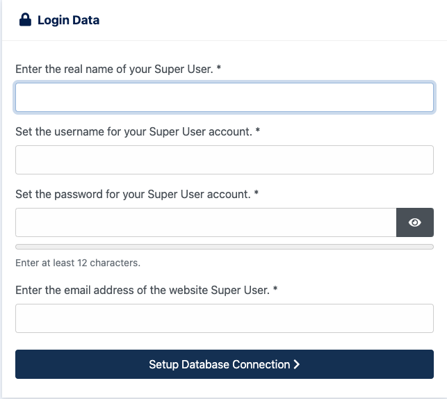
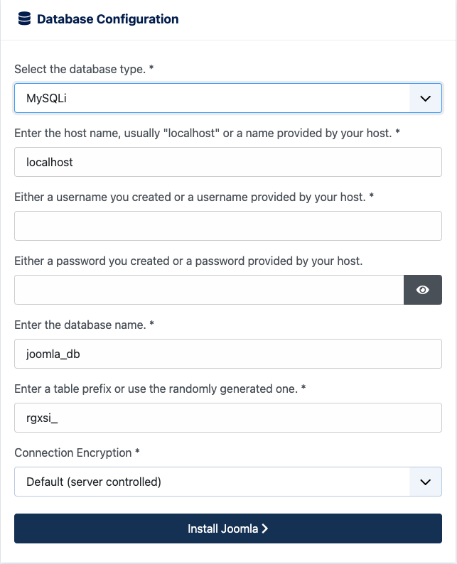

Joomla is an advanced "content management system" (CMS) used to facilitate the easy creation and ongoing maintenance of dynamic websites. Comparable in some respects to other web applications like [Drupal](https://www.drupal.org/) and [WordPress](https://wordpress.org/), Joomla also has advanced features that resemble web-development frameworks like [Ruby On Rails](https://rubyonrails.org/) and [Django](https://www.djangoproject.com/). Deployed on top of the industry standard [LAMP Stack](/docs/web-servers/lamp/), Joomla is designed to be both easy to use and manage from the end-user's perspective and easy to administer and host.

## Deploying the Joomla Marketplace App



**Software installation should complete within 5-10 minutes after the Linode has finished provisioning.**

## Configuration Options

### Joomla Options

Here are the additional options available for this Marketplace App:

| **Field** | **Description** |
|:--------------|:------------|
| **Admin Email for the server** | This email is require to generate the SSL certificates. *Required* |
| **Database Root Password** | This is the root password for the MySQL database. *Required* |
| **Database User Password** | This is the Joomla Database User password for the MySQL database. *Required* |
| **Your Linode API Token** | Your Linode `API Token` is needed to create DNS records. If this is provided along with the `subdomain` and `domain` fields, the installation attempts to create DNS records via the Linode API. If you don't have a token, but you want the installation to create DNS records, you must [create one](/docs/platform/api/getting-started-with-the-linode-api/#get-an-access-token) before continuing. |
| **Subdomain** | The subdomain you wish the installer to create a DNS record for during setup. The suggestion given is `www`. The subdomain should only be provided if you also provide a `domain` and `API Token`. |
| **Domain** | The domain name where you wish to host your Joomla instance. The installer creates a DNS record for this domain during setup if you provide this field along with your `API Token`. |
| **The limited sudo user to be created for the Linode** | This is the limited user account to be created for the Linode. This account has sudo user privileges. |
| **The password for the limited sudo user** | Set a password for the limited sudo user. The password must meet the complexity strength validation requirements for a strong password. This password can be used to perform any action on your server, similar to root, so make it long, complex, and unique. |
| **The SSH Public Key that will be used to access the Linode** | If you wish to access [SSH via Public Key](/docs/security/authentication/use-public-key-authentication-with-ssh/) (recommended) rather than by password, enter the public key here. |
| **Disable root access over SSH?** | Select `Yes` to block the root account from logging into the server via SSH. Select `No` to allow the root account to login via SSH. |

### General Options

For advice on filling out the remaining options on the **Create a Linode** form, see [Getting Started > Create a Linode](/docs/guides/getting-started/#create-a-linode). That said, some options may be limited or recommended based on this Marketplace App:

- **Supported distributions:** Ubuntu 20.04 LTS
- **Recommended plan:** All plan types and sizes can be used.

## Getting Started after Deployment

### Accessing the Joomla App

1.  Open your web browser and navigate to the custom domain you entered during deployment or your Compute Instance's rDNS domain (such as `192-0-2-1.ip.linodeusercontent.com`). See the [Managing IP Addresses](/docs/guides/managing-ip-addresses/#configuring-rdns) guide for information on viewing the rDNS value.

1. Within the Joomla setup pages that appears, you will first be prompted to enter a site name.

    

1. Fill out the Super User information and click Setup Database Connection.

    

1. Continue onto the Database Setup where you will need to enter 'Joomla' as the *database username* and the **Database User Password** you entered during the intial deployment of the app.

    

1.  The installation is now complete!

    

With the Joomla instance install complete, you can now visit the site by navigating to the custom domain you entered during deployment or your Compute Instance's rDNS domain (such as `192-0-2-1.ip.linodeusercontent.com`). If you would like to visit the administration panel, you can visit your domain followed by */administrator* (such as https://192-0-2-1.ip.linodeusercontent.com/administrator). The Joomla Login will appear where you can enter the username (*The username entered during the Super User setup*) and the password (*The password entered during the Super User setup*).

Now that you’ve accessed your dashboard, check out [the official Joomla documentation](https://docs.joomla.org/Main_Page) to learn how to further utilize your Joomla instance.

