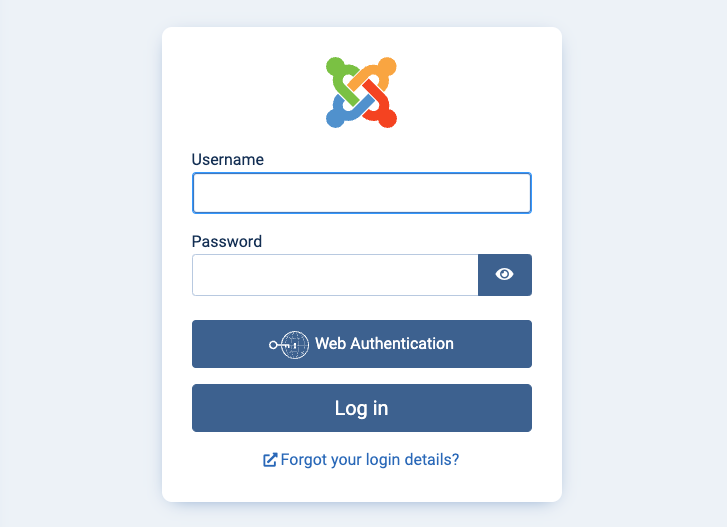

---
author:
  name: Linode
  email: docs@linode.com
description: "Deploy Joomla on a Linode Compute Instance. A content management system to ease administration overhead for your websites."
keywords: ['joomla','csm','website']
tags: ["marketplace", "linode platform", "cloud manager"]
license: '[CC BY-ND 4.0](https://creativecommons.org/licenses/by-nd/4.0)'
published: 2022-03-29
modified_by:
  name: Linode
title: "Deploying Joomla through the Linode Marketplace"
external_resources:
- '[Joomla](https://www.joomla.org/)'
---

[Joomla](https://www.joomla.org/) is an advanced CMS (content management system) used to facilitate the easy creation and ongoing maintenance of dynamic websites. Comparable in some respects to other web applications like [Drupal](https://www.drupal.org/) and [WordPress](https://wordpress.org/), Joomla also has advanced features that resemble web-development frameworks like [Ruby On Rails](https://rubyonrails.org/) and [Django](https://www.djangoproject.com/). Deployed on top of the industry standard [LAMP Stack](/docs/web-servers/lamp/), Joomla is designed to be both easy to use and manage from the end user's perspective and easy to administer and host.

## Deploying a Marketplace App






**Estimated deployment time:** Joomla should be fully installed within 5-10 minutes after the Compute Instance has finished provisioning.


## Configuration Options

- **Supported distributions:** Ubuntu 20.04 LTS
- **Recommended minimum plan:** All plan types and sizes can be used.

### Joomla Options

- **Admin email address** *(required)*: Enter the email address to use for generating the SSL certificates.
- **MySQL `root` password** *(required)*: The password for the `root` MySQL user.
- **MySQL User Password** *(required)*: The password for the `joomla` MySQL user.




## Getting Started after Deployment

### Accessing the Joomla Site

1.  Open your web browser and navigate to the custom domain you entered during deployment or your Compute Instance's rDNS domain (such as `192-0-2-1.ip.linodeusercontent.com`). You can also use your IPv4 address, though your connection will not be encrypted. See the [Managing IP Addresses](/docs/guides/managing-ip-addresses/) guide for information on viewing IP addresses and rDNS.

### Setting Up Joomla

The first time you access your Joomla site, you are prompted to finish the Joomla installation. Complete each step of the process as described below.

1. Within the Joomla Installer page that appears, select your language and enter a name for your site. Then click the **Setup Login Data** button.

    

1. Enter the real name for your Joomla Super User account, your desired username and password, and your email address. Then click **Setup Database Connection**.

    

1. Within the *Database Configuration* page, leave the default values within fields that are already populated. Enter *joomla* as the username and enter the password you created in the **MySQL User Password** field during deployment. Then, click the **Install Joomla** button.

    

1. Joomla now checks the database connection and finishes the installation. Provided everything is successful, you should see a message indicating that the site is ready. To continue, click **Open Site** to view your Joomla site or select **Open Administrator** to view the site's admin panel.

    

### Accessing the Joomla Admin Dashboard

1. Open your web browser and navigate to the URL mentioned within the [Accessing the Joomla Site](#accessing-the-joomla-site) section, appending `administrator` to the URL: `http://[domain]/administrator`.

1. You are prompted to enter the *Super User* username and password you created when setting up Joomla for the first time. Click **Log in** once finished.

    

1. After logging in, the admin dashboard appears. From here, you can manage your site. This includes creating content, new users, adjusting the templates, and *much* more. Check out [the official Joomla documentation](https://docs.joomla.org/Main_Page) to learn how to further utilize your Joomla instance.

    

