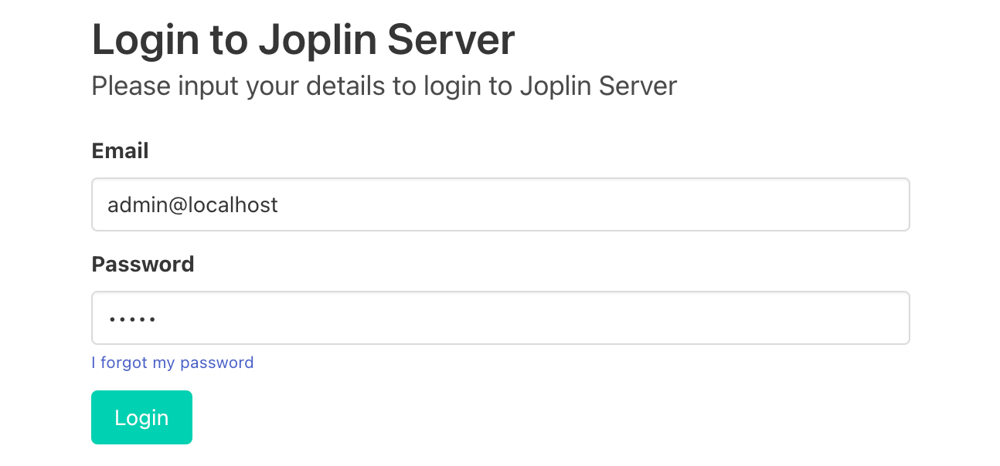
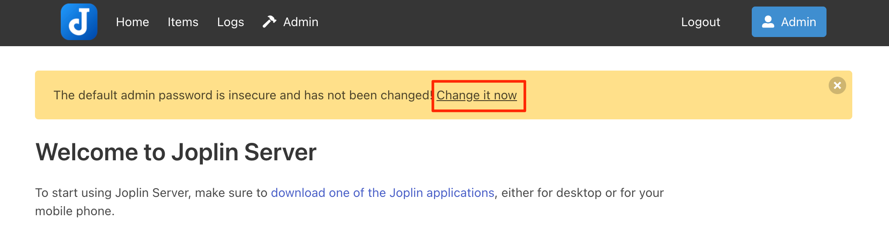
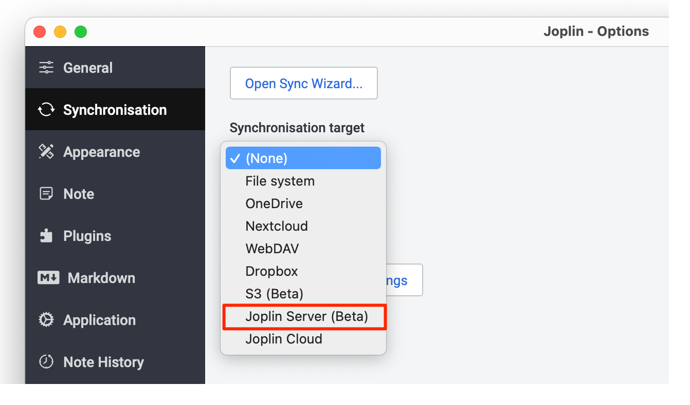
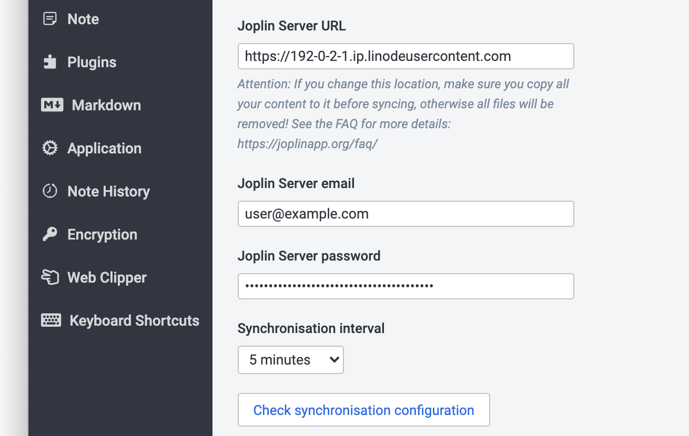

[Joplin](https://joplinapp.org/) is an open source application designed to take notes using the [Markdown format](https://joplinapp.org/markdown/). It is available on many different platforms, including Windows, macOS, Linux, Android, and iOS. To synchronize your notes across multiple devices, you need to enable synchronization. Synchronization can be facilitated through a service like Nextcloud, Dropbox, OneDrive, the Joplin Cloud, or the Joplin Server software. Our Joplin Marketplace App installs the Joplin Server software, enabling you to securely take control of your own data and enable synchronization between all of your devices.

## Deploying a Marketplace App






**Estimated deployment time:** Joplin should be fully installed within 10-15 minutes after the Compute Instance has finished provisioning.


## Configuration Options

- **Supported distributions:** Ubuntu 20.04 LTS
- **Recommended plan:** All plan types and sizes can be used.

### Joplin Options

- **Email address** *(required)*: Enter the email address to use for generating the SSL certificates.
- **Password for the postgres database** *(required)*: Enter the password you wish to use for the `joplin` database user.







## Getting Started after Deployment

### Accessing the Joplin Server

The Joplin server dashboard allows you to manage your account, add other users, and perform various administration tasks. Before using your new Joplin instance to take notes, you should first log in to the admin dashboard and update your profile using the instructions below.

1. Open your web browser and navigate to the custom domain you entered during deployment or your Compute Instance's rDNS domain (such as `192-0-2-1.ip.linodeusercontent.com`). You can also use your IPv4 address, though your connection will not be encrypted. See the [Managing IP Addresses](/docs/products/compute/compute-instances/guides/manage-ip-addresses/) guide for information on viewing IP addresses and rDNS.

1. In the login prompt that appears, enter `admin@localhost` as the **Email** and `admin` as the **Password**. Click **Login** to continue.

    

1. Once logged in, the Joplin Admin page appears. Since the default login credentials are insecure, you should immediately update the email and password for the admin user. Click the **Change it now** link in the warning banner or navigate to `http://[domain]/users/me`.

    

1. The *Your Profile* page appears. Enter your full name, the email address you wish to use, and a new secure password. Then click **Update profile** to make the changes.

1.  To confirm your new email address, navigate to `http://[domain]/admin/emails` or click on the **Admin** menu item and select **Emails**. Select the email with the subject "Confirm your new Joplin Server account email". Click on the **Confirm email** link within the email.

### Using the Joplin App

To start using Joplin to take notes, download the Joplin application for your device and configure the synchronization settings.

1. Download and install the Joplin application on the device you wish to use. See the [Joplin Download](https://joplinapp.org/download) page.

1. Open Joplin. You should see a few example notes.

1. Click the **Synchronise** button or navigate to **Preferences** and select **Synchronisation**. If the **Sync Wizard** screen appears, close it as you will configure custom settings for your new server.

1. Under the **Syncronisation target** dropdown, select *Joplin Server (Beta)*.

    

1. Fill out the new configuration options that appear:

    - **Joplin Server URL:** Enter the custom domain you specified when deploying the new Compute Instance. If you did not use a custom domain, enter the rDNS value for the instance (such as `https://192-0-2-1.ip.linodeusercontent.com`). Be sure to format this as a full URL with the `https` protocol.

    - **Joplin Server email:** Enter the email address specified when updating your profile in the [Accessing the Joplin Server](#accessing-the-joplin-server) section.

    - **Joplin Server password:** Enter the password specified when updating your profile in the [Accessing the Joplin Server](#accessing-the-joplin-server) section.

    

1. Click the **Check synchronisation configuration** button to verify that you have the correct settings.

1. If your settings are correct, you should see a success message. Click the **Apply** button to save your settings.

Now you can start taking notes and your changes will automatically be stored on your new Joplin Server instance and synchronized between all of your devices. Check out [the official Joplin documentation](https://joplinapp.org/help/) to learn how to further utilize your Joplin instance.

