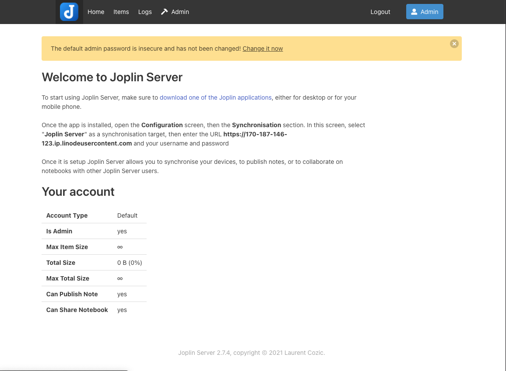
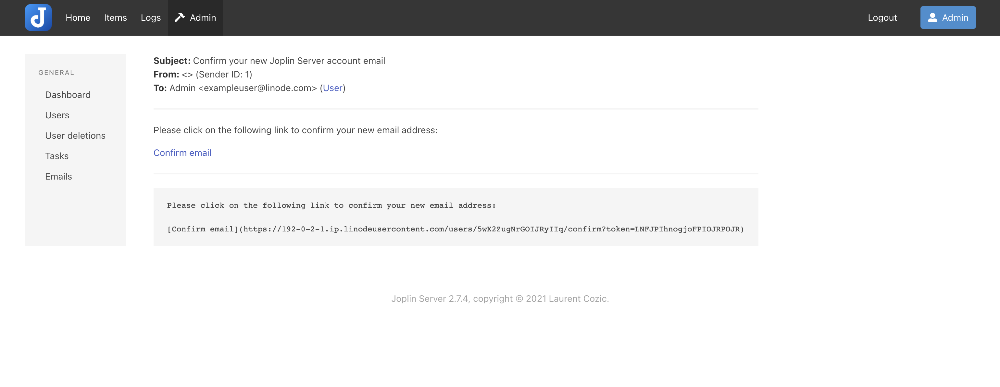

Joplin is a open source note-taking application that your notes are saved to an open format. Joplin also uses End-To-End Encryption (E2EE) to secure your notes and ensure no-one but yourself can access them.

## Deploying the Joplin Marketplace App



**Software installation should complete within 5-10 minutes after the Linode has finished provisioning.**

## Configuration Options

### Joplin Options

Here are the additional options available for this Marketplace App:

| **Field** | **Description** |
|:--------------|:------------|
| **Admin Email for the server** | This email is require to generate the SSL certificates. *Required* |
| **Database Password** | This is the Joplin user password for the Postgres database. *Required* |
| **Your Linode API Token** | Your Linode `API Token` is needed to create DNS records. If this is provided along with the `subdomain` and `domain` fields, the installation attempts to create DNS records via the Linode API. If you don't have a token, but you want the installation to create DNS records, you must [create one](/docs/platform/api/getting-started-with-the-linode-api/#get-an-access-token) before continuing. |
| **Subdomain** | The subdomain you wish the installer to create a DNS record for during setup. The suggestion given is `www`. The subdomain should only be provided if you also provide a `domain` and `API Token`. |
| **Domain** | The domain name where you wish to host your Joomla instance. The installer creates a DNS record for this domain during setup if you provide this field along with your `API Token`. |
| **The limited sudo user to be created for the Linode** | This is the limited user account to be created for the Linode. This account has sudo user privileges. |
| **The password for the limited sudo user** | Set a password for the limited sudo user. The password must meet the complexity strength validation requirements for a strong password. This password can be used to perform any action on your server, similar to root, so make it long, complex, and unique. |
| **The SSH Public Key that will be used to access the Linode** | If you wish to access [SSH via Public Key](/docs/security/authentication/use-public-key-authentication-with-ssh/) (recommended) rather than by password, enter the public key here. |
| **Disable root access over SSH?** | Select `Yes` to block the root account from logging into the server via SSH. Select `No` to allow the root account to login via SSH. |

### General Options

For advice on filling out the remaining options on the **Create a Linode** form, see [Getting Started > Create a Linode](/docs/guides/getting-started/#create-a-linode). That said, some options may be limited or recommended based on this Marketplace App:

- **Supported distributions:** Ubuntu 20.04 LTS
- **Recommended plan:** All plan types and sizes can be used.

## Getting Started after Deployment

### Accessing the Joomla App

1.  Open your web browser and navigate to the custom domain you entered during deployment or your Compute Instance's rDNS domain (such as `192-0-2-1.ip.linodeusercontent.com`). See the [Managing IP Addresses](/docs/guides/managing-ip-addresses/#configuring-rdns) guide for information on viewing the rDNS value.

1. The default email to login to your Joplin instance is `admin@localhost` and the default password is `admin`.

    

1. Once you're on the Joplin Dashboard, you will want to change your username and password by clicking "Change it now".

    

1. From there, you can enter in your *Full name*, *Email*, and *Password* that you'll use to login. 

    

1.  Once the login information is change, Joplin sends an email with a verification link. Since there is no MTA (Mail Transfer Agent) installed on the server, you will need to navigate to the Joplins Admin dashboard where you will find an *Emails* link. In case you have trouble finding it, the URL for it will be `https://example.com/admin/emails` (replace example.com with the custom domain you entered during the deployment or your Compute instances rDNS domain. The email you'll need is called *"Confirm Your new Joplin Server account email"* where you will find the verification email.

    

With the Joplin instance ready to go, you can now visit the Joplin website to download the Joplin application for your device.

https://joplinapp.org/download

You can check out [the official Joplin documentation](https://joplinapp.org/help/) to learn how to further utilize your Joplin instance.

