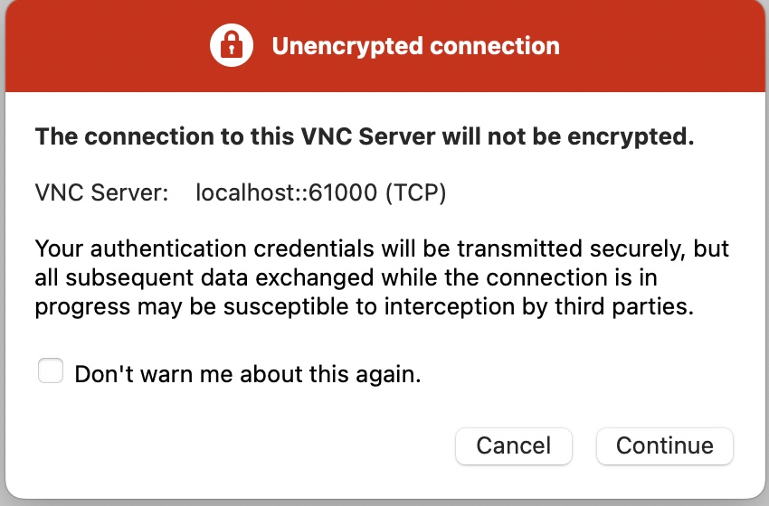
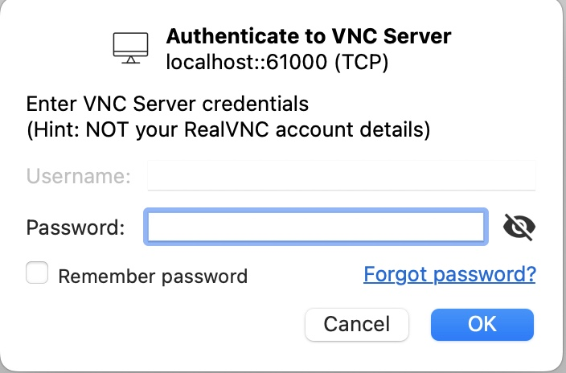

---
author:
  name: Linode
  email: docs@linode.com
description: "Deploy Kali Linux, a popular Linux distribution for penetration testing and security research, on a Linode Compute Instance."
keywords: ['kali','security','pentest']
tags: ["marketplace", "linode platform", "cloud manager"]
license: '[CC BY-ND 4.0](https://creativecommons.org/licenses/by-nd/4.0)'
published: 2022-07-05
modified_by:
  name: Linode
title: "Deploying Kali Linux through the Linode Marketplace"
aliases: ['/products/tools/marketplace/guides/kalilinux/']
---

[Kali Linux](https://www.kali.org/) is a specialized Debian-based Linux distribution that has become an industry-standard tool for penetration testing. Kali Linux includes hundreds of free tools for reverse engineering, penetration testing, computer forensics, security audits, and more. It is open source and prioritizes simplicity. To learn more about Kali Linux and determine if its a viable solution for your workloads, see the following resources from its official documentation site:

- [What is Kali Linux?](https://www.kali.org/docs/introduction/what-is-kali-linux/)
- [Should I Use Kali Linux?](https://www.kali.org/docs/introduction/should-i-use-kali-linux/)


This Marketplace App extends Linode's Kali Linux distribution image by allowing the user to preinstall one of the available metapackages.


## Deploying a Marketplace App






**Estimated deployment time:** Kali Linux should be fully installed within 45-60 minutes after the Compute Instance has finished provisioning.


## Configuration Options

- **Supported distributions:** Kali Linux
- **Recommended plan:** We recommend a 4GB Dedicated CPU or Shared Compute Instance.

### Kali Options

- **Kali Headless Package** *(required)*: This installs the [kali-linux-headless](https://www.kali.org/tools/kali-meta/#kali-linux-headless) metapackage, which includes all non-GUI packages.
- **Kali Everything Package** *(required)*: This installs the [kali-linux-everything](https://www.kali.org/tools/kali-meta/#kali-linux-everything) metapackage, which includes all available Kali packages.

    
If both packages are selected, only the [kali-linux-everything](https://www.kali.org/tools/kali-meta/#kali-linux-everything) package is installed (which includes everything in [kali-linux-headless](https://www.kali.org/tools/kali-meta/#kali-linux-headless)).


- **VNC Installation** *(required)*: This option installs and starts [TigerVNC](https://tigervnc.org/) and [XFCE Desktop package](https://www.xfce.org/).
- **Sudo/VNC Username** *(required)*: The VNC username you wish to create for this Compute Instance. This is used for your VNC session and will have elevated privileges (`sudo`).
- **Sudo/VNC User Password** *(required)*: The password you wish to use for your VNC user.



## Getting Started after Deployment

After Kali Linux has been fully deployed, you can log in through an SSH session as the `root` user and perform your workloads as needed. See the [Kali Linux documentation](https://www.kali.org/docs/) to learn how to further utilize your instance.

### Remote Desktop Connection with VNC

If you selected the VNC installation option, [TigerVNC](https://tigervnc.org/) is installed. This allows you to connect remotely to the desktop environment and access Kali's GUI tools. Perform the steps below to access your Kali Linux desktop through a VNC client. While there are many options for OS X and Windows, this guide will use [RealVNC Viewer](https://www.realvnc.com/en/connect/download/viewer/).

1. From your desktop, create an SSH tunnel to your Compute Instance with the following command. Be sure to replace *[username]* with the VNC username you created and *[ip]* with the IPv4 address of your Compute Instance. See the [Managing IP Addresses](/docs/guides/managing-ip-addresses/) guide for information on viewing IP addresses.

    
ssh -L 61000:localhost:5901 -N -l [username] [ip]


2. Open your preferred VNC viewer application and connect to your Compute Instance through the SSH tunnel you created. The format is `localhost:61000`

    

3. A warning may appear notifying you that the connection is unencrypted. Since you are using an SSH tunnel, your connection is encrypted over the internet. You can safely ignore this warning and continue.

    

4. You are then prompted to enter the password you created for the VNC user.

    

After connecting, the Kali Linux desktop should appear.


