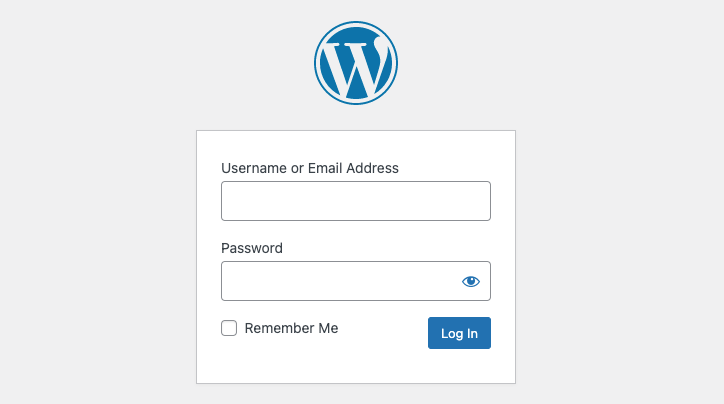
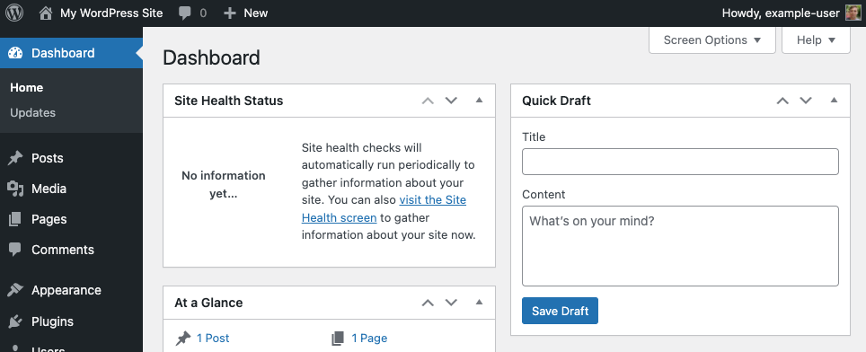

[Kepler](https://www.kepler.app) is a powerful drag & drop WordPress website builder with all-new website style filters that instantly change the look and feel of your website.


Kepler requires a valid license to use the software beyond the initial 14 day free trial period. To purchase a license, visit [Kepler's website](https://kepler.app/pricing.php) and select a plan that fits your needs. Licenses are not available directly through Linode.


## Deploying a Marketplace App






**Estimated deployment time:** Kepler should be fully installed within 2-5 minutes after the Compute Instance has finished provisioning.


## Configuration Options

- **Supported distributions:** Ubuntu 22.04 LTS
- **Recommended minimum plan:** All plan types and sizes can be used.

### Kepler Options

- **Webserver Stack** *(required)*: Chose which web server to use for the WordPress deployment, Apache2 or NGINX.
- **Email address** *(required)*: Enter the email address you wish to use when configuring the WordPress admin user, generating SSL certificates, and optionally creating DNS records for a custom domain.
- **Wordpress Admin Username** *(required)*: Username for your WordPress admin user account. Defaults to `admin` if no username is entered.
- **WordPress Database Username** *(required)*: MySQL username for the WordPress database user. Defaults to `wordpress` if no username is entered.
- **WordPress Database Name** *(required)*: Name for the WordPress MySQL database. Defaults to `wordpress` if no database name is defined.
- **Website Title:** Enter a title for your WordPress site.

    
    The passwords for the WordPress Admin User, WordPress Database User and MySQL root user are automatically generated and provided in the file `/root/.linode_credentials.txt` when the WordPress deployment completes.
    





#### Additional Security Options (Optional)

- **Configure automatic security updates:** Select `Yes` to have the system automatically update WordPress with the latest security updates. Select `No` to if you wish to manage all updates manually.
- **Use fail2ban to prevent automated intrusion attemps?** Select `Yes` to install fail2ban. Select `No` to not install fail2ban during installation. You [can install this at a later time](/docs/products/compute/compute-instances/guides/set-up-and-secure/#use-fail2ban-for-ssh-login-protection).


- **Do you need an MX record for this domain?** Check `Yes` if you plan on using WordPress to send email. The installer, along with your `API Token` (required) sets up the necessary MX records in the DNS Manager. Select `No` if you do not plan on using WordPress to send email. You can [add an MX record manually](/docs/guides/dns-overview/#mx) at a later time if you change your decision.
- **Do you need an SPF record for this domain?** Check `yes` if you plan on using WordPress to send email. The installer, along with your `API Token` (required) sets up the necessary SPF records in the DNS Manager. Select `No` if you do not plan on using WordPress to send email. You can [add an SPF record manually](/docs/guides/dns-overview/#spf) at a later time if you change your decision.
- **Would you like to use a free Let's Encrypt SSL certificate?** Select `Yes` if you would like the install to create an SSL certificate for you, or `No` if you do not. You cannot create secure, encrypted conferences without an SSL certificate.

## Getting Started After Deployment

### Obtain the Credentials

Once the app has been *fully* deployed, you need to obtain the credentials from the server.

1.  Log in to your new Compute Instance using one of the methods below:

    - **Lish Console:** Within the Cloud Manager, navigate to **Linodes** from the left menu, select the Compute Instance you just deployed, and click the **Launch LISH Console** button. Log in as the `root` user. See [Using the Lish Console](/docs/products/compute/compute-instances/guides/lish/).
    - **SSH:** Log in to your Compute Instance over SSH using the `root` user. See [Connecting to a Remote Server Over SSH](/docs/guides/connect-to-server-over-ssh/) for assistance.

1.  Once logged in, access the credentials file by runing the following command:

    ```command
    cat /root/.linode_credentials.txt
    ```

1.  This displays the passwords that were automatically generated when the instance was deployed. Once you save these passwords, you can safely delete this file.

### Accessing the WordPress Admin Dashboard

1.  Open your web browser and navigate to `http://[domain]/wp-admin/`, where *[domain]* can be replaced with the custom domain you entered during deployment or your Compute Instance's IPv4 address or rDNS domain (such as `192-0-2-1.ip.linodeusercontent.com`). See the [Managing IP Addresses](/docs/products/compute/compute-instances/guides/manage-ip-addresses/) guide for information on viewing IP addresses and rDNS.

    

1.  Within the login page that appears, enter the username (*admin username*) that you created when you deployed this instance and the associated password that was automatically generated. Then click the **Log In** button.

    

1.  Once logged in, the WordPress Admin Dashboard appears. From here, you can create new posts, add users, modify the theme, and adjust any settings.

    

### Viewing Your Website

Open a web browser and navigate to `http://[domain]`, replacing *[domain]* with the custom domain you entered during deployment or your Compute Instance's IPv4 address or rDNS domain. See the [Managing IP Addresses](/docs/products/compute/compute-instances/guides/manage-ip-addresses/) guide for information on viewing IP addresses and rDNS. Your WordPress site should now be displayed.



## Going Further

Now that your WordPress installation is deployed, you can start adding content and modifying it to suit your needs. Here are a few links to help get you started:

- [WordPress Support](https://wordpress.org/support/): Learn the basic workflows for using WordPress.
- [Securing WordPress](/docs/guides/how-to-secure-wordpress/): Advice on securing WordPress through HTTPS, using a secure password, changing the admin username, and more.
- [WordPress Themes](https://wordpress.org/themes/#): A collection of *thousands* of WordPress themes.
- [Marketplace Apps Repository](https://github.com/linode-solutions/marketplace-apps): Review the deployment Ansible playbooks.


